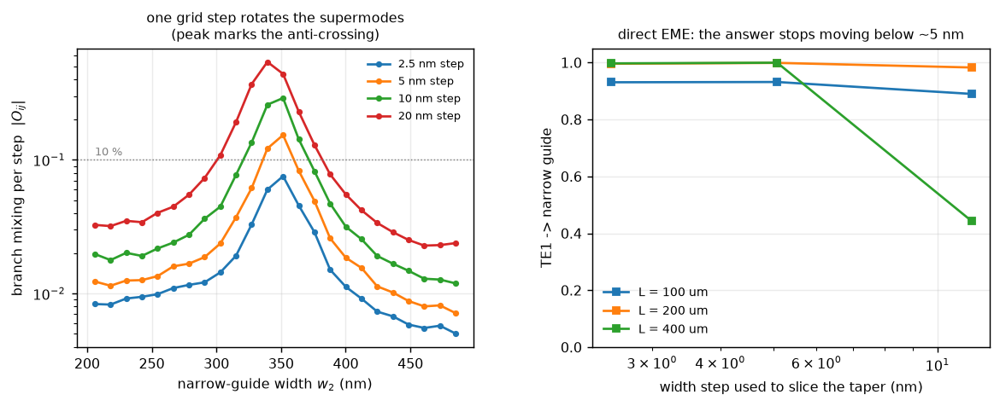
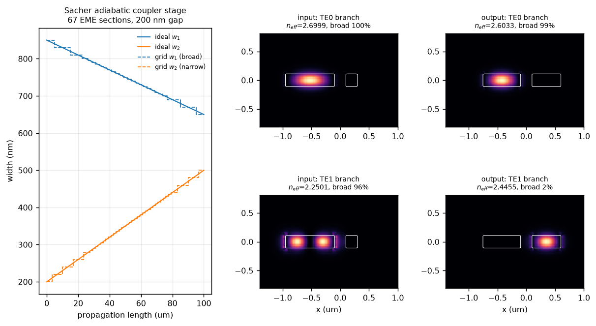
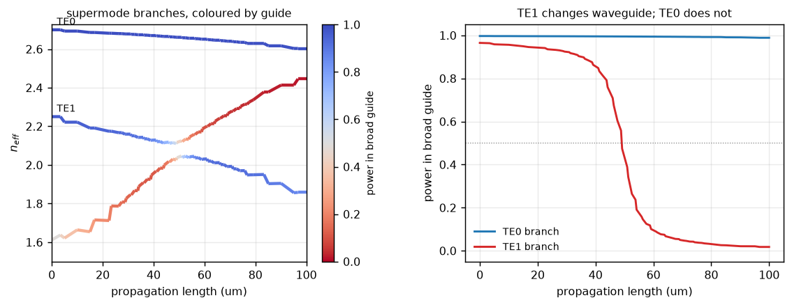
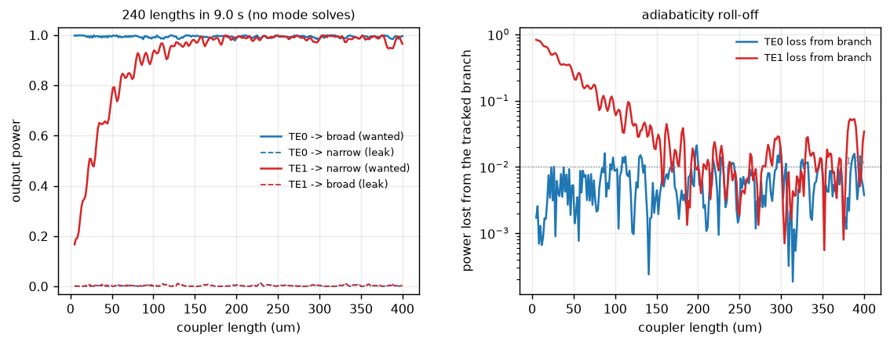
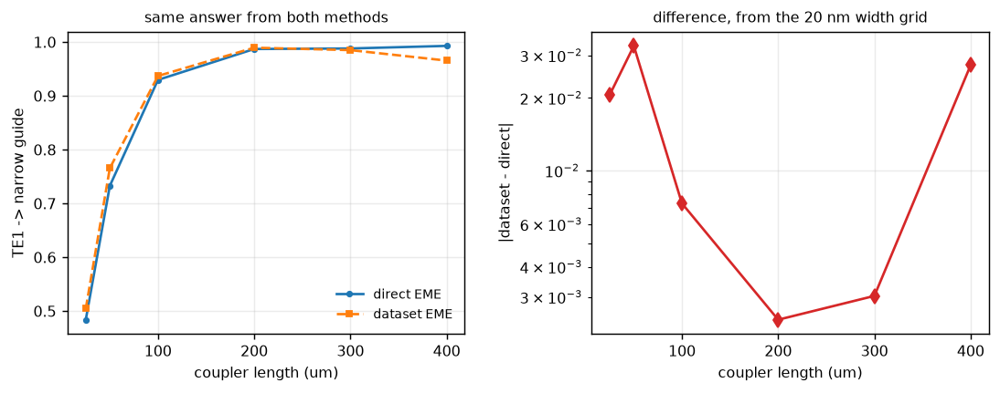

# 01 — Adiabatic coupler (Sacher et al. 2014, PRS stage 2)

Dataset-based EME reproduction of the adiabatic coupler that separates TE0 from
TE1 inside the polarization rotator-splitter of

> W. D. Sacher, T. Barwicz, B. J. F. Taylor, J. K. S. Poon,
> *Polarization rotator-splitters in standard active silicon photonics
> platforms*, **Opt. Express 22(4), 3777 (2014)**,
> [doi:10.1364/OE.22.003777](https://doi.org/10.1364/OE.22.003777)

Reproduce with `python examples/demo_adiabatic_coupler.py`; the numbers below
come from `reports/output/coupler_results.json`, written by that run.

---

## 1. Sanity gate

Measured on the 100 µm device, `force_unitary=False` throughout so that nothing
is hidden by the projection.

| check | criterion | measured | pass |
|---|---|---|---|
| reciprocity, `T_f = T_bᵀ` (§5.1) | < 1e-3 | **2.56e-5** | yes |
| reflection blocks symmetric (§5.1) | < 1e-2 abs | **2.69e-3** | yes |
| power conservation, no projection (§5.2) | \|1 − ΣT\| < 1e-2 | **8.41e-2** | **no** |
| mode-basis convergence (§5.2) | residual falls with N | 0.104, 0.104, 0.084, 0.084 for N = 3, 4, 5, 6 | plateaus |
| branch tracking (§5.13) | weakest link > 0.5 | **0.988** | yes |
| slicing independence (§5.4) | max\|ΔT\| < 1e-3 | **4.31e-4** | yes |

Three of these need comment.

**Reciprocity needed the right identity.** §5.1 asks for `max|S − Sᵀ| < 1e-6`.
That criterion is wrong for this solver, and applying it naively gives 5.1e-1
here and 2.4e-2 on a plain taper — which looks like a broken overlap integral
and is not. `matrix_calculation_tool._convert_3Dmatrix` does **not** produce the
textbook port ordering `[[S11, S12], [S21, S22]]`; it produces

```
S = [[T_forward, R_right],
     [R_left,    T_backward]]
```

so reciprocity requires `T_forward = T_backwardᵀ` and each reflection block
symmetric, not `S = Sᵀ`. With the correct identity the taper gives 2e-5 to 7e-5,
a straight waveguide gives exactly 0, and the reflection blocks are symmetric to
1e-12. This is the numerical confirmation of the overlap convention that §5.16
had established only by audit. **§5.1 in `CLAUDE.md` should be amended.**

**Power conservation fails, and it is real.** The 8.4e-2 residual is the worst
over the five branches guided end to end, and it belongs to the weakest of them
(n_eff 1.61 → 1.86, just above the 1.444 cladding index). The branches this
report is actually about are better but not good: **2.9e-2 for the TE1 branch**
and 4.6e-3 for TE0. Adding modes does not fix it — the residual is flat from
N = 5 to N = 6 — which says the missing basis is the radiation continuum, not
more guided modes. Everything reported below therefore carries an uncertainty
of order 3 % from truncation, and the agreement with direct EME (§4) is the
better error estimate because both methods share that deficiency.

**Branch tracking passes, once asked the right question.** An earlier version of
this check required the tracked n_eff branches never to cross, and it failed.
That criterion is also wrong: two branches of *different polarisation* do not
interact, so they cross for real, and following them through is exactly what
correct tracking looks like. What matters is the confidence of each link, and
the weakest section-to-section overlap over the whole device is 0.988.

---

## 2. Device and dataset

The paper specifies this stage as "fully-etched Si waveguides with symmetric
SiO₂ cladding" in a 220 nm device layer — the same platform as the taper and
bend demos, so no new material stack was needed.

| | |
|---|---|
| broad guide `w1` | 850 → 650 nm |
| narrow guide `w2` | 200 → 500 nm |
| gap | 200 nm, constant |
| device layer | 220 nm Si, fully etched |
| cladding | SiO₂ above and below (symmetric) |
| wavelength | 1550 nm |
| nominal length | 100 µm (the paper gives 475 µm for the *whole* PRS) |

**Dataset** `datasets/Si_pair_fulletch_220nm`, built by the new `CoupledStrips`
cross section: two cores in one device layer, centred on the gap so both stay
inside the window as the widths change. Axes `w1`, `w2`; the gap is fixed rather
than swept, because every extra axis costs two neighbour solves per path point
and this device holds it constant.

* materials: Si (Li 1980) / SiO₂ (Malitson 1965) via PyOptik
* 6 modes per cross section, mesh 220 × 80 (20 nm cells), window 2.125 × 0.8 µm
* **non-uniform grid**: 20 nm steps generally, **5 nm across the anti-crossing**
  (`w1` 700–800 nm, `w2` 280–440 nm)
* 149 points solved, 67 EME sections, ~10 min cold / 0.04 s warm

### Why the grid has to be refined

This is the main methodological result, and it is specific to anti-crossings —
neither the taper nor the bend demo comes near it.

A DBEME dataset models a smooth device as a staircase whose step is the grid
spacing. That is harmless while the modes at adjacent grid points are nearly the
same modes. Measured directly, as the off-diagonal overlap between the two
crossing branches one step apart:

| step | branch mixing, away from the crossing | at the crossing (`w2` ≈ 340 nm) |
|---|---|---|
| 20 nm | ~0.03 | **0.541** |
| 10 nm | ~0.02 | 0.290 |
| 5 nm | ~0.012 | 0.153 |
| 2.5 nm | ~0.008 | 0.076 |

Away from the crossing a 20 nm step is nearly invisible to the modes. At the
crossing the same step scatters **29 % of the power between the two branches at
a single interface**, and the mixing scales linearly with the step. That is
precisely the process an adiabatic device exists to avoid, so a grid that coarse
does not merely add error — it destroys the behaviour being modelled.

The consequence, measured independently with direct EME (no dataset, exact
widths, only the slicing changing):

| width step | L = 100 µm | L = 200 µm | L = 400 µm |
|---|---|---|---|
| 11.5 nm | 0.890 | 0.983 | **0.443** |
| 5.1 nm | 0.932 | 0.999 | 0.999 |
| 2.5 nm | 0.931 | 0.996 | 0.997 |

At 11.5 nm the answer at 400 µm is not merely inaccurate, it is qualitatively
wrong: a *longer* adiabatic device is reported as *worse*. From about 5 nm
downwards the result is stable and monotonic. The shipped grid uses 5 nm.

This is `docs/dataset_doctrine.md` §3's non-uniform-axis recommendation, now with a number
attached: sample at ≲5 nm wherever two branches approach, 20 nm elsewhere. The
refinement is cheap because a wide axis costs nothing until a device visits it.



---

## 3. DBEME result

### Mechanism

At the input the two guides are strongly detuned — the broad one carries TE0 and
TE1, the 200 nm one carries nothing. As the widths sweep past each other the
broad guide's TE1 and the narrow guide's TE0 anti-cross at z ≈ 50 µm
(`w1` ≈ 750, `w2` ≈ 350 nm), with a minimum separation Δn_eff ≈ 0.084. Follow
that branch slowly enough and the light changes waveguide without changing
supermode.

| branch | n_eff in → out | power in broad guide, in → out |
|---|---|---|
| TE0 | 2.6999 → 2.6033 | 0.997 → **0.989** |
| TE1 | 2.2501 → 2.4455 | 0.965 → **0.018** |

TE0 anti-crosses with nothing and stays where it is. TE1 ends up 98.2 % in the
narrow waveguide.





The left panel of the second figure is the whole mechanism in one plot: the two
branches exchange colour — which guide they live in — through the anti-crossing
without their effective indices ever touching.

### Performance

Launching TE1 into a 100 µm coupler:

* into the narrow guide: **0.9371**
* left in the broad guide: 4.5e-4

Stretching the device (free — the sequence of cross sections is fixed by the
*normalised* width schedule, so 240 lengths cost 9 s and no mode solving):

* TE1 crossover exceeds 99 % for **L > 157 µm**
* TE1 crossover exceeds 99.9 % for **L > 304 µm**



Beyond ~150 µm the curve stops improving and oscillates on a ~1e-2 floor. That
floor is the residual 5 nm staircase, the same effect as §2 but four times
smaller; it is not a physical limit of the device.

---

## 4. DBEME vs direct EME

Both paths use the same emepy backend, the same mode count and the same section
count (67), so the only difference is that one snaps onto the parameter grid and
the other solves each section at its exact widths.

| coupler length | dataset EME | direct EME | difference |
|---|---|---|---|
| 25 µm | 0.50464 | 0.48402 | 2.06e-2 |
| 50 µm | 0.76577 | 0.73292 | 3.29e-2 |
| 100 µm | 0.93709 | 0.92976 | 7.32e-3 |
| 200 µm | 0.98961 | 0.98719 | 2.42e-3 |
| 300 µm | 0.98513 | 0.98816 | 3.03e-3 |
| 400 µm | 0.96563 | 0.99297 | 2.73e-2 |

**max |difference| = 3.3e-2**, and 2–7e-3 in the adiabatic region that matters.
That is the same order as the 2.9e-2 truncation residual from §1, so the two
methods agree to within the accuracy either of them has.

Cost: **0.04 s** for the dataset path against **151 s** for the direct path, on
a warm dataset. Cold, the dataset cost ~10 min once; every subsequent device on
this cross-section family — a different length, a different width schedule, a
different gap ratio — is free.



---

## 5. DBEME vs literature

### What is comparable, and what is not

The paper reports a **complete PRS**: a bi-level taper that converts TM0 → TE1,
this adiabatic coupler, mode filters, and a bend to separate the outputs. It
gives **no** curves, length or efficiency for the coupler stage on its own.
Its headline numbers — crosstalk < −13 dB and insertion loss < 1.5 dB over
1530–1580 nm, improving to < −22 dB over 1500–1580 nm with filters — are
device-level, measured, and include the taper, the filters and fabrication.

None of those is a valid comparison for this simulation, for three separate
reasons:

1. **Different scope.** Only stage 2 of 4 is modelled here.
2. **No radiation loss.** This solver has no PML (§5.9), so absolute insertion
   loss is not computed at all — only ratios among guided modes are meaningful.
3. **Single wavelength.** The dataset is built at 1550 nm, so the bandwidth
   claim cannot be tested. Material dispersion is now handled, but a wavelength
   axis is not (§5.14).

### What *is* comparable

The paper makes one explicit, checkable claim about this stage:

> "The TE0 mode is well confined in the broad waveguide while the TE1 mode is
> well confined in the narrow waveguide."

That is a statement about mode localisation at the coupler output, and it is
directly measurable:

| quantity | Sacher et al. | this work | agreement |
|---|---|---|---|
| geometry: `w1`, `w2`, gap, stack | 850→650 nm, 200→500 nm, 200 nm, full-etch 220 nm Si / SiO₂ | identical, by construction | exact |
| TE0 at the output | "well confined in the broad waveguide" | 98.9 % in the broad guide | confirmed |
| TE1 at the output | "well confined in the narrow waveguide" | 98.2 % in the narrow guide | confirmed |
| mechanism | adiabatic mode evolution through a TE1/TE0 anti-crossing | anti-crossing found at `w1` ≈ 750 / `w2` ≈ 350 nm, Δn_eff ≈ 0.084 | consistent |
| coupler length | not stated in the paper; **300 µm** in Flexcompute's reproduction | ≥ 157 µm for 99 %, **≥ 304 µm for 99.9 %** | 1 % |

**Update — the coupler length is now checkable.** The paper does not break its
475 µm down by stage, but Flexcompute's published reproduction of this device
([BilevelPSR](https://www.flexcompute.com/tidy3d/examples/notebooks/BilevelPSR/),
which cites this paper and matches its widths and gap exactly) states the
adiabatic coupler length as **L_ac = 300 µm**. This simulation, run before that
number was in hand, put the 99.9 % crossover threshold at **304 µm**. The
designer picked essentially the shortest length that reaches 99.9 %, which is
what a competent adiabatic design looks like, and it is a much sharper
agreement than the 475 µm budget argument allowed.

### Discrepancy table

| row | difference | physical cause |
|---|---|---|
| absolute insertion loss | not compared | no PML in `MSEMpy`; radiation loss is not modelled (§5.9) |
| bandwidth / crosstalk vs λ | not compared | single-wavelength dataset (§5.14) |
| TM0 → TE1 conversion | not modelled | needs the bi-level partial-etch cross section (§5.11, §5.12) |
| coupler length | 304 µm predicted vs 300 µm published | agrees to 1 %; the published length is the shortest that reaches 99.9 % crossover |
| output localisation | 98.9 % / 98.2 % vs "well confined" | agrees; the paper gives no number to compare against |

---

## 6. Conclusions and limits

**What this supports.** The dataset-based method reproduces the mode-evolution
mechanism of the Sacher adiabatic coupler on the paper's own geometry and
platform, and confirms its one checkable claim quantitatively: TE0 exits 98.9 %
in the broad guide and TE1 exits 98.2 % in the narrow guide. It agrees with
direct EME to 2–7e-3 in the adiabatic region and predicts a 99 % crossover length
of 157 µm. The economic argument holds: after a ~10 min dataset build, a
240-point length sweep costs 9 s and no mode solving, against 151 s for a
*single* direct-EME device.

**What it does not support.** Any absolute loss number, anything about
bandwidth, and anything about the PRS as a whole. The 8.4e-2 worst-case
truncation residual (2.9e-2 on the TE1 branch) bounds every figure quoted here,
and it does not improve with more guided modes.

**The transferable result** is the grid rule. An anti-crossing imposes a
sampling requirement that a taper or a bend never does, because the supermodes
turn over within a narrow range of the swept parameter: ≲5 nm here against 20 nm
elsewhere, verified two independent ways. A dataset built without that
refinement does not give a slightly worse answer — at 400 µm it reports 0.44
where the truth is 0.99, i.e. it inverts the design trend. Any future coupled
dataset (§5.12's family: RAC, ADC, PSR) needs the same treatment.

**Next, in order.** (a) Raise the mode count above 6 and re-measure the
truncation residual — it is the largest single uncertainty here. (b) Add the
wavelength axis (§5.14) so the bandwidth claims become testable. (c) The
bi-level cross section (§5.11) for the TM0 → TE1 stage, which would make the
full PRS reachable.

---

### Reproducing

```bash
cd examples
python demo_adiabatic_coupler.py      # figures 1-4, results JSON, sanity gate
python study_anticrossing_grid.py     # figure 5, the grid rule
```

First run builds `datasets/Si_pair_fulletch_220nm` (~10 min); afterwards both
are seconds apart from the direct-EME reference leg.
