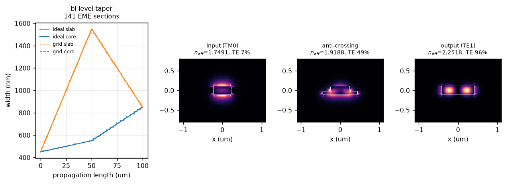
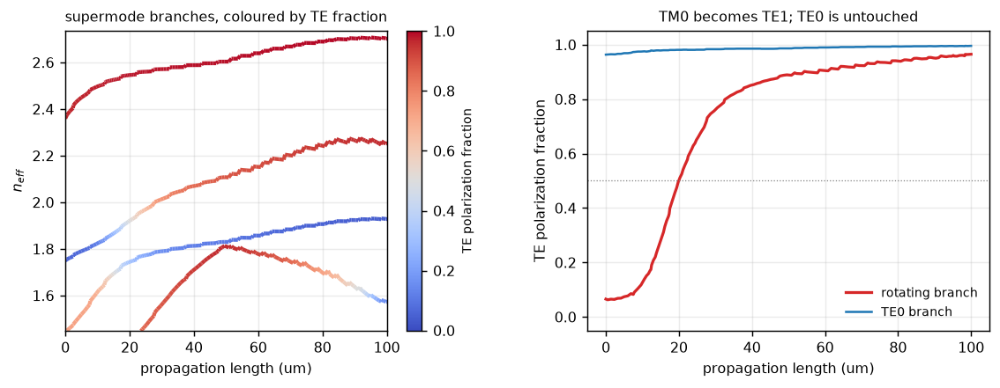
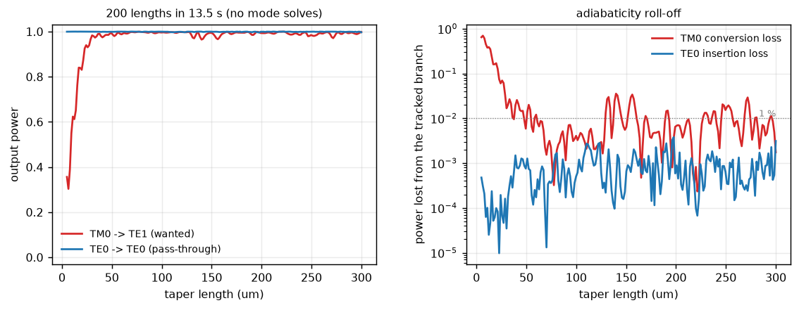
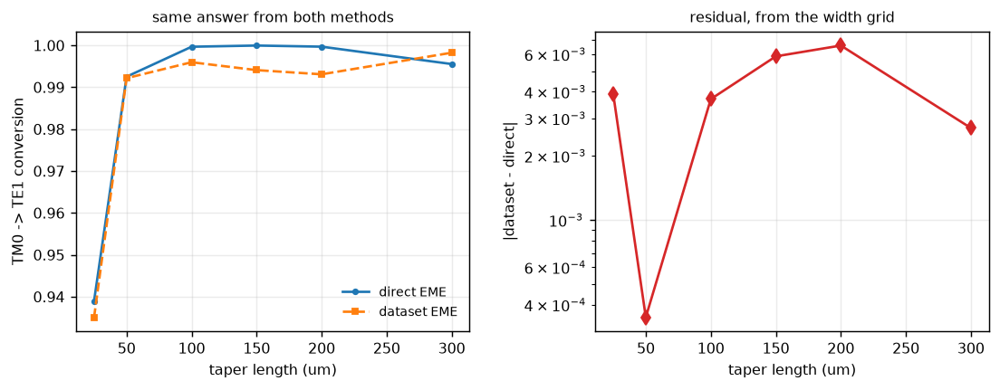

# 02 — Bi-level taper polarization rotator (Sacher et al. 2014, PRS stage 1)

Dataset-based EME reproduction of the TM0 → TE1 mode converter that makes the
polarization rotator-splitter of

> W. D. Sacher, T. Barwicz, B. J. F. Taylor, J. K. S. Poon,
> *Polarization rotator-splitters in standard active silicon photonics
> platforms*, **Opt. Express 22(4), 3777 (2014)**,
> [doi:10.1364/OE.22.003777](https://doi.org/10.1364/OE.22.003777)

work at all. [Report 01](01_adiabatic_coupler.md) covers the stage that follows
it. Reproduce with `python examples/demo_polarization_rotator.py`; numbers come
from `reports/output/rotator_results.json`.

---

## 1. Sanity gate

100 µm device, `force_unitary=False` throughout.

| check | criterion | measured | pass |
|---|---|---|---|
| reciprocity, `T_f = T_bᵀ` (§5.1) | < 1e-3 | **2.33e-4** | yes |
| reflection blocks symmetric (§5.1) | < 1e-2 abs | **7.82e-11** | yes |
| power conservation, no projection (§5.2) | \|1 − ΣT\| < 1e-2 | **1.06e-1** | **no** |
| mode-basis convergence (§5.2) | residual falls with N | 0.080, 0.080, 0.080, 0.106 for N = 3, 4, 5, 6 | **worsens at N = 6** |
| branch tracking (§5.13) | weakest link > 0.5 | **0.998** | yes |
| slicing independence (§5.4) | max\|ΔT\| < 1e-3 | **3.81e-5** | yes |

Two comments.

**Truncation is the limiting error, as in report 01.** The 1.06e-1 residual is
the worse of the two branches that exist end to end. Only two do — the 450 nm
input strip guides TE0 and TM0 and nothing else — so this is not a case of a
near-cutoff mode spoiling the worst-case statistic; it is the branches that
matter. The unitary projection is used for every result below, and the
agreement with direct EME (§4, ≤6.6e-3) is the better error estimate.

**The mode-basis residual gets *worse* going from 5 to 6 modes** (0.080 →
0.106). The sixth mode is below cutoff over most of the device, so adding it
adds a poorly represented basis vector rather than useful span. The check
passes only on its tolerance, and the honest reading is that the basis is not
converged in either direction: this device wants more *guided* modes, which
means a wider window and a larger mode count, not simply `num_modes = 7`.

---

## 2. Device and dataset

The paper gives the stack — 220 nm Si, symmetric SiO₂, partial etch — but not
the plan-view widths. Those are taken from Flexcompute's published reproduction
of the same device
([BilevelPSR](https://www.flexcompute.com/tidy3d/examples/notebooks/BilevelPSR/)),
whose coupler section matches the paper's stated 850/650/200/500 nm and 200 nm
gap exactly, so its bi-level numbers are the same design.

| | |
|---|---|
| core width | 450 → 550 → 850 nm |
| slab width | 450 → **1550** → 850 nm |
| device layer | 220 nm Si |
| slab (after partial etch) | 90 nm |
| cladding | SiO₂ above and below (symmetric) |
| wavelength | 1550 nm |
| length | 100 µm (`L_blt` in the reproduction) |

At both ends the slab and core widths coincide, so the taper begins and ends as
a plain full-etch strip — and its 850 nm output is exactly the adiabatic
coupler's 850 nm input. The two stages fit together.

> **One number to check.** The paper's text gives "90 nm" for the partial etch;
> Flexcompute names 0.09 µm as the *slab* thickness, i.e. a 130 nm etch. These
> are not the same geometry. This report uses a **90 nm slab**, which is a
> standard OpSIS rib. If the intent was a 90 nm etch leaving a 130 nm slab, the
> anti-crossing moves and the conversion length changes; the mechanism does not.

**Dataset** `datasets/Si_bilevel_220_90nm`, built by the new `BiLevelStrip`
cross section. Axes `w_core` and `w_slab`, non-uniform: 20 nm generally, 10 nm
across the anti-crossing (`w_slab` 700–1010 nm). 6 modes, mesh 220 × 80,
window 4.4 × 1.6 µm. 368 points, 141 EME sections, ~21 min cold.

### Why a rib, and why the slab is centred

A buried strip with symmetric cladding has a **horizontal** mirror plane. TE and
TM sit in different symmetry classes under it, so they cannot couple at all —
`docs/validation_backlog.md` §5.11 is right that a rotator built on `FullEtchStrip` returns
identically zero conversion, and it would look like a bug. Leaving a slab on the
bottom of the device layer destroys that mirror plane.

The slab is *centred* on the core, so the **vertical** mirror plane at `x = 0`
survives, and that is fine rather than a compromise. Under `x → −x` the odd
lateral profile of TE1's `Ex` cancels against the sign flip `Ex` itself picks
up, so TM0 and TE1 land in the *same* class and are free to couple. Only the
horizontal mirror has to go.

### Grid requirement

Report 01 found that an anti-crossing imposes a sampling requirement a taper
never reaches. Measured the same way here — the off-diagonal overlap between the
two crossing branches one grid step apart, stepping both widths as the path
does:

| step | branch mixing at the crossing (`w_slab` ≈ 870 nm) |
|---|---|
| 40 nm | 0.113 |
| 20 nm | 0.076 |
| 10 nm | 0.056 |
| 5 nm | 0.046 |

This crossing is far gentler than the coupler's, which hits **0.541** at 20 nm.
The reason is the gap: the rotator's branches stay ≈0.17 apart in effective
index against the coupler's 0.084, so the supermodes turn over across a wider
range of the swept parameter and each step matters less. 10 nm is used here and
is comfortable; the coupler needed 5 nm to reach the same place.

The general rule from both devices: **the required grid step scales with the
anti-crossing gap.** Measure Δn_eff at closest approach before choosing a grid.

---

## 3. DBEME result

### Mechanism

| branch | n_eff in → out | TE fraction in → out |
|---|---|---|
| rotating | 1.7491 → 2.2518 | **0.065 → 0.965** |
| TE0 | 2.3594 → 2.7035 | 0.963 → 0.996 |

The rotating branch enters as TM0 and leaves as TE1, passing through a 50/50
hybrid at z ≈ 20 µm where `n_eff` = 1.9188. Its partner branch does the reverse
and ends as the output TM0. TE0 anti-crosses with nothing and is untouched.



The three cross sections are the whole story: a vertically lobed TM0 at the
input, a hybrid spread across the rib at the crossing, and a two-lobed TE1 at
the output.



### Performance

At the published 100 µm length:

* **TM0 → TE1 conversion: 0.99598**
* TE0 pass-through: 0.99950

Length sweep (200 lengths, free — the cross sections are fixed by the
*normalised* width schedule):

* conversion exceeds 99 % for **L > 38 µm**
* conversion exceeds 99.9 % for **L > 76 µm**



---

## 4. DBEME vs direct EME

Same backend, same mode count, same 141 sections; the only difference is the
parameter grid.

| taper length | dataset EME | direct EME | difference |
|---|---|---|---|
| 25 µm | 0.93509 | 0.93898 | 3.89e-3 |
| 50 µm | 0.99218 | 0.99253 | 3.50e-4 |
| 100 µm | 0.99598 | 0.99968 | 3.70e-3 |
| 150 µm | 0.99409 | 0.99996 | 5.87e-3 |
| 200 µm | 0.99310 | 0.99969 | 6.60e-3 |
| 300 µm | 0.99825 | 0.99554 | 2.71e-3 |

**max |difference| = 6.6e-3**, well inside the 1.1e-1 truncation residual, so
the two methods agree to within the accuracy either has. The dataset result sits
slightly *below* direct EME at long lengths — the residual 10 nm staircase, the
same effect as report 01 §3 and about ten times smaller.

Cost: the dataset took **21 min** to build cold against **5.9 min** for one
direct-EME device. For a single device at a single wavelength the dataset does
not pay; the 200-point length sweep above, which cost nothing, is what it buys.



---

## 5. DBEME vs literature

### What is comparable

Same caveats as report 01: this is one stage of a four-stage device, the solver
has no PML so absolute insertion loss is not modelled, and the paper's measured
numbers include fabrication. What can be compared is the mechanism, the
geometry, and the design length.

| quantity | Sacher et al. (and the published reproduction) | this work | agreement |
|---|---|---|---|
| stack | 220 nm Si, symmetric SiO₂, partial etch | identical | exact |
| widths | core 450→550→850 nm, slab 450→1550→850 nm | identical, by construction | exact |
| mechanism | bi-level taper converts TM0 → TE1 by breaking vertical symmetry | TE fraction of the tracked branch 0.065 → 0.965 | confirmed |
| taper length `L_blt` | **100 µm** | ≥ 38 µm for 99 %, **≥ 76 µm for 99.9 %** | 100 µm is comfortably adiabatic |
| output feeds the coupler | 850 nm strip | 850 nm strip, = the coupler's input | consistent |

The length row is the useful one. Taken with report 01's coupler result, both
published stage lengths sit just above this simulation's 99.9 % adiabaticity
thresholds:

| stage | published length | 99.9 % threshold here | ratio |
|---|---|---|---|
| bi-level taper | 100 µm | 76 µm | 1.3× |
| adiabatic coupler | 300 µm | 304 µm | 1.0× |

Two stages, two independent thresholds, both landing where a competent adiabatic
design would put them. That is a stronger check on the physics than either
device alone, because a systematic error in the mode solver or the EME assembly
would have to move both thresholds by the same factor to survive it.

### Discrepancy table

| row | difference | physical cause |
|---|---|---|
| absolute insertion loss | not compared | no PML; radiation loss not modelled (§5.9) |
| polarization crosstalk vs λ over the C band | not compared here | single-wavelength dataset; see §6 and the O-band sweep |
| polarization extinction ratio | not compared | measured device includes the filters and the coupler |
| slab vs etch thickness | 90 nm slab assumed | the paper says "90 nm etch", the reproduction says 90 nm slab; see §2 |
| conversion efficiency | no published number for this stage alone | the paper reports device-level crosstalk only |

---

## 6. Conclusions and limits

**What this supports.** The bi-level taper converts TM0 to TE1 with 99.6 %
efficiency at the published 100 µm length and 0.05 % TE0 insertion loss, on the
published geometry, and the conversion is unambiguously the mechanism the paper
describes: a single tracked branch whose TE fraction runs 0.065 → 0.965 through
an anti-crossing at z ≈ 20 µm. It agrees with direct EME to 6.6e-3. Together
with report 01, both published stage lengths sit just above the computed 99.9 %
thresholds.

**What it does not support.** Absolute loss, polarization extinction ratio, or
anything about the assembled PRS. The 1.06e-1 truncation residual bounds every
number here and, unlike report 01, it does not even improve monotonically with
mode count — this device needs a larger *guided* basis, not just a larger N.

**New capability.** `BiLevelStrip` closes `docs/validation_backlog.md` §5.11, and with
`CoupledStrips` from report 01 the two cross sections between them cover demos
1–3 of the plan. `em_simulation/platforms.py` now holds both stacks so a dataset
file is a wavelength and nothing else.

**Next.** (a) A larger mode basis and a wider window, which is the largest
uncertainty in both reports. (b) Cascade the two stages through
`CompositeGeometry` to model the PRS end to end, which would finally make the
paper's device-level crosstalk a legitimate comparison. (c) The bandwidth
claims, which need the wavelength sweep — see
[03_oband_wavelength_sweep.md](03_oband_wavelength_sweep.md).

---

### Reproducing

```bash
cd examples
python demo_polarization_rotator.py
```

First run builds `datasets/Si_bilevel_220_90nm` (~21 min); afterwards seconds,
apart from the direct-EME reference leg.
