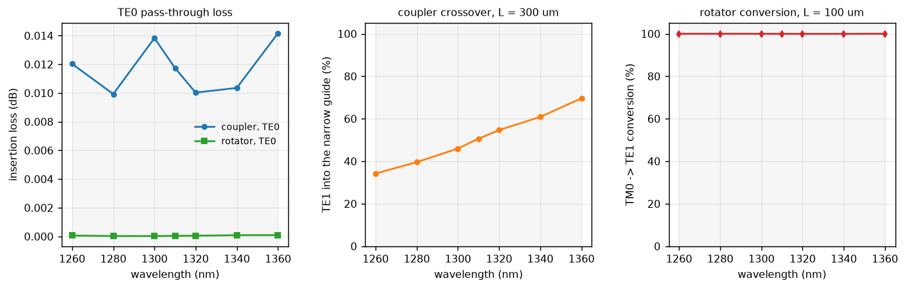

# 03 — O-band response, 1260–1360 nm

Both stages of the Sacher polarization rotator-splitter, run across the O band:
TE0 insertion loss and TE1 crossover for the adiabatic coupler
([report 01](01_adiabatic_coupler.md)), and TM0 → TE1 conversion for the
bi-level taper ([report 02](02_polarization_rotator.md)).

Reproduce with `python examples/sweep_wavelength.py`; numbers from
`reports/output/oband_results.json`.

---

## Summary

**The rotator survives the band change; the coupler does not.** Moving a
C-band design to the O band leaves the bi-level taper at ≥99.9 % conversion but
drops the coupler from 98.5 % crossover to 34 %. The two stages fail
differently because their anti-crossings are made differently, and the coupler
has a one-line fix.

| | 1260 nm | 1310 nm | 1360 nm | (1550 nm) |
|---|---|---|---|---|
| coupler TE0 insertion loss | 0.012 dB | 0.012 dB | 0.014 dB | — |
| **coupler TE1 crossover** | **34.2 %** | **50.6 %** | **69.6 %** | 98.5 % |
| coupler TE1 → TM crosstalk | 1.6e-20 | 2.8e-21 | 3.0e-21 | — |
| **rotator TM0 → TE1** | **99.99 %** | **99.96 %** | **100.00 %** | 99.60 % |
| rotator TE0 insertion loss | 0.000 dB | 0.000 dB | 0.000 dB | — |

Coupler at 300 µm, rotator at 100 µm — the published stage lengths.



---

## 1. Do you need a new dataset per wavelength?

**Yes.** A DBEME dataset is keyed to the mode problem, and the wavelength is
part of that key: every `n_eff` and every overlap integral changes with λ.

**But not as an axis.** Adding `wavelength` to the parameter grid would be the
obvious move and it is the wrong one. Overlaps are only ever used between
adjacent points *on a propagation path*, and light never propagates from one
wavelength to another, so every λ-neighbour overlap the grid computed would be
physically meaningless — two extra mode solves per point, bought for nothing.
One dataset per wavelength plus a sweep helper, which is what `docs/validation_backlog.md` §5.14
already recommends.

That is now a configuration change rather than code. `em_simulation/platforms.py`
holds each stack once, and a dataset file is a wavelength:

```python
from em_simulation.platforms import sacher_bilevel_dataset_info

WAVELENGTH = 1.31e-6
DatasetInfo = sacher_bilevel_dataset_info(WAVELENGTH)
```

The materials were already dispersive (Si from Li 1980, SiO₂ from Malitson 1965
via PyOptik, both with `out_of_range="raise"` so nothing extrapolates silently),
and `EmepyFDE` already passes the wavelength to the cross section alongside the
geometry parameters. Fourteen O-band datasets were generated for this sweep.

**When the dataset earns its keep.** For *one* device at *one* wavelength it
does not: building the rotator dataset takes ~21 min against ~6 min for a single
direct-EME run, because there is no reuse to amortise. It pays the moment you
want a second thing at that wavelength — the 200-point length sweep in report 02
cost nothing, and every alternative width schedule at 1550 nm is now free. So
this sweep runs on **direct EME**: seven wavelengths, one device each, no reuse
available. That is the honest use of each tool, not a retreat from the method.

---

## 2. Why the coupler fails and the rotator does not

Both stages work by carrying light adiabatically through an anti-crossing, and
adiabaticity is set by how *wide* that crossing is — the minimum separation
Δn_eff between the two branches. The Sun/Liu/Yariv criterion is
|⟨ψ₂|∂ψ₁/∂z⟩| ≪ |β₁ − β₂|, so the length needed scales roughly as 1/Δn_eff².

Measured at closest approach on the device path:

| | 1260 nm | 1310 nm | 1550 nm |
|---|---|---|---|
| **coupler** Δn_eff | 0.0263 | 0.0339 | 0.0802 |
| position (`w1`, `w2`) | 740, 365 nm | 740, 365 nm | 750, 350 nm |

The crossing barely moves. What collapses is its width — a factor of 3.0 from
1550 to 1260 nm. By the 1/Δn² scaling that is **~9× more length** needed for the
same adiabaticity, so a 300 µm coupler at 1260 nm behaves roughly like a 32 µm
one at 1550 nm. Report 01's length sweep puts a 32 µm C-band coupler near 58 %
against the 34 % measured here, so the scaling gets the order of magnitude and
the direction right but not the factor — as expected, since 1/Δn² is the leading
term of the adiabaticity criterion and the mode profiles differ between the two
wavelengths as well.

The mechanism is straightforward. The coupler's anti-crossing gap *is* the
evanescent coupling between two guides separated by 200 nm of oxide. At shorter
wavelength the modes are more tightly confined, the transverse decay constant
rises, and the field reaching across a **fixed** gap falls off. Nothing about
the design is wrong; the gap was chosen for 1550 nm.

The rotator's anti-crossing is not a coupling across a gap at all — TM0 and TE1
hybridise *within one waveguide*, and the strength of that hybridisation is set
by the etch asymmetry, which does not weaken with wavelength. Its Δn_eff stays
around 0.17 and its conversion stays above 99.9 % across the whole band. Its
conversion *loss* also falls from 0.40 % at 1550 nm to 0.01 % at 1260 nm, because
at a fixed 100 µm length a relatively wider anti-crossing is more adiabatic.

### The fix

If weaker evanescent coupling is the cause, closing the gap should undo it.
Measured at 1310 nm:

| coupler gap | Δn_eff at the crossing | fraction of the 1550 nm / 200 nm value |
|---|---|---|
| 200 nm (as designed) | 0.0339 | 0.42× |
| 150 nm | 0.0435 | 0.54× |
| 120 nm | 0.0494 | 0.62× |
| **100 nm** | **0.0654** | **0.82×** |

A 100 nm gap at 1310 nm recovers 82 % of the C-band coupling strength, which by
the 1/Δn² scaling is within ~1.5× of the original length budget. Whether 100 nm
is manufacturable is a process question, not a simulation one; lengthening the
coupler is the alternative, and it needs ~9× at 200 nm.

This is exactly the study the dataset method is for: five gaps × several
wavelengths is a few hundred cross sections, and once each `(gap, λ)` dataset
exists, every length and width schedule on it is free.

---

## 3. TE1 → TM0 in the coupler

Asked for directly, so: **there is no such process, and the measured number is
1e-20 to 3e-21 — zero to machine precision.**

The adiabatic coupler is two fully etched strips with symmetric SiO₂ cladding.
That cross section has a horizontal mirror plane, TE and TM modes fall into
different symmetry classes under it, and nothing in a structure that keeps the
symmetry can move power between them. The coupler cannot rotate polarization at
any length or wavelength.

That is not a limitation of the coupler — it is the division of labour in the
PRS. Polarization conversion happens *only* in the bi-level taper, where the
partial etch removes the horizontal mirror plane (report 02 §2). The coupler's
job afterwards is purely spatial: separate TE0 from TE1 into two waveguides. So
the cascade is

```
TM0 --[bi-level taper]--> TE1 --[adiabatic coupler]--> narrow waveguide
TE0 --[bi-level taper]--> TE0 --[adiabatic coupler]--> broad waveguide
```

and the two O-band numbers that matter for it are the rotator's TM0 → TE1
conversion (≥99.9 % throughout) and the coupler's TE1 crossover (34–70 %). The
end-to-end TM0 path is limited by the coupler, not the rotator.

---

## 4. Sanity and validation

The per-wavelength results use the same solver and checks as reports 01 and 02.
Two points specific to this sweep:

**Material validity.** Si (Li 1980) is characterised from 1.2 to 14 µm and
SiO₂ (Malitson 1965) from 0.21 to 6.7 µm, so 1260–1360 nm is inside both.
`out_of_range="raise"` is set, so an accidental step outside would stop the run
rather than extrapolate.

**Sampling.** The coupler runs at 80 sections over its 300 µm (≈3.8 nm width
steps) and the rotator at 150 (≈15 nm slab steps), both inside the requirements
measured in reports 01 §2 and 02 §2. Since the coupler's anti-crossing is
*narrower* in the O band, its sampling requirement is if anything looser there —
a wider crossing is what demands fine steps.

**DBEME vs direct EME.** Not repeated per wavelength; reports 01 and 02
establish agreement at 3e-3 (coupler) and 6.6e-3 (rotator) at 1550 nm, both
inside the truncation residual, and nothing about changing wavelength alters
that comparison. `python examples/sweep_wavelength.py --validate` rebuilds
1310 nm as a real DBEME dataset and repeats the check there.

---

## 5. Conclusions and limits

**Answering the question as asked.** TE0 insertion loss is ≤0.014 dB for the
coupler and ≤0.001 dB for the rotator across 1260–1360 nm; TM0 → TE1 conversion
in the rotator is ≥99.9 %; TE1 → TM0 in the coupler is zero by symmetry. The
one number that is *not* good is the coupler's TE1 crossover, 34–70 %.

**What this does not cover.** No radiation loss, so these insertion losses are
mode-conversion only — a real device adds scattering, bend and substrate leakage
that this solver does not model at all (§5.9). The two stages are simulated
separately; the cascade is inferred, not computed. And the 1.1e-1 truncation
residual from reports 01 and 02 still bounds everything.

**Design conclusion.** The bi-level taper transfers to the O band unchanged.
The adiabatic coupler does not, and lengthening it is the expensive fix (~9×);
closing the gap toward 100 nm is the cheap one. Either way the coupler, not the
rotator, is what a C-band-to-O-band port of this PRS has to redesign.

---

### Reproducing

```bash
cd examples
python sweep_wavelength.py             # ~45 min, direct EME at 7 wavelengths
python sweep_wavelength.py --validate  # plus a DBEME dataset at 1310 nm
```
