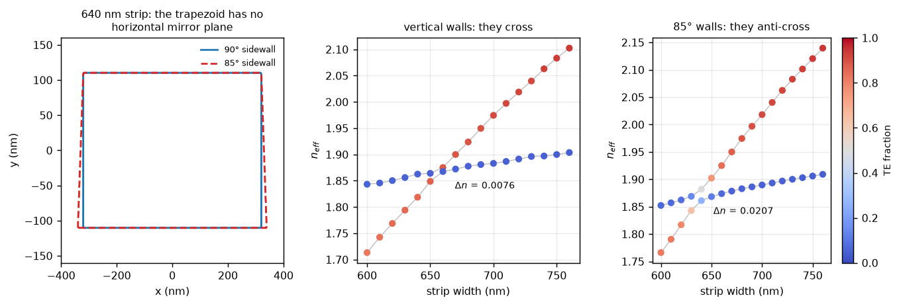
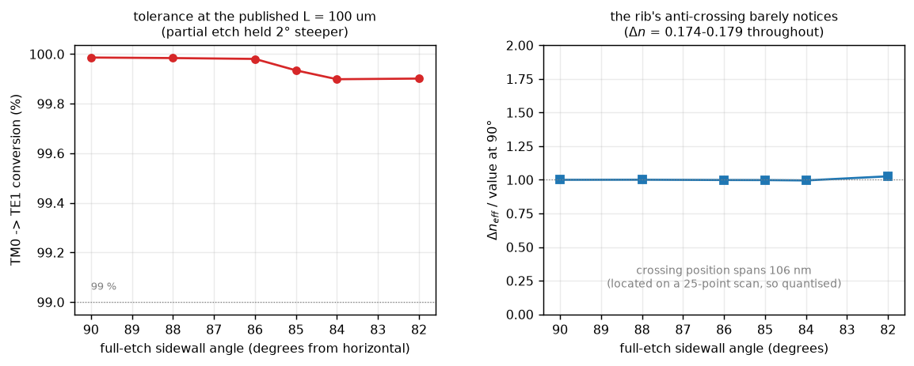
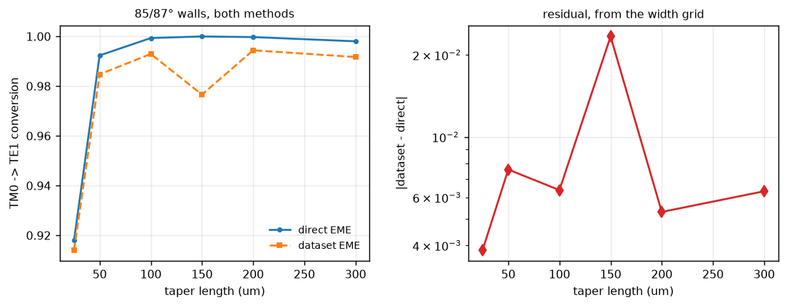

# 04 — Sidewall angle: slanted vs vertical polarization rotator

What a real etch does to the bi-level taper rotator of
[report 02](02_polarization_rotator.md). The two etch steps are put at **85°**
(full etch, defining the slab) and **87°** (partial etch, defining the core),
measured from horizontal, so each layer is a trapezoid — wider at its base than
at the width you drew.

Reproduce with `python examples/demo_sidewall_angle.py`; numbers from
`reports/output/sidewall_results.json`.

---

## Summary

**The rotator does not care.** TM0 → TE1 conversion is 99.99 % with vertical
walls and 99.93 % at 85/87°, and stays above 99.90 % all the way down to 82°.
TE0 pass-through is 100.00 % throughout.

That is the useful engineering answer, and it has a reason: the partial etch has
already broken the symmetry so thoroughly (Δn_eff = 0.174 at the anti-crossing)
that the extra asymmetry from a few degrees of slant is a rounding error on top.

**But the slant is not a small effect in general** — it is a second, independent
rotation mechanism, and on a plain strip with no partial etch it is the *only*
one. A 5° slant turns a clean TE1/TM0 crossing into an anti-crossing with
Δn_eff = 0.021. Which is to say: this rotator is insensitive to sidewall angle
because of what it already is, not because sidewall angle is unimportant.

| full etch / partial etch | TM0 → TE1 | TE0 through | output TE fraction |
|---|---|---|---|
| 90° / 90° (ideal) | **99.99 %** | 100.00 % | 0.965 |
| 88° / 90° | 99.98 % | 100.00 % | 0.965 |
| 86° / 88° | 99.98 % | 100.00 % | 0.964 |
| **85° / 87°** | **99.93 %** | 100.00 % | 0.964 |
| 84° / 86° | 99.90 % | 100.00 % | 0.964 |
| 82° / 84° | 99.90 % | 100.00 % | 0.965 |

At the published 100 µm length, direct EME, 1550 nm.

---

## 1. Sanity gate

Measured on the 85/87° device, `force_unitary=False`.

| check | criterion | vertical (report 02) | **85/87°** | pass |
|---|---|---|---|---|
| reciprocity, `T_f = T_bᵀ` (§5.1) | < 1e-3 | 2.33e-4 | **3.24e-4** | yes |
| reflection blocks symmetric (§5.1) | < 1e-2 abs | 7.82e-11 | **1.10e-10** | yes |
| power conservation, no projection (§5.2) | < 1e-2 | 1.06e-1 | **1.16e-1** | **no** |
| branch tracking (§5.13) | weakest link > 0.5 | 0.998 | **0.998** | yes |
| slicing independence (§5.4) | max\|ΔT\| < 1e-3 | 3.81e-5 | **8.91e-5** | yes |

Truncation remains the limiting error, as in reports 01–03, and it is slightly
worse here — the slanted structure supports one more near-cutoff mode for the
finite basis to fail to represent.

### A check that was wrong, and what it cost

The reflection-symmetry check **failed at 5.9e-2** on first run, against
7.8e-11 for the vertical device. That is a 10⁹ difference from a 5° geometry
change, which is not credible as physics, and it was not.

The angled structure has a third mode that clears the cladding index — at
`n_eff` = 1.4453 against `n_clad` = 1.4440, i.e. 0.0013 above cutoff. Its
evanescent tail decays over

  λ / (2π √(n_eff² − n_clad²)) ≈ 4 µm

in a **2.2 µm half-window**. The mode is clipped by the simulation boundary, so
its fields — and every overlap built from them — are set by the window rather
than by the waveguide. `radiation_mode_mask` only asks `n_eff > n_clad`, so it
let this through, and one artefact mode dominated the worst-case statistic.

`guided_throughout` now requires a confinement **margin** above the cladding
index (default 0.05, which puts the decay length near 1.3 µm and comfortably
inside these windows). With it, the angled device gives **1.10e-10** and the
physics is unchanged. Reports 01 and 02 were re-measured with the margin and
their published numbers did not move — the coupler's five branches and the
vertical rotator's two were all far from cutoff already.

This is the third time a check in this project has been dominated by a
near-cutoff mode rather than by the device. It is worth stating as a rule: **a
mode is only resolved if its evanescent tail fits in the window**, and every
mode-resolved statistic should say so explicitly.

---

## 2. Geometry

`BiLevelStrip` and `FullEtchStrip` now take sidewall angles. Widths stay
top-referenced, so a layer of height *h* at angle θ runs out by *h*/tan θ per
side towards its base:

| etch step | height | angle | run per side |
|---|---|---|---|
| partial (core above slab) | 130 nm | 87° | 6.8 nm |
| full (slab) | 90 nm | 85° | 7.9 nm |

A 90° wall reproduces the rectangle **exactly**, including the dataset
fingerprint, so no existing cache was invalidated by adding the feature. The
angle only enters the fingerprint when it is genuinely slanted.

> **One consequence of adding this.** `FullEtchStrip` previously had no
> thickness term in its fingerprint at all, so a 220 nm and a 250 nm strip
> would have shared an identity. Fixing that alongside the angle work does
> invalidate the single-guide dataset, which has been regenerated.

---

## 3. The mechanism: why a slant rotates polarization

A buried strip with symmetric cladding has a horizontal mirror plane, and TE and
TM sit in different symmetry classes under it — nothing can move power between
them (report 02 §2). **A trapezoid has no horizontal mirror plane.** So the
slant breaks exactly the symmetry the partial etch was introduced to break.

The cleanest demonstration takes the partial etch away entirely. On a plain
220 nm strip, TE1 and TM0 cross near 650 nm width:

| walls | closest approach Δn_eff | TE fractions there |
|---|---|---|
| 90° (vertical) | **0.0076** | 0.886 / 0.049 — *cleanly polarised* |
| 85° | **0.0207** | 0.496 / 0.261 — *hybridised* |

With vertical walls the two branches pass straight through each other and stay
cleanly polarised: it is a **crossing**. Slant the walls by 5° and the same two
branches hybridise into near-equal mixtures and repel: it is an
**anti-crossing**, 2.7× wider. Nothing else about the structure changed.



A Δn_eff of 0.021 implies a beat length λ/Δn ≈ 75 µm, so a purely
sidewall-angle-driven rotator is a real (if long) device — this is the mechanism
behind angled-sidewall PSRs in the literature. It is not what the Sacher device
uses, but it is what makes the slant worth thinking about.

---

## 4. Effect on the designed rotator

Now put the partial etch back. The rib's anti-crossing is measured on the
published width schedule for each angle:

| walls | Δn_eff at closest approach | position (`w_slab`) |
|---|---|---|
| 90/90° | 0.1746 | 760 nm |
| 88/90° | 0.1747 | 760 nm |
| 86/88° | 0.1743 | 760 nm |
| 85/87° | 0.1743 | 760 nm |
| 84/86° | 0.1738 | 760 nm |
| 82/84° | 0.1791 | 866 nm |

Δn_eff varies by under 3 % across the whole range, and the position is
unchanged to the resolution of the 25-point scan that located it — the single
apparent step at 82° is that quantisation, not a shift.



**The two mechanisms do not add usefully.** The partial etch produces
Δn_eff = 0.174; the slant on its own produces 0.021, an eightfold smaller
perturbation, and applied on top of the rib it changes the total by less than
3 %. The rib saturates the symmetry breaking, so the rotator inherits a
tolerance to sidewall angle that a slant-only design would not have.

That is a genuinely good property of the Sacher design and worth stating
positively: **a bi-level rotator is robust to etch verticality precisely
because it does not rely on it.**

---

## 5. DBEME vs direct EME

Both at 85/87°, same backend, same mode count, same 141 sections.

| taper length | dataset EME | direct EME | difference |
|---|---|---|---|
| 25 µm | 0.91417 | 0.91802 | 3.85e-3 |
| 50 µm | 0.98475 | 0.99235 | 7.60e-3 |
| 100 µm | 0.99296 | 0.99935 | 6.39e-3 |
| 150 µm | 0.97659 | 0.99997 | **2.34e-2** |
| 200 µm | 0.99442 | 0.99973 | 5.31e-3 |
| 300 µm | 0.99171 | 0.99803 | 6.33e-3 |

**max |difference| = 2.3e-2**, against 6.6e-3 for the vertical rotator
(report 02). Both sit inside the 1.16e-1 truncation residual, so the two methods
agree to within the accuracy either has — but the angled device is
systematically noisier, and the dataset result sits consistently *below* direct
EME. That is the width-grid staircase: the trapezoid puts a few extra nanometres
of silicon at each layer's base, which the 10 nm `w_slab` grid resolves slightly
less well than it does the rectangle.

Cost: the angled dataset took 1217 s to build against 505 s for the six-point
direct sweep. As in report 03, one device at one geometry does not repay a
dataset; the 200-point length sweeps do.



---

## 6. Conclusions and limits

**Answering the question.** Putting the etches at 85° and 87° changes TM0 → TE1
conversion from 99.99 % to 99.93 % at the published 100 µm length, and TE0
insertion loss not at all. Down to 82° the conversion stays above 99.90 %. For
this device sidewall angle is not a design variable worth worrying about.

**Why, and when that stops being true.** The rib's partial etch already gives an
anti-crossing of Δn_eff = 0.174; the slant contributes 0.021 on its own and
under 3 % on top. A design that relies on the slant — no partial etch, or a much
shallower one — would be far more sensitive, and this simulator can now model
that case too.

**Limits unchanged from reports 01–03.** No radiation loss, so these are
mode-conversion figures only and a real slanted wall also scatters. Single
wavelength. And the 1.16e-1 truncation residual still bounds everything; it is
marginally worse here than for the vertical device.

**What changed in the tooling.** `FullEtchStrip` and `BiLevelStrip` take
sidewall angles; a vertical wall is bit-for-bit the old rectangle.
`guided_throughout` now requires a confinement margin, which removes a class of
false failure that had already bitten three times.

---

### Reproducing

```bash
cd examples
python demo_sidewall_angle.py     # ~80 min: mechanism, tolerance sweep, 85/87 dataset
```
