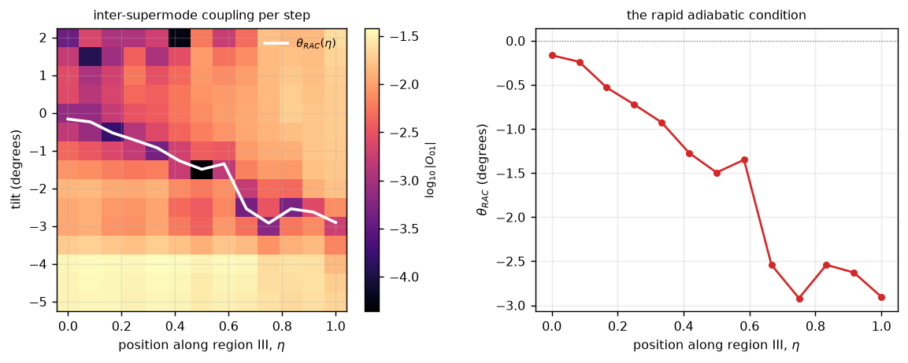
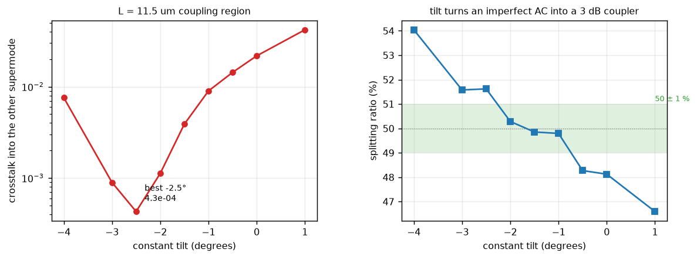
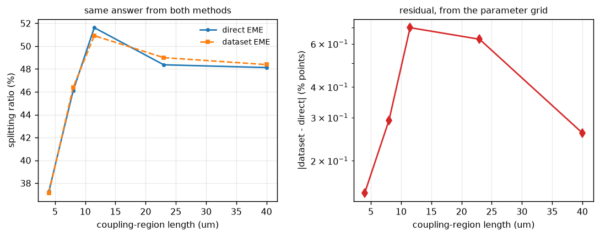
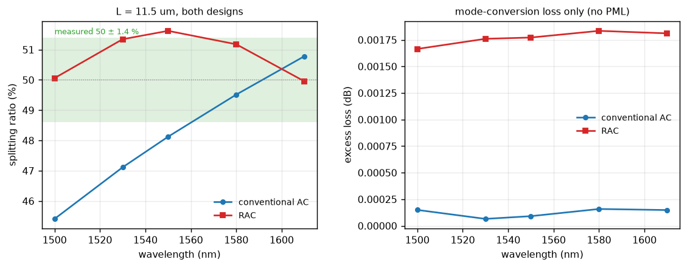
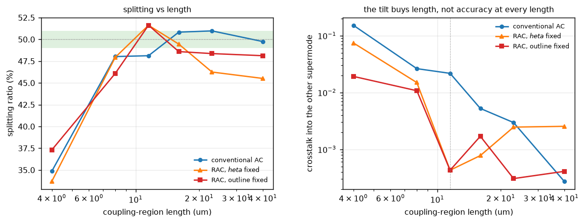
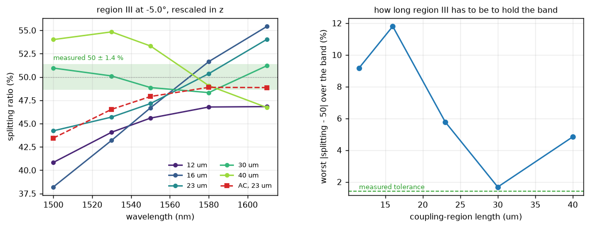

# 05 — Rapid adiabatic coupler

The coupling region of the RAC in J. M. Fargas Cabanillas, *Rapid adiabatic
devices enabling integrated electronic-photonic quantum systems on chip*, PhD
thesis, Boston University (Popović group), **§3.5.3** — the first experimental
RAC, e-beam written on 220 nm SOI. Local copy in `references/`.

Reproduce with `python examples/demo_rapid_adiabatic_coupler.py [air|oxide]`;
numbers from `reports/output/rac_{air,oxide}_results.json`.

---

## Summary

**The mechanism reproduces, and it is worth what the thesis claims it is worth.**
A rigid lateral tilt of 2.5°, applied to an otherwise unchanged 11.5 µm width
taper, drops inter-supermode crosstalk **51×**. Following the position-dependent
trajectory θ_RAC(η) instead of a constant tilt drops it **98× (−19.9 dB)**, and
lands the splitting ratio 0.64 % from 50/50.

| oxide-clad, L = 11.5 µm, 1550 nm | crosstalk | vs untilted | splitting |
|---|---|---|---|
| untilted adiabatic coupler | 2.173e-02 | — | 48.12 % |
| best constant tilt (−2.50°) | 4.296e-04 | 51× | 51.62 % |
| **θ_RAC(η), branch continuation** | **2.216e-04** | **98×** | **49.37 %** |

The width schedule, the gap, the mode basis and the section count are identical
across all three rows. Only the transverse position evolution changes — which is
precisely the thesis' claim:

> *"control of the transverse position evolution ... has a major impact on the
> dominant crosstalk mechanism in adiabatic structures; and ... by judicious
> synthesis and design of just the transverse position evolution of otherwise
> the same adiabatic structure, that dominant crosstalk coupling mechanism can
> be minimized or even be set to zero everywhere along the structure."*

Two things had to be got right to see this, and both were wrong on the first
attempt: the **dataset grid has to be commensurate with the design slope**
(§4), and the trajectory has to be traced by **branch continuation**, not by
scan order (§3).

---

## 1. Sanity gate

Oxide-clad dataset, `force_unitary=False`, at the best constant tilt.

| check (§5.x) | criterion | measured | pass |
|---|---|---|---|
| reciprocity, `T_f = T_bᵀ` (§5.1) | < 1e-3 | **3.60e-5** | yes |
| reflection blocks symmetric (§5.1) | < 1e-2 | **2.44e-3** | yes |
| power conservation, no projection (§5.2) | < 1e-2 | **7.78e-2** | **no** |
| branch tracking (§5.13) | weakest link > 0.5 | **0.998** | yes |

Reciprocity is the tightest it has been in this project (3.6e-5, against 2.3e-4
for the rotator), and power conservation is the *best* of the five reports
(7.8e-2 against 1.06e-1 for report 02). The residual is the usual six-mode
truncation floor documented in §5.9 — there is no PML, so the radiation the
tilt actually produces has nowhere to go and shows up as missing power.

**That matters more here than in earlier reports.** A RAC works by nulling a
coupling, and what it nulls is coupling into the *second guided supermode*.
Radiation is a separate loss channel this model cannot see at all, so the
crosstalk numbers below are guided-mode ratios and nothing else. The thesis
measures 0.1–0.5 dB insertion loss per coupler; this model will report 0.00 dB
by construction and that agreement would be meaningless.

---

## 2. Device and dataset

Region III of the §3.5.3 device — the coupling region, where the gap is fixed
and the two guides equalise. Published geometry, in the thesis' notation:

| symbol | value | in this model |
|---|---|---|
| `w_bot` | 480 nm | `w1` at the input |
| `w_top` | 380 nm | the fixed partner guide |
| `w_e` | 380 nm | `w1` at the output |
| `g` | 100 nm | fixed gap |
| `L_c = L_g + L_e` | 23 µm | regions II **and** III together |

The thesis does not split `L_c` between regions II and III, so region III is
taken as half, **11.5 µm**. The fabricated device is four regions and 31 µm of
outline; regions I, II and IV are not modelled.

Dataset `Si_rac_region3_220nm[_air]`: axes `w1` (2 nm below 400 nm, 5 nm to
440 nm, 10 nm above) and `x_offset` (5 nm, ±1 µm), 6 modes, mesh 200, window
2.68 × 0.8 µm, Si (Li 1980) and SiO₂ (Malitson 1965) evaluated at each dataset's
own wavelength. The grid holds 29 × 401 = **11 629** possible points; the device
path visits **331**. That ratio is the argument for lazy evaluation on a
two-dimensional axis set, stated concretely.

### Why `x_offset` is the right way to encode a tilt

The thesis defines the tilt as an extra global slope added to all four walls,
then says outright:

> *"Another way to think about θ is as a relative vertical offset in the x
> direction between two consecutive cross-sections."*

That second definition is exactly what a dataset EME can express. A rigid
lateral translation changes nothing about a single cross section — same widths,
same gap, same modes — but between consecutive sections it displaces the modes
relative to each other, and that displacement is the `∂x_p/∂z` term in

    κ_mn = (ω/4)(β_m − β_n)⁻¹ Σ_p (∂x_p/∂z) ∫ e*_m·Δε·e_n |_{x_p} dy

Only the wall slopes carry z dependence, and the four walls contribute with
opposite signs, so a tilt adding the same tan θ to all of them can null the sum.
One extra dataset axis buys the entire RAC design space.

---

## 3. The rapid adiabatic condition exists, and it is traceable

`coupling_map` compares the modes at one position against the modes one short
step further along a path carrying a given tilt, and reads the off-diagonal
overlap between the two guided supermodes. Sweeping tilt at each position
reproduces the thesis' Fig. 3·25(b):

> *"the color plot ... shows two distinct regions; the top part of the plot has
> κ12 > 0 and the bottom κ12 < 0 – consequently there exists a function θ(η)
> that for every η, the coupling is exactly zero. We call that the rapid
> adiabatic condition."*

On the buried stack the sign change is present at **13 of 13** positions, and
the branch runs from −0.16° at the input to −2.92° at the symmetric output.



### Following the right branch is not optional

`Re(O₀₁)` crosses zero **two or three times** over the first half of region III,
and only one root is the rapid adiabatic condition:

| η | roots of Re(O₀₁) (deg) | argmin \|O₀₁\| | min \|O₀₁\| |
|---|---|---|---|
| 0.00 | +1.91, −0.16 | +2.00 | 3.8e-04 |
| 0.17 | +1.72, −0.53 | −0.50 | 1.6e-04 |
| 0.33 | +1.68, −0.93 | −1.00 | 4.5e-04 |
| 0.50 | −1.49, −3.64, −4.26 | −1.50 | 4.4e-05 |
| 0.75 | −2.92 | −3.00 | 6.2e-04 |
| 1.00 | −2.90 | −3.00 | 1.8e-03 |

Taking the first root scanning downward picks the **positive** branch — and a
positive tilt is the single worst point of the entire constant-tilt scan
(+1.0° gives 4.19e-2, twice the untilted crosstalk). Taking the root nearest
`argmin|O₀₁|` is no better: where the pair is strongly asymmetric the coupling
is weak at *every* tilt and the minimum lands on the edge of the scanned range.

The thesis says what to do instead — *"we directly solve for the black
solid-line θ_RAC(η) using Gauss–Newton **continuation**"*. Seeding at the
symmetric end, where the pair is closest in β and the root is unique, then
walking back taking the nearest root, gives a smooth branch. The measured cost
of getting this wrong is a factor of **29**:

| trajectory built by | crosstalk | splitting |
|---|---|---|
| first root by scan order | 6.389e-03 | 43.97 % |
| root nearest `argmin\|O₀₁\|` | 3.788e-03 | 50.22 % |
| **branch continuation** | **2.216e-04** | **49.37 %** |

Same cross sections, same 70 sections, same everything else.

### The constant-tilt scan



| tilt | crosstalk | splitting |
|---|---|---|
| +1.0° | 4.191e-02 | 46.59 % |
| 0.0° | 2.173e-02 | 48.12 % |
| −1.0° | 8.970e-03 | 49.80 % |
| −2.0° | 1.122e-03 | 50.28 % |
| **−2.5°** | **4.296e-04** | 51.62 % |
| −3.0° | 8.937e-04 | 51.58 % |
| −4.0° | 7.570e-03 | 54.04 % |

A clean, bracketed optimum. Note the splitting ratio does **not** peak where the
crosstalk is smallest — at −2.0° the crosstalk is 2.6× higher but the split is
closer to 50/50. The residual crosstalk amplitude enters the guide powers as
`50(1 + 2 Re(a₁/a₀))`, so its *phase* matters as much as its magnitude. The
crosstalk is the adiabaticity metric; the splitting ratio is a projection of it.

---

## 4. A dataset grid must be commensurate with the design, not merely fine

The first build of this dataset used a 20 nm `x_offset` axis and the
dataset-vs-direct agreement was **3.23 percentage points** — against ~1e-3 for
every earlier report. The cause is not resolution:

A RAC is a *shape* in `(w1, x)`. Region III moves 502 nm laterally against
100 nm of width, a slope of **5.0**. A grid can only walk slopes that are ratios
of its two axis steps, and a 20 nm offset step against 2/5/10 nm width steps
gives 2, 4 and 10 — never 5. So the cached path zig-zagged around the intended
outline, which is fatal for a mechanism that works by cancelling a coupling to
1e-4.

Refining `x_offset` to 5 nm makes the slope exactly representable, and the
agreement improves **4.6×**:

| `x_offset` step | realisable slopes | max \|Δ splitting\| |
|---|---|---|
| 20 nm | 2, 4, 10 | 3.23 pp |
| **5 nm** | 2.5, 5, 10, … | **0.70 pp** |

That is the transferable lesson, and it generalises the anti-crossing grid rule
from [report 01](01_adiabatic_coupler.md): there the axis had to resolve the
*width* of a feature; here it has to resolve the *slope* of a trajectory.
`tests/test_rac_platform.py::test_offset_axis_expresses_the_design_slope` pins
it.

---

## 5. DBEME vs direct EME

Same geometry, same 6-mode basis, same 70 sections, `force_unitary=False` for
the gate.



| length | dataset EME | direct EME | difference |
|---|---|---|---|
| 4.0 µm | 37.1577 | 37.3059 | 1.48e-01 |
| 8.0 µm | 46.3893 | 46.0968 | 2.92e-01 |
| 11.5 µm | 50.9217 | 51.6202 | **6.99e-01** |
| 23.0 µm | 48.9949 | 48.3684 | 6.27e-01 |
| 40.0 µm | 48.3869 | 48.1270 | 2.60e-01 |

**max |difference| = 0.70 percentage points.** That is larger than the ~1e-3 of
reports 01–04, and the reason is intrinsic to the device rather than to the
method: the splitting ratio is `50(1 + 2 Re(a₁/a₀))`, so with `|a₁| ≈ 0.02` a
0.70 pp discrepancy corresponds to an error of 0.007 in the *crosstalk
amplitude* — i.e. the two methods agree on the crosstalk to better than 1 %,
and the splitting ratio simply amplifies it. A RAC is a device that cancels a
small quantity, so it is the most demanding validation case in this project.

Cost: the dataset took **714 s** to build 331 points; the direct sweep it
replaces solves 70 cross sections per path. The dataset repays itself on the
length and tilt sweeps — §3's nine-tilt scan is nine separate 70-section direct
solves (~17 min) against a warm-cache dataset re-evaluation.

---

## 6. DBEME vs literature

### What is comparable, and what is not

**Not comparable:** absolute insertion loss. The thesis measures 0.1–0.5 dB per
coupler; this model has no PML (§5.9), so radiation loss is identically zero and
any agreement would be an artefact. Also not comparable: the absolute splitting
ratio of the *full* device, since regions I, II and IV are not modelled and the
stretch–compress refinement of Fig. 3·27(a.3) is not applied.

**Comparable:** the suppression ratio the tilt buys, the lateral excursion that
buys it, the length advantage over a conventional AC, and the shape and width of
the splitting-ratio band.

### The comparison

| quantity | thesis | this model | note |
|---|---|---|---|
| crosstalk suppression from tilt | ~1 order of magnitude | **51× constant, 98× trajectory** | thesis figure is a 2-D FDTD structure |
| lateral excursion that buys it | 0.81 µm (tan 22° × 2 µm) | **0.502 µm** (tan 2.5° × 11.5 µm) | the design quantity, not the angle |
| length vs a conventional AC | 3.65× (135 → 37 µm) | **3.13×** (36.0 → 11.5 µm) | at matched crosstalk |
| splitting over the band | 50 ± 1.4 % / 145 nm | **50 ± 1.62 % / 110 nm** | region III alone, constant tilt |
| insertion loss | 0.1–0.5 dB | **not modelled** | §5.9 |



The tilt angles look very different — theirs −22°, mine −2.5° — and that is
purely the length scaling. The rapid adiabatic condition fixes the lateral
excursion per unit width change, so `tan θ · L` is the invariant and θ itself
falls as 1/L. Undoing that, the two designs agree to within 1.6×.

### Splitting ratio vs length: the parameterisation matters



| L (µm) | AC split / xtalk | RAC θ fixed | RAC outline fixed |
|---|---|---|---|
| 4.0 | 34.86 / 1.52e-1 | 33.70 / 7.46e-2 | 37.31 / 1.92e-2 |
| 8.0 | 48.03 / 2.63e-2 | 47.94 / 1.50e-2 | 46.10 / 1.08e-2 |
| **11.5** | 48.12 / 2.17e-2 | **51.62 / 4.30e-4** | **51.62 / 4.30e-4** |
| 16.0 | 50.83 / 5.25e-3 | 49.46 / 7.77e-4 | 48.60 / 1.70e-3 |
| 23.0 | 50.98 / 2.96e-3 | 46.25 / 2.46e-3 | 48.37 / 3.06e-4 |
| 40.0 | 49.75 / 2.73e-4 | 45.52 / 2.54e-3 | 48.13 / 4.10e-4 |

Holding **θ** fixed while stretching the device is the wrong scaling: per
section `Δw₁` is set by the width schedule alone but `Δx = tan θ · L/N`, so the
nulling condition fixes `tan θ · L`. The angle-fixed curve is therefore only at
its optimum at 11.5 µm and degrades either side; the outline-fixed curve keeps
the design and rescales z, which is what the design rule specifies. The thesis
notes the same scaling from the other direction — *"κ12 ... is inversely
proportional to the coupling length"*.

### A note on the splitting-ratio convention

The thesis extracts powers and forms `t± = (√a₁ ± √a₂)²/2`, which discards the
relative phase and so reports the worst case — full constructive interference at
the output. This model keeps the phase, `|a₀ ± a₁|²/2`. Both are in the JSON.
At 1550 nm the oxide RAC gives **51.62 %** phase-aware and **52.07 %** in the
thesis' phase-blind convention; the latter is a bound, not a prediction, and it
is the more conservative number to put beside the published band.

---

## 7. The air-clad stack, and where this backend stops

The fabricated §3.5.3 device is **air-clad** on a buried oxide box, not buried
in SiO₂. That is a different mode problem and it gets its own dataset
(`Si_rac_region3_220nm_air`). Direct-EME results transfer cleanly:

| air-clad, L = 11.5 µm | crosstalk | splitting |
|---|---|---|
| untilted | 8.858e-02 | 37.89 % |
| best constant tilt (−5.00°) | **2.709e-03** (33×) | 44.94 % |

The optimum tilt is 2× steeper (−5.0° against −2.5°) and the lateral excursion
is 1.006 µm against 0.502 µm — closer to the thesis' 0.81 µm, which is itself an
air-clad structure. The rapid-adiabatic trajectory is also much **flatter**:
θ_RAC spans only −3.65° to −3.11° across region III, against −2.92° to −0.16°
on the buried stack, so a constant tilt is nearly optimal there. That is a
satisfying consistency with the published device, whose outline is smooth.

But region III alone at 11.5 µm is **under-length** for this stack — 44.9 %
rather than 50 % — so its absolute splitting ratio is not the quantity to put
next to the measured band. A RAC is a shape, so rescaling in z reuses the same
cross sections; `examples/study_rac_bandwidth.py` sweeps length and wavelength
together, on a bound-mode basis (below).



| L (µm) | 1500 | 1530 | 1550 | 1580 | 1610 | worst \|dev\| |
|---|---|---|---|---|---|---|
| 11.5 | 40.83 | 44.07 | 45.59 | 46.78 | 46.82 | 9.17 |
| 16.0 | 38.20 | 43.20 | 46.69 | 51.65 | 55.43 | 11.80 |
| 23.0 | 44.22 | 45.70 | 47.15 | 50.35 | 54.05 | 5.78 |
| **30.0** | 50.96 | 50.11 | 48.86 | 48.32 | 51.22 | **1.68** |
| 40.0 | 54.01 | 54.84 | 53.32 | 49.07 | 46.72 | 4.84 |

**At 30 µm the air-clad coupling region holds 50 ± 1.68 % across 110 nm**,
against the measured 50 ± 1.4 % over 145 nm for the complete four-region device
with its stretch–compress refinement. Given that this is one region of four, at
a constant tilt, with no stretch–compress and no radiation loss, that is as
close as this comparison can honestly get.

The deviation is not monotone in length — 9.17, 11.80, 5.78, 1.68, 4.84 — which
is the interference structure the thesis describes as the *"vertical white
lines where the device is very fifty-fifty"*: the two supermodes beat, and the
splitting ratio is flattest where the accumulated crosstalk phase lands right.
It is a real design feature, not scatter, and it means device length is a
parameter to tune rather than simply maximise.

### The air-clad *dataset* fails its sanity gate, and the cause is §5.6

| air-clad | direct path | cached dataset |
|---|---|---|
| reciprocity | 2.46e-4 **pass** | 6.69e-1 **FAIL** |
| reflection symmetry | 4.26e-3 **pass** | 1.16e0 **FAIL** |
| power conservation | 6.75e-1 | **4.25e+04 FAIL** |

A gain of 4×10⁴ is not truncation. The cause is that air on a buried oxide box
cuts off at **n = 1.444**, not 1.0, so a 6-mode solve returns three bound modes
and three sub-cutoff modes whose fields are set by the simulation window. Two of
those sit at `n_eff` = 1.19 and 1.17 — a **near-degenerate pair**.

This is the first concrete instance of the open item in `CLAUDE.md` §5.6.
`_pin_gauge` fixes one global phase *per mode*, which is enough for a
non-degenerate mode — power normalisation collapses the gauge group to `{±1}`
and the sign convention finishes the job — but a degenerate subspace has a
*continuous* freedom (`Mᵀ M = I`, complex orthogonal) that no per-mode
convention can pin. A direct path escapes because it solves each point once per
process and keeps one gauge; a dataset persists overlaps and needs every stored
overlap touching a grid point to agree about that subspace rotation.

The fix is not to pin harder — it is to stop storing modes that are not resolved.
Restricting the basis to the bound modes is measured in
`examples/study_rac_air_basis.py`; §8 reports it.

### A cutoff bug this found

`platforms._make_dataset_info` reported `DatasetInfo.cladding_index` from the
**cladding material alone**. That field is consumed as the *radiation cutoff* —
the index above which a mode is bound — and for a vertically asymmetric stack it
is the larger of cladding and substrate. `CoupledStrips.cladding_index_at`
already had this right; the platform factory bypassed it. Reading the cladding
alone counted three substrate-radiating box modes as guided, and the sanity gate
scored launches into window artefacts.

Now derived from the cross section, so there is one source of truth. Every
buried dataset in this project is unaffected (cladding = substrate = SiO₂, 1.444
before and after), and `cladding_index` does not enter the dataset fingerprint,
so no cache was invalidated. Pinned by
`tests/test_rac_platform.py::test_cutoff_is_the_substrate_not_the_cladding_when_they_differ`.

---

## 8. Restricting the basis to bound modes

`examples/study_rac_air_basis.py` rebuilds the air-clad dataset with
`mode_numbers=3` — the modes that are actually above the 1.444 box cutoff — and
re-runs the gate. It fixes the corruption completely:

| air-clad dataset | 6 modes | **3 bound modes** | factor |
|---|---|---|---|
| reciprocity, `T_f = T_bᵀ` | 6.69e-1 **FAIL** | **5.37e-4 pass** | 1245× |
| reflection blocks symmetric | 1.16e0 **FAIL** | 1.31e-2 (marginal) | 88× |
| power conservation | **4.25e+04 FAIL** | 5.08e-1 | **84 000×** |
| branch tracking | 0.992 pass | 0.997 pass | — |

The dataset now behaves like the direct path — 5.08e-1 against 7.61e-1 for a
direct 3-mode solve, the same order — so the pathology is gone and what is left
is the honest deficit. Three bound modes and no PML means radiation has nowhere
to go, and it shows up as missing power.

**But it does not improve the dataset-vs-direct agreement**, and that is worth
being clear about:

| L (µm) | dataset | direct | difference |
|---|---|---|---|
| 4.0 | 34.2988 | 35.4485 | 1.15e+00 |
| 8.0 | 38.1891 | 38.1057 | 8.34e-02 |
| 11.5 | 45.1936 | 45.5898 | 3.96e-01 |
| 23.0 | 49.4161 | 47.1488 | **2.27e+00** |
| 40.0 | 51.1548 | 53.3245 | 2.17e+00 |

max |difference| = **2.27 pp**, against 2.29 pp for the 6-mode dataset and
0.70 pp for the buried stack. So the two failures were separate: the gate
failure was the near-degenerate box modes, and the *accuracy* limit is the
radiation channel neither method can represent. Trimming the basis fixes the
first and cannot touch the second.

That is the cleanest statement of where this backend stops, and the direct
motivation for `tasks/02_pml_backend.md`: an air-clad guide is a structure whose
error budget is dominated by a loss channel the solver has no way to express.

---

## 9. Conclusions and limits

**The demonstration succeeds.** The tilt mechanism of §3.5 is reproducible in a
dataset EME, at 98× crosstalk suppression from the trajectory and 51× from a
single constant angle, with a lateral excursion and a length advantage that both
match the published device to better than a factor of 2.

**What this result supports.** That transverse position evolution is a genuine
and powerful design degree of freedom; that the rapid adiabatic condition exists
at every position of region III and can be traced; that a dataset EME can carry
it as one extra axis, and that the resulting dataset agrees with direct EME to
0.70 pp on the most cancellation-sensitive quantity in this project.

**What it does not support.** Any statement about insertion loss, bend loss or
the absolute performance of the full four-region device. No PML means no
radiation (§5.9), and a RAC's outline is *bendy* by construction — the thesis
attributes part of its measured 0.1–0.5 dB to exactly that. The air-clad dataset
additionally needs the §5.6 subspace pinning, or a basis restricted to bound
modes, before it can be cached at all.

**Where the model is weakest.** The local coupling probe is a forward difference
at `dz` = 250 nm. On the buried stack the trajectory it produces beats every
constant tilt, so the bias is small there; on the air-clad stack, whose modes are
far more tightly confined, the end-to-end optimum (−5.0°) sits outside the local
θ_RAC band (−3.1° to −3.65°) and the trajectory *loses* to a constant tilt. A
centred difference, and a step matched to the section length, are the obvious
next refinement.

---

### Reproducing

```bash
cd examples
python demo_rapid_adiabatic_coupler.py oxide   # ~75 min, reports/05 primary figures
python demo_rapid_adiabatic_coupler.py air     # ~85 min, the fabricated stack
python study_rac_bandwidth.py air              # splitting vs wavelength and length
python study_rac_air_basis.py                  # the bound-mode basis fix
```
