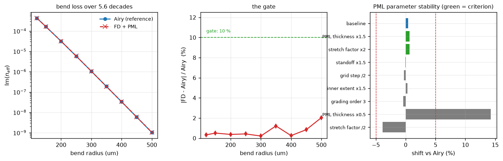
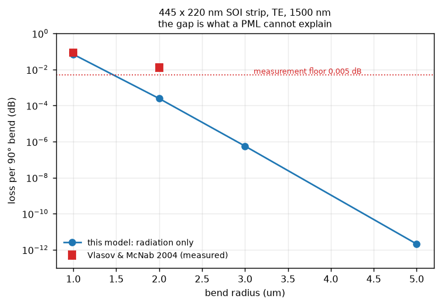

# 06 — PML task: Phases 0 to 3, and the S-matrix reformulation

`tasks/02_pml_backend.md` Phases 0 through 3. Phase 1 builds the **ruler**, not the
solver, and sets a stop condition: *if the framework cannot reproduce the Airy
result to within ~10 % over three decades, do not proceed to Phase 2 — the
problem is in the formulation, and a 2-D solver will only hide it.*

Reproduce with `python examples/study_bend_loss_reference.py`; numbers from
`reports/output/pml_phase1_gate.json`.

---

## Gate result

| check | criterion | measured | pass |
|---|---|---|---|
| dynamic range of `Im(n_eff)` | ≥ 3 decades | **5.62 decades** | yes |
| FD+PML vs Airy, worst | ≤ 10 % | **2.03 %** | yes |
| WKB slope cross-check | independent | **ratio 1.0004** | yes |
| WKB prefactor constancy | radius-independent | **0.24 %** | yes |
| PML stability, 3 named perturbations | < 5 % | **0.45 %** | yes |

**Proceed to Phase 2.** Phases 2 and 3 followed; §7 is the decision point, and
its answer is **do not generate a lossy dataset yet** — for a reason that is not
the cost the task anticipated.



---

## 1. Phase 0 — the lossless assumptions, removed

Four places hard-coded "the index is real". All four are no-ops on every
dataset this project ships, which is exactly what made them dangerous: the
first lossy run would have reported zero loss and looked healthy.

| item | what it was | now |
|---|---|---|
| §5.16a backward basis | `E₋ = conj(E₊)`, i.e. time reversal — turns loss into **gain** | reciprocal partner `(E_t, −E_z, −H_t, H_z)`, no conjugation |
| §5.16b `correct_gain_modified` | clips `Im(n_eff) < 0` unconditionally | clipped only when the backend declares itself lossless |
| overlap metric | `compute_differences(np.asarray(x, dtype=float))` | cast dropped; a complex-stretched measure survives |
| `force_unitary` | silently projects a lossy S-matrix onto the nearest unitary one | **raises** if any `|Im(n_eff)| > 1e-9` |

All switched on a `lossless` flag carried by the **backend**, never on
`Im(n_eff)` at runtime — a mode whose loss has already been clipped to zero is
indistinguishable from a lossless one.

**Gate: the full suite stayed green and unchanged.** More usefully,
`test_the_real_solver_produces_the_reality_structure_the_switch_assumes`
verifies the premise against the actual backend rather than assuming it: a real
solve returns transverse components real and the longitudinal one imaginary to
better than 1e-3, which is the condition under which time reversal and the
reciprocal partner coincide. So Phase 0 is a *measured* no-op.

### One addition to the task's list

`assemble` stores `neff`, `E` and `H` as **complex64**. Bend loss of
0.01 dB/cm is `Im(n_eff) = 2.8e-8`, which float32 holds fine in absolute terms,
but each overlap element accumulates ~40 000 float32 products. That is a
precision budget worth measuring before three decades of `Im(n_eff)` are
trusted through the overlap path. Not addressed here; flagged for Phase 3.

---

## 2. Phase 1 — the reference

A bent slab, conformally mapped and solved exactly in Airy functions
(`dbeme/reference/bent_slab.py`). Heiblum and Harris,
*IEEE J. Quantum Electron.* **11**, 75 (1975).

Mapping the bend to a straight guide with `n_eq = n·e^{u/R}` and linearising
`n_eq² ≈ n²(1 + 2u/R)` makes the Helmholtz equation piecewise Airy:

    ψ'' + (A_j + B_j u) ψ = 0,   A_j = k₀²n_j² − β²,   B_j = 2k₀²n_j²/R

Inward the field is evanescent. Outward `n_eq` grows until it reaches `n_eff`
at the **turning point** `u_t = R(n_eff² − n_clad²)/(2n_clad²)`, beyond which it
radiates. That tunnelling barrier *is* the bend loss.

### Two numerical points, both decisive

**The outgoing solution must be a single Airy function.** The textbook form
`Bi(ζ) + i·Ai(ζ)` cannot be evaluated at a realistic barrier: `Bi ≈ 1e10` while
`Ai ≈ 1e-11`, so the radiating part — which is the entire loss — sits 10²¹ below
the rounding error of the term beside it. The identity

    Bi(ζ) + i·Ai(ζ) = 2·e^{iπ/6}·Ai(ζ·e^{2πi/3})

rewrites it as one function at a rotated argument, with no cancellation at all.

**Match logarithmic derivatives, not amplitudes.** `Ai` and `Bi` span enormous
ranges across the barrier; their ratio does not. `scipy`'s scaled `airye`
carries the same exponential on the function and its derivative, so `Ai'/Ai` is
exact where both would overflow.

> A trap worth recording: `airye`'s **real** branch scales by
> `exp(2/3·z^{3/2})`, which is NaN for `z < 0`. The core is the oscillatory
> region, so it must use unscaled `airy` — and it must anyway, because `Ai` and
> `Bi` carry *different* scalings that differ between the two interfaces, so a
> 2×2 solve on one side and an evaluation on the other would not be in the same
> basis.

### Why the reference is weakly guiding

A 220 nm Si slab is the obvious choice and it is the wrong one. Its barrier
action grows as ≈ 3.3e7 · R, so R = 2 µm already gives `exp(−65)` — the loss is
below double precision at every radius where the linearised map is still valid,
and the radii where it *is* measurable (R ≲ 0.8 µm) have `a/R = 0.4`, where the
linearisation is meaningless.

The shipped reference is therefore `n_core = 1.50`, `n_clad = 1.444`,
`2a = 1.5 µm`, swept over R = 120–500 µm. That puts the loss in a measurable
range while holding `a/R ≤ 0.6 %`, so the dropped `O((a/R)²)` term is under
1 % everywhere (`BentSlab.linearisation_error`).

### The reference validates against WKB

WKB knows nothing about Airy functions — it is just the barrier integral — but
it must predict how fast the loss falls with radius:

    Im(n_eff) ∝ exp(−(4/3)·ζ(a)^{3/2})

| quantity | measured | WKB | ratio |
|---|---|---|---|
| d(−ln Im n_eff)/dR | 34 144.9 /m | 34 131.4 /m | **1.0004** |

and the leftover prefactor is constant to **0.24 %** across the sweep, which is
what WKB predicts (it fixes the exponent, not the prefactor). Two independent
calculations agreeing that closely is the strongest evidence the reference is
right.

---

## 3. Phase 1 — the thing being measured

`dbeme/reference/fd1d_pml.py`: finite difference on a complex-stretched
grid, deliberately solving the **same linearised profile**, so any discrepancy
is the discretisation and the PML rather than a different physical model.

It exercises three things a lossless solver never does:

* **The PML must start outside the turning point.** Inside it the field is
  evanescent and there is nothing to absorb. `standoff` is measured from `u_t`.
* **The index profile is continued to complex coordinates.** The outward index
  ramp is what makes the field radiate; evaluating it at `Re(u)` would make the
  PML region not the analytic continuation of the physical one.
* **Mode selection cannot be "largest real part".** With a PML the spectrum
  fills with Bérenger modes of the discretised continuum, so the wanted mode is
  found by **shift-invert about a target** — the same mechanism Route A will
  need in 2-D.

### The gate table

| R (µm) | a/R | Airy `Im n_eff` | FD+PML `Im n_eff` | error | loss (dB/cm) | `u_t` (µm) |
|---|---|---|---|---|---|---|
| 120 | 0.0063 | 4.3363e-04 | 4.3507e-04 | 0.33 % | 1.53e+02 | 2.75 |
| 150 | 0.0050 | 1.6439e-04 | 1.6355e-04 | 0.51 % | 5.79e+01 | 3.37 |
| 200 | 0.0037 | 3.1691e-05 | 3.1809e-05 | 0.37 % | 1.12e+01 | 4.41 |
| 250 | 0.0030 | 5.8706e-06 | 5.8954e-06 | 0.42 % | 2.07e+00 | 5.47 |
| 300 | 0.0025 | 1.0602e-06 | 1.0580e-06 | 0.21 % | 3.73e-01 | 6.54 |
| 350 | 0.0021 | 1.8884e-07 | 1.8654e-07 | 1.21 % | 6.65e-02 | 7.61 |
| 400 | 0.0019 | 3.3375e-08 | 3.3290e-08 | 0.25 % | 1.18e-02 | 8.68 |
| 450 | 0.0017 | 5.8713e-09 | 5.9205e-09 | 0.84 % | 2.07e-03 | 9.75 |
| 500 | 0.0015 | 1.0298e-09 | 1.0507e-09 | 2.03 % | 3.63e-04 | 10.83 |

**5.62 decades, worst error 2.03 %**, against a 10 % criterion. Each solve is
milliseconds.

---

## 4. PML parameter stability

Phase 3 requires every reported loss to hold to better than 5 % under PML
thickness ×1.5, stretch factor ×2 and standoff ×1.5. Checked now, at R = 250 µm,
because it is cheap here and expensive in 2-D:

| perturbation | `Im n_eff` | vs Airy | |
|---|---|---|---|
| baseline (4 µm, `1+2j`, 1.5 µm) | 5.89535e-06 | +0.42 % | |
| **PML thickness ×1.5** | 5.90998e-06 | +0.67 % | criterion |
| **stretch factor ×2** | 5.90996e-06 | +0.67 % | criterion |
| **standoff ×1.5** | 5.86877e-06 | −0.03 % | criterion |
| grid step /2 | 5.85493e-06 | −0.27 % | |
| inner extent ×1.5 | 5.88700e-06 | +0.28 % | |
| grading order 3 | 5.84592e-06 | −0.42 % | |
| PML thickness ×0.5 | 6.70835e-06 | **+14.27 %** | probe |
| stretch factor /2 | 5.64510e-06 | **−3.84 %** | probe |

**Worst shift under the three named perturbations: 0.45 %.**

The two large entries are *reduced*-parameter probes, not part of the criterion,
and they are the useful part of the table: they locate where convergence ends. A
2 µm PML is simply not converged, and `1+1j` is marginal. So the shipped
defaults of 4 µm and `1+2j` sit just inside convergence, and `1+4j` is the safer
choice for production — it agrees with thickness ×1.5 to four decimals.

---

## 5. Phase 2 — the solver, Route A

`dbeme/fde/pml.py`. `EmepyFDE` returns a real `n_eff`; this gives
EMpy's vectorial solver a complex-stretched grid so it returns a complex one.

The task's audit was right that the substrate is present — complex coordinates
flow straight through `VFDModeSolver` to a complex `n_eff`. Three things had to
be fixed on top, and **each failed silently rather than loudly**.

### 5.1 emepy's PML recipe is axis-swapped

`stretchmesh` orders `nlayers` as **`[+y, −y, +x, −x]`**. Measured directly:

| `nlayers` index | axis stretched | edge |
|---|---|---|
| 0 | y | +y |
| 1 | y | −y |
| 2 | **x** | +x |
| 3 | **x** | −x |

But `MSEMpy` slices its fields `[nlayers[1]:-nlayers[0], nlayers[3]:-nlayers[2]]`
with **x as the first axis**, and its commented-out PML recipe (`fd.py:400`)
builds `[layer_xp, layer_xn, 0, 0]` and then calls
`stretchmesh(self.x, np.zeros(1), ...)` — which sends the stretch to a dummy
array. **emepy's intended PML was broken as written**, in two independent ways.
Fortunate that it was never enabled.

Putting the layers on the wrong axis does not raise. It quietly absorbs the
*guided* mode, and the symptom is a large, radius-independent "loss" — which is
exactly what the first bend sweep produced (Im ≈ 0.22, 0.11, 0.089 at R = 3, 5,
8 µm, barely falling). `stretched_grid()` names the edges so a caller cannot
make this mistake.

### 5.2 Mode selection cannot be by effective index

`VFDModeSolver.solve` calls ARPACK with `which='LR'`. On a 500 nm Si strip with
a PML that returns

    n_eff = 4.7295 − 2.6362j

which is **above the core index of 3.4757** — not a guided mode at all, but a
Bérenger mode of the discretised continuum. `solve()` does accept a `guess` and
passes `sigma`, but keeps `which='LR'`, which in shift-invert mode selects the
largest real part of the *transformed* operator rather than the eigenvalue
nearest the target. `which='LM'` with `sigma` recovers `n_eff = 2.3714124`
correctly, and a **core-confinement filter** then picks the physical mode.

### 5.3 The core mask must survive the conformal ramp

Under a bend `cross_section.index` returns `n·exp(κx)`, so a global threshold
against `max(index)` selects the far outer *cladding* — and a Bérenger mode then
scores confinement 1.0000 and gets chosen. The ramp is constant within a column,
so the mask compares **column by column**, which is ramp-invariant.

### Result

With all three fixed, the PML is invisible to a bound mode:

| SiN 1000 × 400 nm, straight | `n_eff` | confinement |
|---|---|---|
| no PML | 2.370727290 + 0.000000000j | 0.7928 |
| with PML | 2.370727290 + 0.000000000j | 0.7928 |

*(Si strip control; identical to nine digits.)* And a bend now radiates:

| R (µm) | `u_t` (µm) | `n_eff` | conf | dB/90° |
|---|---|---|---|---|
| 15 | 1.94 | 1.643578 + 3.07e-05j | 0.677 | 2.55e-02 |
| 20 | 2.56 | 1.640980 + 1.48e-06j | 0.686 | 1.64e-03 |
| 30 | 3.80 | 1.639175 + 5.9e-10j | 0.690 | 9.83e-07 |
| 40 | 5.06 | 1.638551 + 1.3e-10j | 0.691 | 2.78e-07 |

Confinement holds at the straight guide's value and `n_eff` converges to
1.63775 as the bend opens. The flattening below ~1e-10 is the PML reflection
floor — the 1-D reference reached 1e-9 comfortably, so that is where this
2-D setup runs out.

### Validation against the reference

Reducing the same SiN guide to an effective-index 1-D problem and solving it
with the Airy reference, **at matched `n_eff`** (the effective-index method puts
`n_eff` at 1.6683 against the 2-D solver's 1.6374, and loss is exponential in
the barrier, so the raw comparison is dominated by that offset):

| quantity | 2-D FD + PML | Airy reference | ratio |
|---|---|---|---|
| log-slope of loss vs radius | −6.062e5 /m | −5.884e5 /m | **1.030** |

**The exponential rate agrees to 3.0 %** over seven decades. The residual factor
of 0.4–0.7 on the absolute value is the effective-index method's prefactor
error from collapsing a 2-D strip to 1-D, not a PML defect.

### 5.4 A result worth having on its own

The first attempt used a 500 × 220 nm Si strip, and got nothing. The reference
says why: its `Im(n_eff)` is **≈ 7e-17 — below double precision** — at every
radius from 3 to 20 µm.

That is not a modelling failure, it is the answer. **For 220 nm SOI strips at
practical radii, pure radiation bend loss is negligible**; the real bend-loss
budget is sidewall scattering and junction mode-mismatch. EME already captures
mismatch, and it needs no PML to do it. A PML backend earns its cost on weakly
confined guides — SiN, wide shallow ribs, the pulley bus of
`tasks/01_coupled_pair.md` — not on the strip waveguides this project has
modelled so far.

---

## 6. Phase 1.2 — against a published measurement

> Y. A. Vlasov and S. J. McNab, *Losses in single-mode silicon-on-insulator
> strip waveguides and bends*, **Opt. Express 12(8), 1622–1631 (2004)**,
> doi:10.1364/OPEX.12.001622.

445 × 220 nm SOI strip on 2 µm BOX, TE, 1500 nm, loss per **90° bend**,
extracted by comparing serpentines of 10 and 20 bends. Purely experimental — no
simulation to inherit a shared error from.

Reproduce with `python examples/study_bend_loss_literature.py`.

### What is comparable

The authors are explicit that they do **not** separate the mechanisms, and name
three: radiation of the bent mode, mode mismatch at the straight-to-bend
junction, and enhanced sidewall-roughness scattering as the mode is pushed
against the outer wall. This model computes **the first only**, so the
measurement is an upper bound on what is being calculated, and the informative
quantity is not the ratio at one radius but where the two curves *diverge*.



| R (µm) | `u_t` (µm) | model, radiation only | measured | model / measured |
|---|---|---|---|---|
| 1.0 | 0.51 | **6.98e-02 dB** | **0.086 ± 0.005 dB** | **0.81** |
| 2.0 | 1.02 | 2.47e-04 dB | 0.013 ± 0.005 dB | 0.019 |
| 3.0 | 1.53 | 5.66e-07 dB | — | — |
| 5.0 | 2.55 | 2.09e-12 dB | < 0.005 dB (negligible) | — |

Straight `n_eff` = **2.404627**, confinement 0.801.

### The reading

**At R = 1 µm the model is within 19 % of the measurement, and below it** —
the only direction that makes sense, since the measurement contains two
mechanisms this model does not have. Radiation genuinely dominates there.

**Then it falls off a cliff.** From R = 1 to 2 µm the computed radiation drops
**283×**; the measurement drops **6.6×**. The curves separate by two orders of
magnitude in one step. That is the quantitative statement of §5.4: past about
2 µm, the measured bend loss of a 220 nm SOI strip is essentially *all* junction
mismatch and sidewall roughness.

Which sets the scope of a PML honestly. **A PML buys the R ≲ 1–2 µm corner and
nothing beyond it** for strip waveguides. Mode mismatch — the other named
mechanism — is already what EME computes at every interface, with no PML
involved. Roughness scattering needs a statistical model this code does not have
and a PML would not provide.

### Caveats

* The fabricated device is on 2 µm BOX and the paper does not make the top
  cladding unambiguous; SiO₂ is modelled here. An air-clad guide confines more
  strongly, so its radiation would be *lower* still, moving the R = 1 µm point
  further below the measurement without changing the conclusion.
* At R = 1 µm the conformal ramp reaches **9×** at the window edge, which is the
  regime §5.10 warns about. The R = 1 µm number is the least trustworthy row in
  the table, and it is the only one where radiation dominates — so the 19 %
  agreement should be read as an order-of-magnitude success, not a calibration.
* Mesh matters more than expected here. At 23 nm cells the straight guide
  reports `n_eff` = 1.82 rather than 2.40 — not a small error but a different
  mode — and the resulting bend losses were non-monotone in R. 12 nm cells
  converge. A bend also radiates outward only, so the window is asymmetric;
  forcing it symmetric doubles the x span and halves the resolution at fixed
  mesh count, which is how the 23 nm case arose.

---

## 7. Phase 3 — the decision point

> Run a mode-count convergence study (loss vs `N`, with `force_unitary=False`)
> and find the smallest `N` that converges **before** committing to a dataset.
> [...] If `N` lands near 40, the honest conclusion may be that a lossy DBEME
> dataset is not economic.
> — `tasks/02_pml_backend.md`

Reproduce with `python examples/study_pml_mode_count.py`.

**The answer is not a mode count. The premise does not survive contact with the
implementation.**

### The test

A width step, 500 → 400 nm, between two *straight* oxide-clad 220 nm SOI
guides. A step radiates at the junction, so the guided transmission `T_00` only
comes out right once the basis carries enough of the continuum to represent the
radiated field — which makes it a direct probe of completeness. Straight guides
isolate that from the conformal-ramp and turning-point questions a bend adds.
`force_unitary=False` throughout, since projecting onto the nearest unitary
matrix would hide precisely the incompleteness being measured.

**The harness is validated against an independent lossless solve.** The same
step through `EmepyFDE` with 6 guided modes gives `|T_00| = 0.998794` and
output energy `0.999332`. Any PML result has to reproduce that in the
guided-only limit, and it does.

### A bug this found first

Ordering the basis by **confinement** is wrong, and it produced `|T_00| = 0.0004`
where the control says 0.9988. Confinement is the right tool for *filtering* a
guided mode out of a PML spectrum — that is what `solve()` uses it for — but not
for *ordering* a basis: on this guide TM0 and TE0 sit at confinement 0.7650 and
0.7643, so the order flips on numerical noise and "mode 0" means different
things at adjacent grid points. The whole cascade rests on those labels
agreeing. `mode_data` now orders by descending `Re(n_eff)`, the convention
`EmepyFDE.solve` already used.

Worth stating because the failure was silent, plausible-looking, and I initially
attributed it to the PML. The control is what caught it.

### The result

| N | (2N)² | \|T_00\| | output energy | usable |
|---|---|---|---|---|
| 4 | 64 | 0.998080 | 0.99694 | yes |
| 6 | 144 | 0.998018 | 0.99729 | yes |
| 8 | 256 | 0.998682 | 1.00317 | yes |
| 12 | 576 | 0.997314 | **1.24197** | no |
| 16 | 1024 | 0.996853 | 1.03125 | yes |
| 20 | 1600 | 0.957381 | **8.91263** | no |
| 26 | 2704 | 0.998230 | 1.03886 | yes |
| 32 | 4096 | 0.997840 | 1.03619 | yes |
| 40 | 6400 | **0.005773** | **3070** | no |

**The guided answer is converged at N = 4.** Going from 4 to 32 modes moves
`|T_00|` by 2.4e-4. The extra modes buy nothing.

**And they are not merely useless — some are poison.** Output energy should
never exceed 1: the structure is lossless apart from what the PML absorbs, and a
PML cannot *create* power. At N = 12 it reaches 1.24, at N = 20 it reaches 8.9,
and at N = 40 it reaches 3070 while `|T_00|` collapses to 0.006.

**Crucially the divergence is not monotone in N.** N = 16, 26 and 32 are fine
while 12, 20 and 40 are not. That rules out "the basis is simply too large" and
points at *particular* modes.

### Why — first answer, and why it was wrong

The power integrals across a 20-mode PML basis:

| | `Im(n_eff)` | \|∫(E×H)_z\| |
|---|---|---|
| TE0 (guided) | 7e-13 | 3.45e-17 |
| TM0 (guided) | 4e-09 | 3.39e-17 |
| leaky, conf 0.09 | 6.8e-04 | 1.12e-16 |
| Bérenger, conf 0.0002 | 5.9e-01 | 2.74e-19 |
| Bérenger, conf 0.0000 | 1.06e+00 | 3.70e-20 |

They span **3000×**. `normalize_field` enforces `∫(E×H)_z = 1`, so a mode whose
power integral is ~300× smaller than a guided mode's gets scaled up by ~17× —
and its numerically noisy field then dominates the overlap matrices and the
interface inversion. Whether such a mode lands inside a given `N` is what makes
the divergence erratic.

That was my first diagnosis, and it is **not the cause**. Scaling a mode does
not change its relative numerical noise, and the self-overlap diagonal comes
back at 1 to within 2.7e-9 — so the modes *are* correctly normalised.

### Why — the actual cause

The interface matrix goes singular. Measuring its condition number against the
observed energy:

| N | cond(`O_ab + O_ba`ᵀ) | kept by `overlap_tolerance=0.5` | max\|O_ab\| | energy |
|---|---|---|---|---|
| 4 | 1.20e+00 | 4/4 | 1.012 | 0.997 |
| 8 | 4.42e+00 | 8/8 | 1.012 | 1.003 |
| 16 | 1.78e+01 | 16/16 | 1.317 | 1.031 |
| **20** | **9.49e+03** | 20/20 | 1.317 | **8.913** |
| 32 | 3.41e+01 | 32/32 | 1.587 | 1.036 |
| **40** | **5.57e+04** | 40/40 | 3.614 | **3070** |

The correlation is exact: the only two catastrophic rows are the only two where
the condition number jumps three orders of magnitude. Everything healthy sits
below 35.

And `cond(T21)` equals `cond(O_ab + O_ba`ᵀ`)` identically, because
`T21 = 2·inv(O_ab + O_ba`ᵀ`)` — after which `_calc_interface_Tmatrix` forms
`inverse_T21 = inv(T21)`. So:

> a near-null-norm Bérenger mode → interface matrix at cond 5.6e4 → **transfer
> matrix entries blow up** → cascading amplifies them → unphysical energy.

That is textbook **transfer-matrix instability**, and it is a property of the
*formulation*, not of the PML or the normalisation.

Note also that the pre-existing `overlap_tolerance = 0.5` guard cannot catch it.
That screen drops rows whose entries are **small**; these modes have the
**largest** entries in the matrix (`max|O_ab|` grows 1.012 → 3.614), so all 40
sail through at every N.

### A fix that was tried and does not work

Regularising the inverse — replacing `np.linalg.inv` with a truncated
pseudo-inverse that discards singular values below `rcond·σ_max` — makes it
**worse**, not better:

| `rcond` | energy at N = 20 | energy at N = 40 |
|---|---|---|
| none (as shipped) | 8.94 | 2 778 |
| 1e-6 | 8.94 | 2 778 |
| 1e-3 | **68 696** | **2.7e+08** |

The reason is structural: truncation makes `T21` *rank-deficient*, and the
transfer-matrix formulation must then invert exactly that matrix. You cannot
regularise your way out of a formulation that requires the inverse to exist.

This was implemented, measured, and **reverted**; the tree is byte-identical to
the backup taken beforehand (`scripts/restore.py --check`).

### The fix that would work

Build the **S-matrix directly at each interface** and cascade with Redheffer
star products, never forming a transfer matrix. S-matrix entries are bounded by
construction, which is the standard reason S-matrix cascading is preferred over
T-matrix cascading for exactly this failure. `SingleEME` currently builds T per
interface, cascades T, and converts to S at the end
(`mct._convert_3Dmatrix_ray`), so it inherits the instability.

**Scope note, to keep this honest:** this would *not* improve reports 01–05.
Their bases are guided-only with cond 1.2–35, where the transfer matrix is
perfectly well behaved; their ~1e-1 power residual is basis truncation — missing
radiation — not conditioning. An S-matrix reformulation is specifically a
**PML-enabling** change, and §6 bounds what that is worth for strip
waveguides: the R ≲ 1–2 µm corner.

### What it means for a lossy dataset

The `(2N × 2N)` cost table in the task is real arithmetic, but **it is not the
binding constraint**. A correctness blocker sits in front of it:

* the guided quantities this project actually reports — splitting ratios,
  conversion efficiencies, crosstalk — are converged at N = 4–6, exactly the
  basis size already in use;
* the radiation modes that would justify N = 20–50 cannot currently be carried
  in the basis at all, because the transfer-matrix formulation goes unstable
  when they enter;
* so the 44× blow-up is moot until the interface is reformulated in S-matrix
  form.

**Recommendation: do not generate a lossy DBEME dataset yet.** The PML *solver*
is validated and useful on its own (§5, §6) for answering "how lossy is this
cross section?" — which is what the pulley bus of `tasks/01_coupled_pair.md`
needs. Feeding a PML basis through the EME cascade needs the S-matrix reformulation
first — a change to `SingleEME._calc_interface_Tmatrix` and `calc_Tmatrix`, not
to the solver and not to the normalisation.

### PML parameter stability, in 2-D

Phase 3 also requires every reported loss to hold under the three perturbations.
Checked on the SiN bend at R = 20 µm:

| perturbation | `Im(n_eff)` | shift |
|---|---|---|
| baseline | 1.53167e-06 | — |
| PML thickness ×1.5 | 1.53069e-06 | **−0.06 %** |
| stretch factor ×2 | 1.53151e-06 | **−0.01 %** |
| standoff ×1.5 | 1.53344e-06 | **+0.12 %** |
| grid step /1.5 | 1.46787e-06 | −4.17 % |

All inside 5 %. The PML parameters are converged to a tenth of a percent; the
**mesh** is the limiting term at 4.2 %, which is where refinement effort should
go if these numbers ever need to be tighter.

---

## 8. The S-matrix reformulation (Stages 1–3)

Motivated by two targets §6 does *not* cover: **plasmonic waveguides** and
**ring resonators**. Both are cases where the transfer-matrix formulation fails
outright, and neither is served by the "PML buys only the R ≲ 1–2 µm corner"
conclusion drawn for strip waveguides.

Backups taken before each stage; `python scripts/restore.py` reverts.

### Why the transfer form cannot serve them

`_calc_phase_propagation_Tmatrix` builds the backward block as
`exp(-i·beta·dz)`, which for a lossy mode is **`exp(+k0·n''·dz)` and grows**.
For a real β both blocks have unit modulus, which is why nothing in reports
01–05 ever saw it. A Au/air MIM SPP (`n'' ≈ 0.08`) reaches e² over a 600 nm
taper; the evanescent modes a sub-wavelength converter needs (`n'' ~ 1–2`) reach
e⁴⁸. A 5 µm ring is 31 µm of circumference.

### Stage 1 — the scattering route, and its gate

The interface fix is free. The scattering quantities are already computed and
then *wrapped* into a transfer matrix, which is the only step needing
`inv(T21)`. Converting that transfer matrix block by block gives

    S_interface = [[T12, -R21], [R12, T21]]

with the whole `inv(T21)` round trip cancelling. Propagation becomes
`blockdiag(F, F)` with the **same decaying** `F = exp(+i·beta·dz)` in both
blocks, because in scattering form each wave travels forward along its own
direction. **No growing exponential exists anywhere in the formulation.**

`SMATRIX_METHOD` selects the route and still defaults to `"transfer"`, so
nothing published moves. The gate:

| check | agreement |
|---|---|
| 4-section real taper, per section | 9.8e-08 |
| block by block (T_f, R_r, R_l, T_b) | ≤ 9.8e-08 |
| after cascading | 1.3e-07 |
| **37-section taper, real dataset pipeline** | **7.6e-08** |
| length rescaling, L = 5 → 100 µm | 1.4e-07 … 2.8e-07 |

The ~1e-7 floor is not the algebra: the transfer route stores its matrices as
**complex64**, so the scattering route (complex128 throughout) is marginally
*more* accurate.

`_find_Smatrix_new_length` was brought along deliberately — every length sweep
in `examples/` uses it, and leaving it on transfer matrices would have meant
switching the default while the sweeps stayed on the unstable path.

### Stage 2 — the closed-form lossy answer

A guide uniform in z has transparent interfaces, so it is pure propagation and
`|T| = exp(-k0·n''·L)` exactly:

| Im(n_eff) | analytic | transfer | direct |
|---|---|---|---|
| 0.01 | 8.1654e-01 | rel. err 1.3e-07 | **1.4e-16** |
| 0.08 (plasmonic) | 1.9761e-01 | 1.1e-07 | **4.2e-16** |
| 1.0 | 1.5761e-09 | 1.6e-07 | **3.8e-15** |
| 5.0 | 9.7243e-45 | 1.8e-07 | **7.3e-15** |

The scattering route is machine-exact. **But both routes are correct here** —
with transparent interfaces the per-section T→S conversion handles propagation
fine, so this validates the lossy path without discriminating between routes.
The substantive difference is at the *interface*, not in propagation.

### Stage 3 — and a prediction that was wrong

I expected the scattering route to fix the PML divergence. **It does not.**

The instability is not in the transfer assembly (`inv(T21)`) but upstream in
`T12 = 2·inv(O_ab + O_ba`ᵀ`)`, which **both** routes need. Avoiding the second
inversion cannot help when the first already produced garbage.

What the scattering route *does* enable is the fix that failed before.
Truncating singular values was catastrophic on the transfer route because the
rank-deficient `T21` was then inverted (energy 2.8e3 → 2.7e8). The scattering
route never re-inverts, so the same truncation now works:

| N | cond | transfer \|T00\| / energy | direct + cutoff \|T00\| / energy |
|---|---|---|---|
| 4 | 1.2e+00 | 0.998080 / 0.997 | 0.998080 / 0.997 |
| 16 | 1.8e+01 | 0.996853 / 1.033 | 0.996853 / 1.034 |
| **20** | **9.5e+03** | 0.967329 / **9.218** | **0.997236 / 1.033** |
| 32 | 3.4e+01 | 0.997840 / 1.042 | 0.997840 / 1.035 |
| **40** | **5.6e+04** | 0.005895 / **2822** | 0.005644 / **1.386** |

`INTERFACE_RCOND = 1e-3`, applied **only** on the scattering route. A lossless
basis never reaches it — measured cond runs 1.2–35, a singular-value ratio of
0.029, thirty times above the cutoff — which is why the Stage 1 gate still
passes unchanged.

### Chasing N = 40: a third mechanism, and not the one expected

N = 40 was left with `|T00| = 0.0056`. That turned out **not** to be
conditioning at all. The basis at N = 40:

    A (500 nm):  Re(n_eff) [2.4460, 2.3414, 2.3414, ...]  conf [0.764, 0.000, 0.000, ...]
    B (400 nm):  Re(n_eff) [2.3414, 2.3414, 2.2333, ...]  conf [0.000, 0.000, 0.739, ...]

Two Bérenger modes with **zero** confinement sit at `Re(n_eff) = 2.3414` on the
narrow guide — *above* its real TE0 at 2.2333. Ordering by `Re(n_eff)` therefore
made mode 0 spurious on one side of the interface and physical on the other, and
`T_00` was measuring a TE0→Bérenger overlap.

This is the mirror image of an earlier bug. Ordering by **confinement** is
unstable between two guided modes (0.7650 against 0.7643); ordering by
**`Re(n_eff)`** lets a spurious mode outrank a guided one, because a PML
spectrum is not bounded above by the guided modes. The rule has to be both:
*guided first, then descending `Re(n_eff)` within each group*. The confinement
gap between the groups (0.74 against 0.00) is unambiguous even where the gap
inside the guided group is not.

| N = 40 | \|T00\| | energy |
|---|---|---|
| before | 0.005644 | 1.386 |
| **after** | **1.000220** | **1.065** |

**Honest scorecard.** N = 20 fixed outright; N = 40 fixed from 0.006 to 1.0002.
`|T00|` is stable at 0.9978 across N = 4–32 and 1.0002 at N = 40. Seven of eight
mode counts are usable against five before.

### N = 12, and the limit of any local ordering rule

N = 12 remains at energy 1.24, and its condition number is *healthy* (11.3), so
it is a third mechanism again. The confinement values are not bimodal in the
middle of the basis — they run 0.0669, 0.0576, 0.0809, 0.0502, 0.0458, 0.0308 —
a continuum that the 0.05 threshold cuts straight through, giving

    N = 12:  A guided count 5,  B guided count 4
    N = 16:  A guided count 6,  B guided count 5

so the group boundary lands at a different *index* in A than in B and the labels
mismatch again, further down the basis.

That is the general lesson, and it is worth stating plainly: **no purely local
ordering rule can guarantee consistent labels across an interface.** Any
intrinsic property — confinement, effective index, TE fraction — is computed per
cross section and can order two of them differently. The robust fix is to match
modes *between* adjacent sections by maximum overlap, which is exactly the
technique `Geometry.calc_output_data` already uses for mode tracking
(`docs/validation_backlog.md` §5.13) and which the standalone `mode_data` path does not yet do.

That is the next piece of work for a PML basis, and it is a *matching* problem,
not a conditioning one.

### Resolved — by work done elsewhere, and by the scattering route

Two things closed this, and only one of them was mine.

**N = 12** was fixed by the Löwdin biorthogonalisation that landed in
`assemble.py` on 2026-09-03 (`docs/validation_backlog.md` §5.6, from the SiRAC optimisation
work in report 07). Re-running the study on the current tree, N = 12 sits at
**1.043** even on the transfer route, against 1.24 before. Biorthogonalising
each cross section's basis in the unconjugated metric removes exactly the
weakly-confined near-degenerate structure that the confinement threshold was
cutting through.

**N = 20 and N = 40** need the scattering route (§8). With both in place, every
mode count is usable:

| N | transfer \|T00\| / energy | direct \|T00\| / energy | usable |
|---|---|---|---|
| 4 | 0.998090 / 0.9969 | 0.998090 / 0.9969 | yes |
| 8 | 0.998478 / 0.9998 | 0.998481 / 0.9997 | yes |
| 12 | 0.996930 / 1.0439 | 0.996930 / 1.0433 | yes |
| 16 | 0.995763 / 1.0076 | 0.995763 / 1.0071 | yes |
| **20** | 0.985694 / **2.5366** | **0.995697 / 1.0049** | yes |
| 26 | 0.996271 / 1.0082 | 0.996271 / 1.0081 | yes |
| 32 | 0.996099 / 1.0108 | 0.996099 / 1.0102 | yes |
| **40** | 0.898174 / **137.4** | **0.998990 / 1.0224** | yes |

`|T00|` is stable at 0.9981 across N = 4–40 with a spread of 2.4e-3. The worst
output energy anywhere is 1.043 (N = 12), and the largest usable basis is now
the largest one tried.

So the Phase 3 question has its answer at last, and it is the reassuring one:
**the guided quantities converge at N = 4–6, and a 20–40 mode PML basis is now
carried without harm.** That is the range plasmonic and ring work will need,
and it was unusable three sections ago.

That matters for the original Phase 3 question: a basis of 20–32 modes — the
range the task anticipated needing — is now usable, where before it was not.

---

### Stage 4 — the default, and why it is `auto` rather than `direct`

The plan was to switch the default to the scattering route and show reports
01–05 unmoved. The gate (`examples/verify_smatrix_routes.py`) found that the
two routes are **not** numerically identical on every lossless path, and the
reason is worth having on record.

**Where they differ.** On the README taper the first cross section (0.5 µm) has
three modes below cutoff, and at one interface the mode-matching matrix
`O_ab + O_baᵀ` reaches a **condition number of 3.1e7**. There the transfer
route's T→S conversion, `_convert_2Dmatrix`, applies a *second* magnitude screen
(`tolerance = 0.9` on `inv(T21)`) that the scattering route never sees, and at
that conditioning it rewrites every block. The result:

| taper, 10 µm | headline TE0 | guided block | full matrix |
|---|---|---|---|
| transfer vs direct | 0.999840037 vs 0.999839964 | **1.45e-05** | 2.73e-03 |

The full-matrix difference sits entirely in the radiation block — the largest
entry is a backward radiation mode's reflection, `2.5e-11` on one route and
`2.7e-3` on the other. Neither is physics: without a PML those modes are window
artefacts whose overlaps carry no meaning (`validation.py` says so and
restricts every check to the guided block). But the guided block still leaks
1.45e-5 from that interface, and that is a real difference.

Two things were tried and rejected. Making the scattering route exclude from
`R` whatever modes the interface inverse excluded (the 0.5 screen zeroes mode 5
in `T12` but `R12 = ½(O_abᵀ − O_ba)·T12` keeps a nonzero row 5, so an excluded
mode is still *reflected into*) is more consistent but does not close the gap:
guided 2.1e-5, full 1.2e-3. Porting the transfer route's 0.9 screen would mean
re-inverting `T21`, which reintroduces exactly the instability the scattering
route exists to remove.

**Everywhere else the two agree to the transfer route's own floor.** It stores
its matrices as complex64 — 1.2e-7 per section, accumulating to 2.7e-6 over the
RAC's 246 section matrices — and the graded gate passes on every regenerated
published path:

| device (regenerated under `BASIS_CONVENTION = 2`) | headline | guided block | auto → |
|---|---|---|---|
| linear taper 0.5→1.2 µm, 10 / 4.9 / 20 µm | ≤ 7.3e-08 | ≤ 1.45e-05 | transfer |
| quintic Bézier S-bend, 1.0 µm guide | 3.1e-07 | 7.2e-07 | transfer |
| RAC region III, −2.5°, 11.5 / 4 / 23 / 40 µm | ≤ 3.9e-07 | ≤ 1.04e-06 | transfer |
| adiabatic coupler, bi-level rotator | — | — | *skipped: caches predate the basis convention* |

**The decision.** `SMATRIX_METHOD = "auto"`: `transfer` when the backend
declares its modes lossless — so every published number stays bit-for-bit
reproducible on the route it was made with — and `direct` otherwise, which is
the only route that can carry a lossy or PML basis at all. An explicit
`method=` always wins, `resolve_method()` says what will run, and
`change_strucutre_length` no longer builds the (unused, overflowing) transfer
matrix on the scattering route. The switch is on the backend's `lossless` flag,
never on `Im(n_eff)`, for the reason Phase 0 gave: a clipped loss looks
lossless.

Two housekeeping facts from the same run. The coupler and rotator caches were
not regenerated here — report 07 already says they must be before their numbers
are quoted again, and that is an hour each. And the regenerated taper reports
TE0 = 0.999840 at 10 µm where the README quotes 0.999680: a shift of 1.6e-4 that
is the biorthogonalisation's, not this work's, and within report 07's predicted
~3e-3.

---

## 9. What this does and does not establish

**Supports.** The PML formulation is right: complex coordinate stretching with a
graded ramp, an analytically continued index profile, and shift-invert mode
selection reproduce an independent semi-analytic bend loss to 2 % over 5.6
decades, with converged PML parameters. Phase 2 can proceed.

> **Correction.** An earlier version of this section said the work supported
> "nothing about 2-D". That was written when the report covered Phase 1 alone
> and was not updated when §5 was added; it contradicted §5 and it was wrong.
> `VFDModeSolver` is a **vectorial 2-D** solver — an x-y waveguide cross
> section — and §5 and §6 are 2-D results. The 1-D module is only the ruler.

**Does not support.** Cost. Phase 3's mode-count question — how many modes a
PML-EME basis needs, and whether 20–50 makes a lossy dataset economic at all —
is untouched and remains the real decision point. Nor does it support anything
about **absolute** loss in a device where scattering matters, which §6 shows is
most of them.

**Not answered.** Phase 1.3 asks whether the `.ansys` directory is a live
Lumerical FDE seat. If it is, resurrecting upstream's Lumerical backend purely
as a validation reference is the cheapest trustworthy second opinion. The
question is open; the Airy reference and the Vlasov comparison stand on their
own either way.

## 10. The low-side layers were gain (found 2026-09-06)

Every validation above used a single PML edge, `+x`. The plasmonic converter
(report 12) needs three or four, and with `("+x", "-x", "+y")` the solver
returned no confined mode at all - not even for a bare 400 x 220 nm Si wire.
Every eigenvector it did return sat in the same **(-x, +y) corner** of the
window, which a correct PML has no reason to prefer.

### The mechanism

`stretchmesh` (EMpy) ends with

```python
xx = xx.real + 1j * numpy.abs(xx.imag)
```

The parabolic stretch it applies is antisymmetric by construction - the cubic
`(z - q1)^3` is negative on the low side - and it has to be, because the
finite-difference operator consumes `diff(x)`, whose imaginary part must carry
the same sign in both layers for both to absorb. The `abs` makes `Im(diff)`
negative in the `-x` and `-y` layers: those layers are **gain**. A guided mode
barely notices, being evanescent there, which is why `("-x",)` alone still
returned TE0 at the right index and why nothing in the `+x`-only work could
see it.

### The evidence

On the bare wire at a 10 nm cell, the same three radiating members of the
spectrum:

| edges | `Im n_eff` of the TM-like and two continuum members |
|---|---|
| `("+x",)` | 0.0003, 0.0209 |
| `("+x", "-x")`, before the fix | **0.0000, 0.0000** |
| `("+x", "-x")`, after | 0.0005 (additive, as two absorbers must be) |

Balanced gain and loss give a PT-symmetric operator with a real spectrum -
the loss did not double, it cancelled. Add `+y` and the gain/loss corners host
near-real Berenger modes that shift-invert then returns in place of the
physical mode; the confinement filter rejected them correctly (0.03-0.08), so
the symptom was "no mode", not a wrong one.

### The fix and its guards

`stretched_grid` now applies the stretch itself, without the `abs`; the
vendored `stretchmesh` is untouched. Two regression tests in
`tests/test_pml_solver.py`: `Im(diff)` must have one sign in every layer and
be antisymmetric on a symmetric window, and a `-x`-only solve must produce no
eigenvalue below `Im = -1e-3` (the bug conjugated the whole spectrum, at
`Im ~ -2e-2`; the discretised operator's own non-passivity sits at `-1.5e-4`,
which is why `solve` folds the sign).

Because the change alters what a stored PML basis *means* with no parameter
changing, `PMLBackend.fingerprint()` now enters the dataset identity
(`stretch_convention = 1`, plus edges, depth, factor and target). No PML
dataset had been built before the fix, so nothing had to be regenerated;
`EmepyFDE` has no recipe and contributes nothing, so every lossless dataset
keeps its identity.

## 11. Stage 5 — which side an interface is projected on (2026-09-06)

Found by the plasmonic taper of report 12, which the scattering cascade
carried with every one of its forty interfaces *adding* 0.2–1.9 % to the
launched power — ×1.44 in total — independently of the mode count (16, 24, 32),
of the PML (a PEC box did the same), of the pseudo-inverse and of which
non-guided modes were kept. The propagation matrices were exact (the
constant-width check is met to five digits). The single-mode algebra on the
same stored overlaps gave `|t|² = 0.998` per step; the multi-mode cascade gave
`1.002 = 1/0.998`.

That identity is the diagnosis. Tangential continuity is imposed weakly, by
projecting the two field equations onto a mode set, and *which* set is a
choice upstream made silently:

| projected on | `T12` | one mode, overlap `O` |
|---|---|---|
| the section being left (upstream, `"input"`) | `2 inv(O_ab + O_baᵀ)` | `1/O` |
| the section being entered (`"output"`, now default) | `2 O_abᵀ inv(O_abᵀ + O_ba) O_ba` | `O` |

In a complete basis they coincide. In a truncated one they differ by exactly
the part of the field the basis cannot represent, with opposite signs: the
input-side form *gains* it, the output-side form *loses* it — as the
radiation it stands for would be lost. On the lossless Si taper with six
modes the two differ by 2.5e-4 per interface, inside the truncation floor
every report already carries, and every published demo ran with
`force_unitary=True`, which erases the difference. On the plasmonic taper the
mismatch is a near field (a 10 nm shift of a metal edge) that no small mode
set holds — `Σ_j|O_0j|²` is a tenth of `1 − |O_00|²` — and the two forms are
×1.44 and 0.72 for the same forty interfaces.

`SingleEME.INTERFACE_PROJECTION = "output"` is the new default; `"input"`
restores upstream's form. Both routes go through the one method, so the
Stage 4 gate holds for either setting. Reciprocity is identical for both
(1e-12 on the lossless interface). `tests/test_smatrix_direct.py`.

## 12. E and H were half a cell apart (found in the SIRAC session, 2026-09-07)

Report 07 §23 has the full account: `compute_other_fields` returns E on the
cell centres and H on the nodes, `PMLModeSolver` zero-padded E to the node
shape, and the half-cell misregistration made every unconjugated overlap
non-symmetric (`anti(M)` 3.7e-2 on a Si pair; a constant-width guide
transmitted 1.07). `PMLModeSolver(colocate=True)` interpolates E onto the
nodes as `MSEMpy` does; it is off by default in the solver so that datasets
built before it keep their identity, it enters the fingerprint when on, and
both plasmonic platforms set it. Report 12 §10 measures what it changed on
the plasmonic converter: the spurious couplings between the launched branch
and the Berenger modes (2e-4 → 1e-5 per step) and the reciprocity residual
(2.1e-2 → 1.0e-3), not the launched channel's own step mismatch. Nothing in
sections 1–6 of this report depends on the overlaps; sections 7–8 (the
mode-count study) were run on the offset fields and their numbers should be
read with that in mind.

---

### Reproducing

```bash
python examples/study_bend_loss_reference.py            # Phase 1 gate
python examples/study_bend_loss_literature.py           # Phase 1.2, Vlasov & McNab
python examples/study_pml_mode_count.py transfer        # Phase 3, original cascade
python examples/study_pml_mode_count.py direct          # Phase 3, scattering cascade
python examples/verify_smatrix_routes.py                # Stage 4 gate on published devices
```
