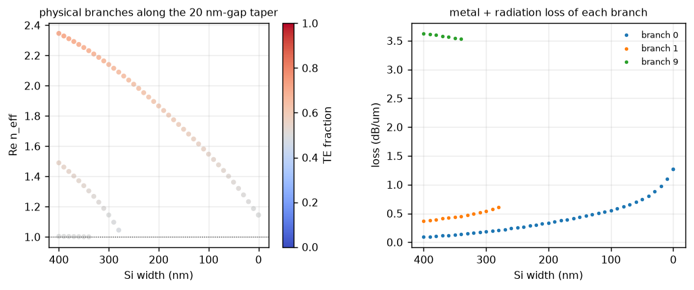
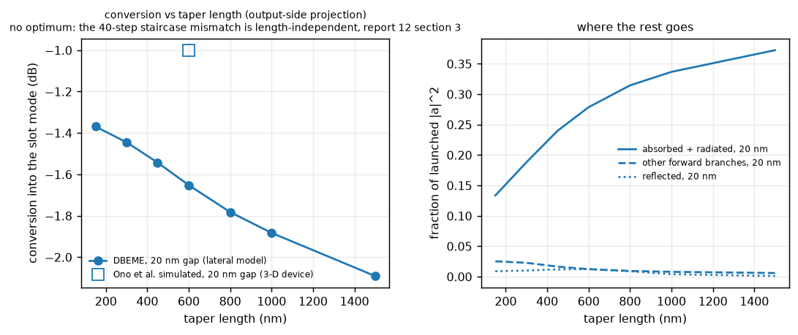
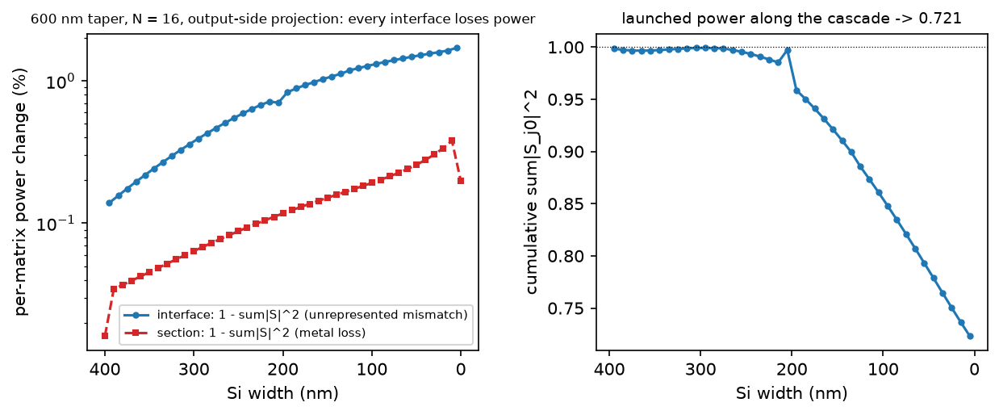
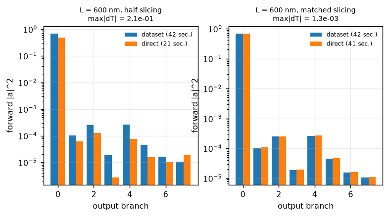

# 12 — Plasmonic mode converter (lateral 2-D model)

> **Outcome in one paragraph.** The first device on the lossy PML backend
> runs end to end and is passive, but only after the interface algebra was
> changed: upstream projects tangential continuity on the modes of the section
> being *left*, which for a field the truncated basis cannot represent returns
> the missing part as **gain** — here 0.2–1.9 % per 10 nm step, ×1.44 over the
> taper, independent of mode count and of the PML. Projected on the section
> being *entered* the same dataset gives a bounded cascade: **−1.65 dB at
> 600 nm**, of which about −1.5 dB is the mismatch loss of a 40-step staircase
> and only ~0.1 dB is metal loss. The slot loss, 1.3 dB/µm, matches the paper's
> "about 1 dB/µm". The conversion efficiency is *not* the paper's −1 dB and
> §5 says why it cannot be; reciprocity of the physical channel holds to 2 %,
> not 1e-6, and that residual is quantified (§1).

**Device.** Ono, Taniyama, Kuramochi, Nozaki, Notomi — *Toward Application of
Plasmonic Waveguides to Optical Devices*, NTT Technical Review **16**(7), 2018
(the device: Ono *et al.*, Optica **3**, 999, 2016). A 400 × 200 nm Si wire
feeds a gold/air metal–insulator–metal (MIM) waveguide with a 50 × 20 nm air
core through a 600 nm taper. The paper's numbers at 1.55 µm: coupling
**−1 dB simulated** with the designed 20 nm air gap, **−1.4 dB calculated and
−1.7 dB measured** with the 40 nm gap that was fabricated, and a slot loss of
**about 1 dB/µm** in the deep-subwavelength regime.

**What this report models.** The 2-D *lateral* stepping stone CLAUDE.md
prescribes for this device (§7, demo 4): the Si width tapers 400 nm → 0
between two gold walls that follow the taper at a constant air gap, and the
walls' `2 × gap` slot is the output waveguide. The device confines its plasmon
**vertically** — the 20 nm is between gold above and below — and one swept
width cannot represent that; the model's plasmon is the lateral gap plasmon of
the slot the walls leave behind. §5 says which comparisons survive it.

**Method.** DBEME on a **lossy PML basis** (`PMLBackend`, report 06): complex
`n_eff`, the scattering-matrix cascade (`SMATRIX_METHOD = "auto"` → `direct`
because the backend declares itself lossy), `force_unitary=False` throughout
— projecting a lossy S-matrix onto the nearest unitary one would delete the
metal loss it is supposed to report — and, new in this report, the interface
continuity projected on the output side (`INTERFACE_PROJECTION = "auto"` →
`"output"` for a lossy basis; §7.5, report 06 §11).

---

## 1. Sanity gate

Shipped configuration (§2), 20 nm gap. `reports/output/plasmonic_converter.json`,
`plasmonic_interface_excess.json`, `plasmonic_single_mode_estimate.json`.

| check (§5.x) | criterion | measured | pass |
|---|---|---|---|
| constant-width walled wire, 1 µm: `T = exp(−2 k₀ Im n L)` — propagation loss carried through the cascade | `|T − expected| < 1e-3` | 0.97883 measured, 0.97883 expected (`n = 2.3459 + 0.0026j`, 0.093 dB/µm) | ✓ |
| passivity: launched (physical) column of `|S|²` sums below 1 | `< 1.05` | **0.721** at 600 nm (mode 0); 0.384 for the TM-like input. Was **1.462** with the input-side projection | ✓ |
| interface power change per 10 nm step, `1 − Σ_j|S_j0|²` (fig. 4) | reported | −0.14 % at 400 → 390 nm falling to −1.7 % at 10 → 0 nm — every interface loses. Was +0.21 % → +1.9 %, every interface gained | ✓ |
| 5.1 reciprocity of the physical channel, `|T12 − T21|` for the launched mode, 600 nm | `< 1e-6` | **1.9e-2** (2.3 % of `|S00| = 0.828`); per interface `T21 = T12ᵀ` to 6e-7, but the reflection blocks are asymmetric at 6e-2 in the Berenger rows for *every* formulation tried, upstream's included, and that leaks through 82 star products | ✗ truncation |
| 5.8 DBEME vs direct EME, 600 nm, direct sections at the 41 axis widths | `max|ΔT| < 1e-3` | −1.65 dB vs −1.64 dB, `max|ΔT|` = **1.3e-3** per branch; 2670 s direct against < 0.1 s warm | ≈ (§4) |
| 5.4 slicing: direct at 21 sections (20 nm steps) vs 41 | `max|ΔT| < 1e-4` | **−3.23 dB vs −1.64 dB**, `max|ΔT|` = 0.21 — the staircase mismatch doubles when the step doubles | ✗ by construction (§3) |
| 5.2 mode-count independence of the interface error, 400 → 390 / 100 → 90 nm | should fall with N | N = 16: 0.21 % / 0.65 %; N = 24: 0.20 % / 1.35 %; N = 32: 0.27 % / — (input form) | ✗ does not fall — §7.5 |
| same junctions with the PML off (PEC box, real box modes) | | 0.24 % / 1.35 % | same — not the Berenger modes |
| same junctions with a second shift-invert target at 1.05 and non-guided modes kept by lowest loss | | 0.195 % / 1.35 %; launched mode couples to `Σ_j|O_0j|² = 1e-5` | same — not basis selection |
| power-normalisation factors `r = P_phys/|P_unconj|` of the end modes | reported | `r_in` 1.0000, `r_out` 0.9973 | — |
| 5.7 cell convergence, Si end / slot, 8 / 6 / 5 / 4 nm | reported, not graded | Si end 2.4033 / 2.4548 / **2.3459** / 2.3416; slot 1.3402 / 1.4007 / **1.1447** / 1.1795. Only 5 and 4 nm put the 20 nm gap on cell boundaries: between those the Si-end mode moves 0.2 %, the corner-concentrated slot mode 3 %. The unaligned 8 / 6 / 4 nm series had read 2.602 / 2.471 / 2.400 — partial metal cells, not the pitch (§7.3) | — |
| grid alignment (§7.3): `n_eff` smooth in width, every edge on a cell boundary | | 400 / 390 / 380 nm: 2.3459 / 2.3287 / 2.3057 | ✓ |
| 5.6 gauge, 5.13 tracking, PML low-side sign (report 06 §10) | tests | `tests/test_plasmonic_slot.py`, `test_pml_solver.py`, `test_lossy_assumptions.py`, `test_smatrix_direct.py` | ✓ |

Two things a lossy basis changes about *reading* an S-matrix, both applied:

* modes are normalised with the **unconjugated** power `½∫(E × H)_z`, so
  `|a_i|²` is physical power only up to `r_i`. For the two end modes `r` is
  1.0000 and 0.9973. Berenger modes have `r` = 2–3, which is why column sums
  over *their* inputs (max 1.19) are not a passivity statement and are not
  graded.
* reciprocity is `S = Sᵀ` in the standard two-port arrangement. The lumped
  matrix is ordered `[b₂; b₁] = S [a₁; a₂]`; testing it directly reads 1.1
  and means nothing.

---

## 2. Device and dataset

### The model, and every departure from the paper

| | paper (3-D device) | this model (lateral) | why |
|---|---|---|---|
| Si core | 400 × 200 nm | 400 × **220** nm | every dataset in this project is 220 nm |
| taper | 600 nm, lateral **and vertical** | width only, 400 nm → 0 | one swept axis; the vertical taper needs a second geometric axis |
| MIM core | 50 × 20 nm, gold above and below | the `2 × gap` slot between the walls: **40 nm wide × 400 nm tall** | vertical confinement is not representable |
| air gap Si–metal | 20 nm designed / 40 nm fabricated | 20 nm; the 40 nm sweep was not run — its 80 nm slot is only marginally bound (`n = 1.0069`) | §7.4 |
| gold | thickness not stated | walls **400 nm tall, centred on the Si** | wall *height* is what binds a lateral slot mode — §7.4 |
| stack | Si on SiO₂, air above | **suspended in air** | over oxide the lateral slot's mode sits below the substrate index and leaks — §7.4 |
| input | plain Si wire, gold begins at the taper | walled wire (gold alongside the 400 nm section) | the dataset family has the walls everywhere; the plain → walled junction is estimated separately: **−0.46 dB** (mode-mismatch overlap, 2.0716 → 2.3459 + 0.0026j) |

### Dataset `Si_plasmonic_slot_1550`

* cross section `PlasmonicSlotConverter`, axis `w_si` = 0 … 400 nm in
  **10 nm** steps (41 points); gold Johnson & Christy (n = 0.524 + 10.74j at
  1550 nm, ε = −115 + 11j); permittivity averaged in **ε**, not n.
* grid: **5 nm** cell, 369 × 301 points (window ±0.92 × ±0.75 µm), snapped so
  that every geometric edge falls on a cell boundary at every axis point
  (§7.3); PML 0.25 µm on all four edges, stretch 1 + 2j; 16 modes about a
  shift-invert target of 2.0; the PML recipe is part of the dataset identity.
* cost: 60–110 s per point; the cold build of the axis took **73 min**
  (4389 s, 41 points with their neighbour overlaps). Every device on the warm
  dataset then costs **< 0.1 s** — the 7-length sweep below, and the
  re-evaluation of the whole sweep after the interface algebra changed, cost
  nothing. Direct EME costs 41 solves *per device*.

### The two end modes (aligned 5 nm grid)

| end | mode | `n_eff` | loss | confinement |
|---|---|---|---|---|
| Si, 400 nm | lateral hybrid plasmonic (TE-like) | 2.3459 + 0.0026j | 0.09 dB/µm | 0.95 |
| slot, 0 nm | gap plasmon of the 40 × 400 nm slot | 1.1447 + 0.0362j | **1.3 dB/µm** | 0.51 |

The slot loss is directly comparable with the paper's "about 1 dB/µm", and
agrees. The Si-end mode is not the bare wire's TE0 (2.0716 suspended): with
gold 20 nm from each sidewall it is a hybrid plasmonic mode with its field
pulled into the gaps — which is also what the real device's input becomes once
the gold begins. Along the taper this is the only physical branch: at 190 nm
the basis holds it (1.8359 + 0.0101j) and fifteen Berenger modes.



---

## 3. DBEME result



| L (nm) | sections | converted `|S_out,in|² r_out/r_in` | dB | reflected (physical) | absorbed + radiated |
|---|---|---|---|---|---|
| 150 | 42 | 0.729 | −1.37 | 0.0089 | 0.134 |
| 300 | 42 | 0.718 | −1.44 | 0.0101 | 0.188 |
| 450 | 42 | 0.702 | −1.54 | 0.0120 | 0.240 |
| 600 | 42 | **0.684** | **−1.65** | 0.0126 | 0.279 |
| 800 | 42 | 0.664 | −1.78 | 0.0089 | 0.315 |
| 1000 | 42 | 0.648 | −1.88 | 0.0041 | 0.337 |
| 1500 | 42 | 0.618 | −2.09 | 0.0011 | 0.372 |

Monotonic in length, with no optimum. That is what the model must say, and
it is the report's most useful negative result about DBEME on this device:

* the grid-snapped path visits the **same 41 cross sections at every
  length**. The mismatch loss of the 40 steps is therefore length-independent
  — from the stored overlaps the single-mode staircase product is
  `A = Π|t_m|² = 0.702` (−1.54 dB), and the cascade at 150 nm, where metal
  loss is negligible, sits at 0.729;
* what grows with length is the metal loss along the taper (0.09 →
  1.3 dB/µm across the width range): 0.986 at 150 nm, 0.945 at 600 nm, 0.869
  at 1500 nm as a propagation factor. `A × propagation` is 0.663 at 600 nm
  against the cascade's 0.684 — the multi-mode cascade recovers a little of
  the staircase through coherent multiple scattering, not more;
* the physics that makes a real taper *better* when longer — the
  destructive interference of the field shed at successive steps, which is
  what "adiabatic" means — needs that shed field to be in the basis. Here
  `Σ_j|O_0j|²` is a tenth of `1 − |t|²` at every step (§7.5): the basis holds
  one physical branch and Berenger modes, and the near field a 10 nm shift of
  a metal edge displaces is in neither. The output-side projection loses it,
  correctly, instead of returning it as gain; it cannot make it interfere.

So the −1.65 dB decomposes as **≈ −1.5 dB of staircase mismatch** (a
discretisation artefact that scales with the width step — per-step loss ∝
Δw², steps ∝ 1/Δw, so the total ∝ Δw) **and ≈ −0.1 dB of metal loss**; the
plain-wire junction adds −0.46 dB in front of it. The lateral model's
converged answer at 600 nm, extrapolating the staircase to Δw → 0, is
therefore of order −0.6 dB — metal loss plus junction — *if* the taper is
adiabatic, which this basis cannot test.

### Where the power goes, interface by interface



The direct route stores an interface and a propagation matrix per section.
Every propagation matrix removes the branch's metal loss (red, 0.02 → 0.36 %
per section); with the output-side projection every interface matrix
removes its unrepresented mismatch (blue, 0.14 → 1.7 %). With upstream's
input-side projection the blue curve had the same magnitude and the opposite
sign, and the cascade ended at 1.439 instead of 0.721.

---

## 4. DBEME vs direct EME



| 600 nm taper | sections | converted | `max|ΔT|` per branch | time |
|---|---|---|---|---|
| dataset (grid-snapped path) | 42 | −1.65 dB | — | **< 0.1 s** warm (73 min cold, once) |
| direct, sections at the 41 axis widths | 41 | −1.64 dB | **1.3e-3** | 2670 s |
| direct, every other axis width | 21 | −3.23 dB | 0.21 | 225 s (widths already cached in-process) |

At matched slicing the two routes agree to 1.3e-3 per branch — the residual
is section placement: the dataset path puts its interfaces where the width
crosses a grid mid-point, the direct path at uniform `z`, so the first and
last sections differ by half a step. The direct sections were placed *at* the
axis widths deliberately; any other width puts a metal edge inside a cell
(§7.3) and compares a different discretisation, not a different method.

The half-slicing row is not an agreement check, and it is the more
informative one: with 20 nm steps the mismatch loss doubles, exactly the
∝ Δw behaviour of §3. Direct EME at 41 sections reproduces the dataset, and
both reproduce the discretisation.

Timing is the method's claim: the 7-length sweep of §3 cost one cold build
(4389 s) and then nothing measurable per device; the same sweep by direct
EME would have cost seven times 2670 s. Re-evaluating the entire sweep after
the interface algebra changed (§7.5) cost 0 s of mode solving.

---

## 5. DBEME vs literature

### What is comparable, and what is not

| quantity | comparable? | why |
|---|---|---|
| slot propagation loss | **yes** | a property of the plasmon itself: **1.3 dB/µm** here, "about 1 dB/µm" in the paper |
| plain-wire → walled-wire junction | as an order of magnitude | −0.46 dB here is mode mismatch only; in the device it is part of the −1 dB |
| conversion efficiency at 600 nm | **no** | −1.65 dB is ≈ −1.5 dB of staircase artefact; and lateral vs vertical confinement, suspended vs on oxide, 220 vs 200 nm Si, no vertical taper |
| optimum taper length | **no** | the model has none, for the reason in §3 |
| 20 nm vs 40 nm gap | **no** | in the device the gap is a taper parameter and the MIM core stays 50 × 20 nm; here the gap sets the output slot, and the 80 nm slot barely binds (1.0069) |

### Discrepancy table

| quantity | paper | this model | cause |
|---|---|---|---|
| slot loss | ~1 dB/µm (50 × 20 nm vertical core) | 1.3 dB/µm (40 × 400 nm lateral slot) | different slot geometry; both deep-subwavelength gap plasmons in gold |
| coupling at 600 nm, 20 nm gap | −1 dB | −1.65 dB cascade; ≈ −0.6 dB with the staircase extrapolated away | staircase mismatch of a 10 nm-step basis (§3); lateral model; junction counted separately |
| coupling at 600 nm, 40 nm gap | −1.4 / −1.7 dB | not computed | the lateral 80 nm slot is not a bound port |
| optimum length ≈ 600 nm | yes | none | shed field not in the basis (§3, §7.5) |

---

## 6. Conclusions and limits

**Established.**
1. The lossy chain works end to end: `PMLBackend` behind `DataUpdater`,
   complex `n_eff` in the pickles, the PML recipe in the dataset identity,
   Hungarian tracking through 41 interfaces, the scattering route chosen by
   `auto`, propagation loss carried exactly, and a passive cascade once the
   interface is projected on the output side. Warm devices cost < 0.1 s, and
   a change of interface algebra re-evaluates a whole sweep for free.
2. The lateral slot plasmon of a 40 nm gold slot is at 1.145 + 0.036j —
   1.3 dB/µm, the paper's regime — *once* the walls are tall enough and the
   structure is suspended (§7.4).
3. The interface projection side is a real choice with a real consequence
   in a truncated basis (§7.5, report 06 §11): upstream's form is unbounded
   there. `INTERFACE_PROJECTION = "auto"` now takes the bounded form for a
   lossy basis and leaves the lossless datasets, whose transfer route needs
   the other form invertible, exactly as validated.
4. DBEME's fixed grid cannot show an adiabatic optimum for a device whose
   step-to-step mismatch field is outside its basis: the mismatch loss is
   length-independent and only the metal loss varies. This is CLAUDE.md
   §5.9 item 5 and §7 demo-4 blocker 4 measured, not argued.

**Not established.** The paper's efficiency or optimum length, or any gap
sensitivity. Reciprocity of the physical channel is 2 %, not 1e-6.

**What would improve it, in order of cost.**
1. *Finer aligned steps*: the staircase loss is ∝ Δw; 5 nm steps halve it
   but need a 2.5 nm cell for alignment (4× the cost per solve).
2. *A variational interface*: least-squares matching of `E_t` and `H_t` over
   the aperture rather than projection onto a truncated basis, which would
   also bound the reflection blocks — a Stage 6 of the S-matrix work.
3. *A basis that holds the near field*: not more shift-invert modes (N = 24,
   32, a second target — all tried, none helped) but edge-adapted functions
   or a 3-D reference. FDTD of the same lateral structure is what the report
   protocol asks for, and nothing here replaces it.

**Limits carried regardless.** Between the two exact grids (5 and 4 nm) the
Si-end index moves 0.2 % and the corner-concentrated slot index 3 % (§1);
the model is lateral; the 40 nm gap has no bound lateral counterpart.

---

## 7. Five things found on the way

None was visible on the lossless datasets or on the `+x`-only PML validation;
each is now a regression test.

### 7.1 The `-x` and `-y` PML layers were gain (report 06 §10)

EMpy's `stretchmesh` ends with `abs(Im)` on the stretched coordinate. The
stretch is antisymmetric by construction and must be, because the operator
consumes `diff(x)`; the `abs` made the low-side layers amplify. With `+x` and
`-x` together every radiating mode's `Im n_eff` came out exactly 0
(PT-symmetric spectrum), and with a third edge the gain/loss corners hosted
near-real Berenger modes that shift-invert returned instead of the physical
mode. `stretched_grid` now applies the stretch itself. `tests/test_pml_solver.py`.

### 7.2 The radiation mask condemned every plasmonic mode

`radiation_mode_mask` rejected any mode above 100 dB/cm — a lossless-model
heuristic. A Si wire 20 nm from gold sits at 0.09 dB/µm and the slot at
1.3 dB/µm, so the launch basis was empty. The rule now applies only when the
dataset says it is lossless. `tests/test_lossy_assumptions.py`.

### 7.3 Sub-cell aliasing of a metal edge

With the metal edge free to fall anywhere inside a cell, the ε-averaged edge
cell swings between air and gold as the width changes, and the hybrid mode's
index with it: at a 6 nm cell, 400 / 395 / 375 nm read 2.471 / 2.371 / 2.429
— a 0.1 jump per 5 nm where the physical slope is 0.002 per nm. Every
interface then carried a spurious geometric step. The cure is alignment: a
pitch exactly equal to the cell with the origin on a node, and an axis in
steps of `2 × cell`, so every edge sits on a cell boundary at every axis point
and every cross section is discretised identically.
`tests/test_plasmonic_slot.py::test_platform_grid_is_aligned_with_the_geometry`.

The alignment also removed a comfortable illusion: with partial-metal cells
the 40 nm lateral slot had read 1.10–1.34 depending on where the edge fell;
discretised exactly, between 220 nm walls, it is **0.869** — below the air
line. Which is how §7.4 was found.

### 7.4 What binds a lateral slot mode is the wall height

| walls | slot 20 nm | slot 40 nm | slot 80 nm |
|---|---|---|---|
| 220 nm (Si height) | 1.037 + 0.084j | 0.869 (leaky) | — |
| 400 nm, centred | — | **1.145 + 0.036j** | 1.007 + 0.027j (marginal) |

A 40 nm MIM slab plasmon sits at 1.47, but a slot 220 nm tall and open above
and below is a slab of index 1.47 and thickness λ/7 in air — `V ≈ 1`, barely
bound. The device does not have this problem because it confines vertically.
The model therefore uses 400 nm walls centred on the Si, and a window tall
enough to keep the slot mode's tail 0.3 µm from the PML. Over oxide the slot
mode is below the substrate index in every configuration tried (1.18 + 0.058j
at best) and leaks.

### 7.5 Which side an interface is projected on

The taper's first run ended at ×1.44 with every interface *adding* power. It
was not the mode count (16, 24, 32 gave 0.21, 0.20, 0.27 % at the first
step), not the PML (a PEC box gave 0.24 %), not the pseudo-inverse
(`rcond=None`, identical digits), not basis selection (a second target near
the cladding line, 0.195 %). The single-mode algebra on the same overlaps
gave `|t|² = 0.998`; the cascade gave `1.002 = 1/0.998`, and that identity
is the mechanism. Tangential continuity is imposed weakly, by projecting the
field equations on a mode set, and upstream projects on the section being
*left*: `T12 = 2 inv(O_ab + O_baᵀ)`, single-mode limit `1/|O|²` — the part
of the mismatch the basis cannot hold comes back as gain. Projected on the
section being *entered*, `T12 = 2 O_abᵀ inv(O_abᵀ + O_ba) O_ba`, limit
`|O|²`, it is lost. On six-mode Si tapers the two differ by 2.5e-4 per
interface, under the truncation floor every earlier report carries and under
the `force_unitary=True` they all ran with; here they are 1.44 against 0.72
for the same forty interfaces and the same dataset. `SingleEME.
INTERFACE_PROJECTION = "auto"`; report 06 §11; `tests/test_smatrix_direct.py`.

Why the lossless datasets keep upstream's form: the transfer route inverts
`T21`, and the output-side `T` inherits the near-zero overlap of a radiation
mode that barely exists on one side of an interface. On the README taper,
whose one near-cutoff radiation mode already gives an interface condition
number of 3e7, the Stage 4 gate read 9e4 with the output form forced. A lossy
basis runs the direct route, where no inverse of `T` is ever formed.

---

### Reproducing

```bash
cd examples
python demo_plasmonic_converter.py --gaps 20 --direct-lengths 600 --cell-check   # ~2.5 h cold
```

Results are cached stage by stage in `reports/output/plasmonic_converter.json`;
a second run is warm. The interface profile and the staircase estimate are
scratch analyses whose outputs are `plasmonic_interface_excess.json`,
`plasmonic_single_mode_estimate.json` and `plasmonic_4_interface_excess.png`.
