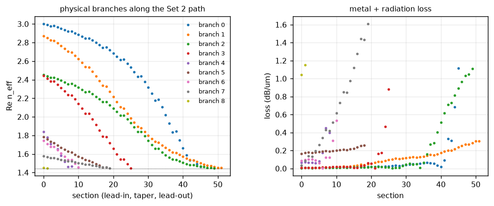
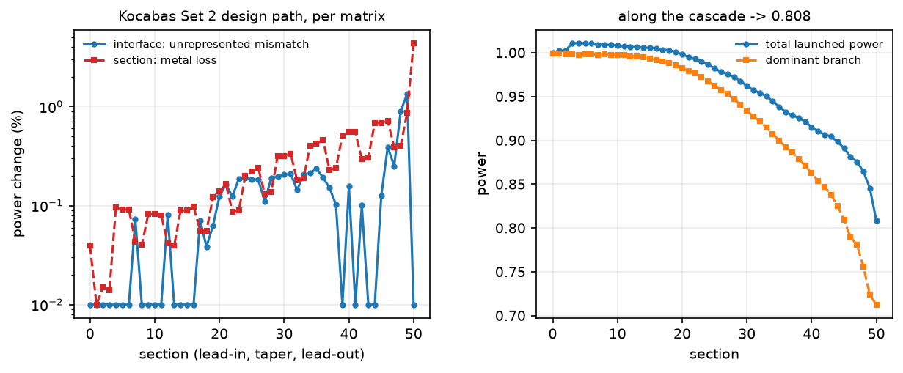
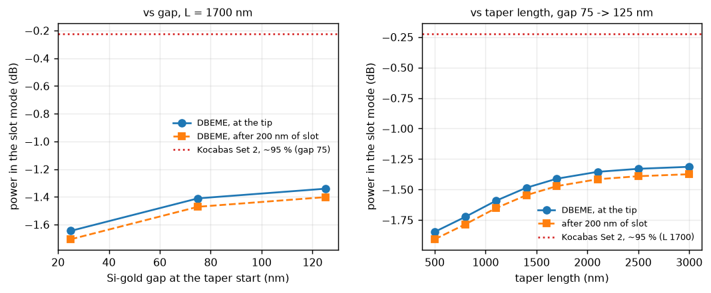

# 13 — Si wire to plasmonic slot converter, SiO₂-embedded (Kocabaş 2017)

**Why this device.** Report 12 ended with a negative result about the NTT
converter: its air-core MIM on oxide has no bound lateral mode (§9 there),
so the coupling-versus-gap and coupling-versus-length curves Jae asked for
cannot be computed on that geometry with one swept width. S. E. Kocabaş,
*The effect of metal thickness on Si wire to plasmonic slot waveguide mode
conversion*, arXiv:1801.00833 (2017), is the same device class — a laterally
tapered Si wire feeding a gold slot through an air-gap-like clearance — with
every dimension published (Table II), everything embedded in SiO₂ so that
both ends are bound, and numbers to hit: ~95 % transmission for the 250 nm
gold design (Set 2), ~88 % for 30 nm gold (Set 1), slot propagation lengths
versus gold thickness (Fig. 4), and transmission versus gold thickness
(Fig. 7). It is therefore the better test of the PML backend and the
converter demonstration this work is for.

**The device (Set 2).** Si wire 400 × 725 nm; gold 250 nm thick, centred on
the Si; slot 250 nm; taper 1700 nm after a 200 nm lead-in, with the Si going
400 → 0 nm and the slot going 550 → 250 nm independently, so the Si–gold
clearance runs 75 → 125 nm; 200 nm of slot after the tip. Material constants
as in the paper's Table I (Si 12.085, SiO₂ 2.0852, Au −126.80 + 5.37i in
this project's convention). COMSOL 3-D with PML in the paper; DBEME on a
two-axis `(w_si, gap)` dataset here.

**Method.** `PMLBackend` dataset `SiO2_kocabas_set2_1550` (5 nm cell, grid
snapped so every straight edge sits on a cell boundary at every grid point;
PML 0.25 µm on four edges; 20 modes about a shift-invert target of 2.3 —
§1 records why not 16 about 1.9), scattering cascade,
output-side interface projection, `force_unitary=False`. The transmission is
the power in the slot mode at the end of the 200 nm lead-out, and — the
paper's convention — back-propagated to the tip with the slot mode's own
loss. The launched mode is the wire's TE-like **fundamental** (E along x,
the slot's polarisation), 2.873 on this grid; a 725 nm-tall wire also carries
a TM-like fundamental at 3.002 and first-vertical-order TE/TM modes at
2.443 / 2.451, which a shift-invert target of 1.9 returned *instead of* the
fundamental (§1).

---

## 1. Sanity gate

Rows from `reports/output/kocabas_converter.json` (co-located fields,
target 2.3, 20 modes) and from the window study (`kocabas_window.json`):

| check (§5.x) | criterion | measured | pass |
|---|---|---|---|
| constant 250 nm slot, 1 µm: `T = exp(−2 k₀ Im n L)` | `|T − expected| < 1e-3` | 0.93244 vs 0.93244 | ✓ |
| 5.1 reciprocity of the physical channel, design path | `< 1e-6` | 1.1e-3 | ✗ — the same magnitude as report 12 §10 on co-located fields (1.0e-3); the residual of the unconjugated overlap on a 5 nm staircase, not a convention error (§5.1 there) |
| passivity: physical input columns of `|S|²` | `< 1.05` | 0.81 | ✓ |
| 5.3/5.7 grid convergence: the whole device at a 2.5 nm cell (`SiO2_kocabas_set2_1550_c25`) | reported | 78.9 % against 72.3 %; discretisation loss 24.8 → 18.4 %, fitting `2.5 %/nm × Δ + 12 %`; the slot mode moves to 1.4941 + 0.0062j, so cell and axis move together by construction (§7). Reciprocity 1.1e−3 → 4.0e−3, passivity 0.887 | — |
| 5.8 DBEME vs direct EME, sections at the dataset's own points | `max|ΔT| < 1e-3` | **3.4e−5** — the cached cascade and a fresh section-by-section solve of the same cross sections agree to five digits (§5) | ✓ |
| 5.4 slicing: the same device with sections at uniform `z` instead | reported | 84.1 % against 72.3 %, `max|ΔT|` = 1.2e-1 — off-grid sections put every metal edge inside a cell *and* let the gap move 1.25 nm at a time instead of 5 (§5) | — |
| 5.7 window: the weakly bound slot modes with 0.5 / 1.5 / 2.5 µm margins | reported | 250 nm slot: 1.4498 + 0.0086j (`L_p` 14.3 µm) / 1.4475 + 0.0060j (20.7) / 1.4476 + 0.0055j (22.3); 220 nm: 14.2 → 19.3 µm; **30 nm: identical** (1.8349 + 0.0243j) | — |
| 5.13a basis membership along the path: is the launched branch in the stored set at every width? | every physical branch present | target 1.9, 16 modes: the TE-like fundamental (2.87 at 400 nm) **absent** at 300 nm; the tracker linked the first-vertical-order branch into cutoff and the cascade read **−20 dB**. Target 2.3, 20 modes: fundamental present at 400 / 300 / 260 / 160 / 60 / 0 nm (2.873 / 2.541 / 2.326 / 1.800 / 1.534 / 1.450) | ✓ after the change |
| 5.6 gauge, 5.13 tracking, PML sign, grid alignment, gap as a path parameter | tests | `tests/test_plasmonic_slot.py` | ✓ |

The window row is the one real limit of the platform grid: a mode bound by
0.006 above silica has a 2 µm tail, four times the 0.5 µm margin the dataset
is built on, and the PML takes about a third of its apparent loss. The
index moves by 0.002, the mode shape not measurably (confinement 0.475 vs
0.486). The converter numbers below therefore carry the slot mode with a
loss ~50 % too high; the 200 nm lead-out back-propagation that this affects
is 1.4 % against 0.9 %. A dataset with 1.5 µm margins would cost 4× per
solve and is the first thing to buy if the slot loss itself is the quantity
of interest.

## 2. Modes

### The wire, the middle and the slot (5 nm cell, 0.5 µm margins, target 2.3)

| cross section | branch | `n_eff` | confinement |
|---|---|---|---|
| wire 400 × 725 nm, gap 75 nm | TM-like fundamental | 3.002 + 0.000j | 0.99 |
| | **TE-like fundamental (launched)** | **2.873 + 0.000j** | 0.98 |
| | first vertical order, TM / TE | 2.451 / 2.443 | 0.98 / 0.91 |
| | second order, TE / TM | 1.841 / 1.783 | 0.89 / 0.86 |
| | slot-like | 1.451 + 0.030j | 0.22 |
| Si 260 nm, gap 95 nm | TM / TE fundamental | 2.748 / 2.326 | 0.98 / 0.96 |
| Si 160 nm, gap 105 nm | TM / TE fundamental | 2.318 / 1.800 | 0.95 / 0.85 |
| Si 90 nm, gap 115 nm | TM / TE fundamental | 1.751 / 1.592 | 0.78 / 0.71 |
| slot 250 nm, gold 250 nm | slot mode (port) | **1.4498 + 0.0086j** (`L_p` 14.3 µm) | 0.49 |



Left: the physical branches the tracker follows along the path, from the
400 nm wire to the 250 nm slot. Right: their loss. The launched branch
(orange) starts at 2.873 with essentially no loss and ends at 1.450 with
0.3 dB/µm; the branches that reach a dead end part-way (red, purple, brown)
are guided modes going into cutoff as the Si narrows, where their loss rises
and they leave the physical set.

The TE-like fundamental descends continuously — 2.873, 2.541 (300 nm),
2.326, 2.159 (230), 1.800 (160), 1.693 (130), 1.642 (110), 1.592 (90) — and
becomes the slot mode: the wire mode and the slot mode are one supermode,
which is what an adiabatic converter needs. The TM-like fundamental stays
above it all the way and ends just below the silica line.

The output mode is bound by only 0.006 above the silica line: the
silica-filled 250 nm gap's MIM index is barely above 1.444 to begin with, and
250 nm of height leaves a slab of `V` ≈ 0.14. Its evanescent tail is about
2 µm, four times the window margin, so the value above carries PML
absorption; §1 quantifies that with a wide-window solve.

### Slot propagation length against the paper's Fig. 4 (gold 250 nm)

| `w_slot` | `n_eff` | `L_p` | confinement | MIM slab limit (infinite height, his gold) |
|---|---|---|---|---|
| 30 nm | 1.8349 + 0.0242j | 5.1 µm | 0.48 | 2.281 + 0.0153j, 8.1 µm |
| 50 nm | 1.6224 + 0.0175j | 7.1 µm | 0.58 | 1.988 + 0.0104j, 11.9 µm |
| 100 nm | 1.4921 + 0.0113j | 10.9 µm | 0.54 | — |
| 220 nm | 1.4517 + 0.0087j | 14.2 µm | 0.51 | — |

Same ordering and the same monotonic trend as the paper's Fig. 4 (`L_p`
grows with the slot width as the field leaves the metal), on the 0.5 µm-margin
platform window. The wider slots are bound by a few thousandths above the
silica index and their tails reach the PML; the wide-window solve of §1 says
how much of the loss is the window's.

## 3. The design point

**72.3 % (−1.41 dB) into the slot mode at the tip**; 71.3 % (−1.47 dB) at
the end of the 200 nm lead-out. Reflection 1.3e-4 into the physical modes
and 1.7e-3 into the Berenger set; nothing in the other physical forward
branch (the TM-like family is decoupled by the `y` mirror symmetry, as in
the paper's PMC plane); 0.094 of the launched `|a|²` leaves the lead-out as
non-physical forward amplitude, the scattered field the PML modes
represent. The paper's Set 2 number is ~95 %.

**What the paper's number is.** Kocabaş integrates the *total* Poynting
flux through a cut 1100 nm after the tip and back-propagates it to the tip
with the slot mode's own `L_p` (his §II and Fig. 7); the modal power,
obtained with the unconjugated inner product this project also uses, lies
below the total — for Set 1 he reports the total at "slightly less than
88 %" and the bound-mode fit under it. So 95 % is an upper bound on the
modal conversion, and the quantity computed here is the modal power. The
comparison is 72 % against something between ~90 and 95 %.

**Where the 28 % goes** (the design path matrix by matrix, same construction
as report 12 §3):



| factor | product along the path | reading |
|---|---|---|
| interface matrices (unrepresented mismatch) | 0.951 (−0.22 dB) | 51 steps of 10 nm in `w_si` and 5 nm in the gap; 0.1–0.9 % each, largest at the narrow end |
| propagation matrices | 0.850 (−0.71 dB) | the supermode's own metal loss integrates to 0.957 over the taper and 0.986 over lead-in and lead-out; the other ~11 % is the decay of amplitude the interfaces scattered into the Berenger set — the model's radiation |
| end of the cascade | 0.808 total, 0.713 in the slot branch | the difference is non-physical forward amplitude |

Two of the three loss channels are discretisation, not device: a smooth
1700 nm taper between these two modes has no 10 nm staircase to scatter
from, and a 20-mode basis cannot let scattered field re-couple further
along, as a 3-D FEM with PML does implicitly. The candidates for the gap to
the paper, in the order they should be tested:

1. **The parameter axes — which means the cell.** §5 runs the same device
   with its sections placed continuously instead of on the grid, and it
   reaches 84.1 %. Some of that is a sub-cell artefact and some is real, but
   it bounds the axis-snapping cost at about 12 points — half the deficit.
   The first reading of this was that the gap axis was the suspect, because
   the gold wall stands still for several sections and then jumps 5 nm; a
   second reading blamed the silicon tip. The exact split below, made on
   axes where the two edges move separately, settles it: **the cost is the
   gold wall's 5 nm jumps once the mode is slot-like.**

   *The axis cannot be refined on its own.* `w_si` steps `2 cell` and `gap`
   steps `cell` precisely so that the Si edge (at `w_si/2`) and the metal's
   inner edge (at `w_si/2 + gap`) both land on cell boundaries at every grid
   point. A 2.5 nm gap axis on a 5 nm cell would put every second metal edge
   in the middle of a cell, alternating aligned and misaligned points along
   the path — which *adds* a spurious per-step mismatch rather than removing
   one. Halving the gap axis means halving the cell, which is
   `SiO2_kocabas_set2_1550_c25`: §7.

   **Tested, and it is about half the story.** 72.3 % → 78.9 %, the two grids
   fitting `loss = 2.5 %/nm × Δ + 12 %`. The staircase part is real and
   extrapolates away; the 12 % does not.

   **Which edge the staircase is.** Two attributions were tried and one of
   them was wrong in an instructive way. Charging each section's propagation
   loss to the interface before it smears badly on fine slicing, because a
   Berenger mode decays over ~300 nm; and on the `(w_si, gap)` axes the wall
   sits at `w_si/2 + gap`, so every "Si step" also moves the wall by 5 nm.
   The clean quantity is the launched branch's own single-mode mismatch
   `1 − |t|²` at each interface, read straight from the cached overlaps,
   on the `(w_si, half_slot)` dataset of §7 where the two edges move
   separately (`kocabas_exact_attribution.json`):

   | moving edge | interfaces | single-mode mismatch |
   |---|---|---|
   | gold wall, 5 nm jumps | 30 | **6.1 %** — 0.2–0.3 % each once the wall is inside 225 nm and the mode slot-like |
   | Si width, 10 nm steps above 120 nm, 2 nm below | 88 | **1.1 %** — the fifty 2 nm steps at the tip cost 0.25 % together |

   Product over the path 0.931, against 0.903 on the plain 5 nm grid, where
   the same integral splits as 2.0 % for the ten explicit gap steps and 8.2 %
   for the forty steps that moved Si and wall together. The wall is the
   staircase; the silicon is cheap. What the tip *does* carry is the field's
   change of character as the core vanishes, and §7 shows that is not a step
   effect either.
2. **The basis size**, 20 modes against the 40–50 a PML-EME normally wants.
   **Now the leading suspect**, because that 12 % floor has a signature: the
   forward amplitude in the Berenger branches is ~9 % on *both* grids. It is
   field the basis can only hold as PML modes, which are absorbed instead of
   re-coupling — and a 3-D FEM with PML lets it propagate, which is where
   Kocabaş's *total*-power measure picks it up (§7).
3. **The window**, which inflates the slot-like branch's `Im n_eff` by about
   a third over the last 300 nm (§1) — worth about 1 % of power, not 20.

## 4. Transmission against the Si–gold gap and against taper length



### Taper length (gap 75 nm, slot 250 nm, warm cache — every length is a new path over the same grid points)

| `L_taper` | slot mode at the tip | scattered (Berenger) amplitude at the lead-out | reflected |
|---|---|---|---|
| 500 nm | 65.4 % (−1.85 dB) | 0.193 | 6.7e-3 |
| 800 nm | 67.2 % (−1.72 dB) | 0.156 | 1.5e-3 |
| 1100 nm | 69.3 % (−1.59 dB) | 0.129 | 2.5e-4 |
| 1400 nm | 71.0 % (−1.49 dB) | 0.109 | 2.0e-4 |
| **1700 nm (paper)** | **72.3 % (−1.41 dB)** | 0.094 | 1.3e-4 |
| 2100 nm | 73.2 % (−1.35 dB) | | 1e-4 |
| 2500 nm | 73.6 % (−1.33 dB) | | 1e-4 |
| 3000 nm | 73.9 % (−1.31 dB) | | 1e-4 |

The curve rises monotonically and flattens beyond ~2 µm, with the
scattered amplitude falling roughly as `1/L` and the reflection as its
square — the adiabatic behaviour report 12's device could not show, because
there the 40-step staircase was the whole loss. The paper's 1700 nm sits at
the knee. The plateau near 74–75 % is not the device's limit: the
length-independent part is the staircase and basis loss of §3, and the
supermode's metal loss grows with `L` (0.957 at 1700 nm) and takes over
beyond it.

### Si–gold gap at the taper start (`w_gap`; slot end fixed at 250 nm, `L` = 1700 nm)

`w_gap` sets the Si–gold clearance where the taper *starts*; the clearance at
the tip is fixed by the slot at 125 nm. So the parameter really chooses how
the gold wall moves relative to the Si edge, and 125 nm is the special case
where it does not move at all.

| `w_gap` | clearance along the taper | path points | slot mode at the tip |
|---|---|---|---|
| 25 nm | 25 → 125 nm | 62 | 68.5 % (−1.65 dB) |
| **75 nm (paper)** | 75 → 125 nm | 52 | **72.3 % (−1.41 dB)** |
| 125 nm | 125 nm, constant | 42 | 73.4 % (−1.34 dB) |

Monotonic, and **the model cannot separate the physics from its own
discretisation here**: the dataset's gap axis has a 5 nm step, so a path that
opens the clearance by 100 nm visits exactly 20 grid points more than one that
holds it constant, and 42 + (125 − `w_gap`)/5 reproduces the third column
exactly. The 4.9 points of transmission between the ends of the sweep divided
by those 20 extra sections is 0.25 % each — and §3's exact split puts a
5 nm wall jump at 0.2–0.3 % once the mode is slot-like, so the whole sweep
is consistent with the extra wall steps and nothing else. A wall that stays put costs nothing to step
past; that is true of the physics *and* of the staircase, and this dataset
cannot say in what proportion.

What can be said: nothing in the range 25–125 nm reaches the paper's
efficiency, the ordering does not contradict it, and the paper's own choice of
75 nm is not reproduced as an optimum — this model has no interior optimum in
`w_gap`, exactly as report 12's device had none in length. Testing it properly
needs the gap axis refined to 2.5 nm and the comparison made at fixed section
count, which is the same convergence question as §3(i).

## 5. DBEME vs direct EME

Two direct runs, because on a two-axis dataset *where the sections are placed*
turns out to matter more than whether the modes came from a cache.

| route | sections | at the tip | `max|ΔT|` vs the dataset | cost |
|---|---|---|---|---|
| dataset (grid-snapped path) | 52 | 72.3 % (−1.41 dB) | — | **0 s** warm, 15 034 s cold once |
| direct, sections at the dataset's own points | 52 | 72.3 % (−1.41 dB) | **3.4e−5** ✓ | 10 445 s |
| direct, sections at uniform `z` (off grid) | 52 | **84.1 % (−0.75 dB)** | **1.2e−1** | 9 879 s |

**The cache is faithful.** Solving the dataset's own 52 cross sections from
scratch and cascading them gives the same transmission to five digits, at
10 445 s against 0 s warm. Whatever separates this model from the paper, it is
not the caching.

**The off-grid row is not a failure of the cache either; it is a different
device.**
`DirectParametricPath` samples the parameter functions at uniform `z`, which
on report 12's single-axis linear taper lands exactly on the axis widths and
here does not: the taper carries 200 nm of lead-in, `w_si` steps 10 nm and
`gap` steps 5 nm, so uniform sampling gives widths like 398.6 and 388.9 nm and
gaps moving 1.25 nm at a time. Every metal edge then sits inside a cell, which
report 12 §7.3 measured as an `n_eff` alias of up to 0.1, and every interface
sees a smaller perturbation than the dataset's, whose gap can only move in
5 nm jumps. Both differences push the same way, and together they are worth
12 points of transmission. The demo now runs the aligned placement as well
(`_FixedPointPath`); the row above is the §5.8 check proper, and the
difference between the two direct rows is what snapping a continuous taper
onto this grid costs.

That number matters for §3: **about half the deficit against the paper may be
the axis discretisation, not the method.** A continuous-section EME of the
same device loses 16 %, the grid-snapped one 28 %. §7 measures what refining
the axes buys — and, since the axis steps are tied to the cell to keep metal
edges on cell boundaries, what it costs.

**The warm-cache claim**, which the two sweeps already support: the design
point cost 15 034 s cold; every one of the eight taper lengths in §4 then cost
**0 s**, because a different longitudinal path over the same `(w_si, gap)`
grid points solves nothing new. A direct EME pays ~9 900 s for each of them.

## 6. Conclusions and limits

**What this report establishes.**

1. The lossy PML backend runs a two-axis dataset end to end on a device with
   a published geometry, and lands at **72.3 % modal conversion** on the 5 nm
   grid and **78.9 %** on the 2.5 nm one, where the paper reports ~95 % total
   power. §7 turns the gap from a guess into a decomposition: the
   discretisation part is `2.5 %/nm × Δ` and extrapolates away, leaving about
   **85 %** in the continuum limit, and the remaining ~12 % is a
   step-independent floor whose signature is the ~9 % forward amplitude
   sitting in the Berenger branches on both grids. The paper's number is a
   *total*-power figure (his §II, and the Set 1 example where his bound-mode
   fit sits below his total) that counts that scattered field, which this
   model discards.
2. **The converter is adiabatic in this model and the report-12 device was
   not.** Transmission rises monotonically with taper length and flattens
   near 2 µm, and the scattered amplitude falls as roughly `1/L`. That is the
   qualitative behaviour a mode converter must have, and it is the first time
   this simulator has shown it on a plasmonic device — report 12's air-slot
   taper had a length-*independent* mismatch because a 10 nm edge step sheds a
   field no shift-invert basis holds. The difference is the device: here both
   ends are bound and silica-embedded, the supermode is continuous from
   `n_eff` 2.87 to 1.45, and the wall moves 5 nm at a time against a 250 nm
   slot.
3. **Basis membership is a first-class correctness condition for a
   shift-invert lossy solver.** With the target at 1.9 the wire's TE
   fundamental left the 16 nearest eigenvalues part-way along the path, the
   tracker linked a first-vertical-order branch instead, and the cascade read
   −20 dB — a plausible-looking wrong answer, not a crash. CLAUDE.md §5.13a
   now states the rule; §1 records the evidence.

**Limits.**

* The slot mode is bound by 0.006 above silica and its tail is four times the
  window margin, so its loss carries about a third of PML absorption (§1).
  Everything back-propagated over the 200 nm lead-out inherits that, which is
  1.4 % against a true 0.9 %.
* 20 modes, not the 40–50 a PML-EME basis usually wants; the Berenger set is
  the only representation of radiation here and it cannot re-couple. §7 puts
  a number on that — a ~12 % floor refining the grid does not touch — which
  makes basis size, not step size, the next thing to buy.
* The wall axis is coarse where it matters: 5 nm jumps of the gold wall,
  each worth 0.2–0.3 % once the mode is slot-like, 6.1 % over the design
  path (§3). Refining the whole grid halves that (§7); refining the strip
  the wall moves through does the same at a fraction of the cost, and the
  1 nm wall-strip dataset is the run in progress. Refining the Si tip,
  tried first, bought 0.7 points — its steps were never the problem.
* One wavelength, one metal thickness. The paper's Fig. 7 sweep over
  `h_Au` = 30–250 nm is a dataset per thickness, since `h_Au` changes the
  cross-section topology and therefore the mode problem.
* Modal power, not total power: comparable to the paper's cyan curve, not its
  blue one.

---

## 7. Halving the axes: the 2.5 nm cell

§5 bounds the cost of snapping this device onto the grid at about 12 points
of transmission. This section measures what halving the grid does about it,
then — with the piecewise-refined grid built for the purpose — what refining
the Si tip does (little) and what refining the gold wall does (the run in
progress).

**Why the cell and not just the axis.** `w_si` steps `2 cell` and `gap` steps
`cell` so that the Si edge (`w_si/2`) and the metal's inner edge
(`w_si/2 + gap`) both land on cell boundaries at every grid point. Put a
2.5 nm gap axis on a 5 nm cell and every second point has its metal edge in
the middle of a cell; report 12 §7.3 measured that misalignment as an `n_eff`
error of up to 0.1 on a plasmonic slot, and here it would *alternate* along
the path, adding a spurious per-step mismatch instead of removing one. So the
refinement is a new grid: `SiO2_kocabas_set2_1550_c25`, 941 × 693 at 2.5 nm,
`w_si` in 5 nm steps and `gap` in 2.5 nm, the design path's 40-step staircase
becoming an 80-step one.

**The cheap version of the question first.** Per-step scattering should go as
the square of the step, so two half-steps ought to cost about half of one
whole step. One triple of solves on the fine grid settles that without running
a cascade: `|t|²` for a 5 nm gap step at `w_si` = 200 nm, against the product
of the two 2.5 nm steps that span it.

At `w_si` = 200 nm, gap 100 → 105 nm (`kocabas_cell_check.json`):

| quantity | 5 nm cell | 2.5 nm cell |
|---|---|---|
| `n_eff` of the launched branch at gap 100 | 2.53165 + 0.00076j | 2.53357 + 0.00073j |
| `|t|²`, one 5 nm gap step | 0.999842 | 0.999764 |
| `|t|²`, two 2.5 nm gap steps spanning the same 5 nm | — | 0.999942 × 0.999945 = **0.999886** |
| loss, one 5 nm step → two 2.5 nm steps | — | 2.36e−4 → **1.14e−4**, ratio **0.482** |
| seconds per solve | 128 | 625–685 (**4.9×**) |

**The scaling is exactly the expected one.** Halving the step quarters the
scattering per step and doubles the number of steps, so the total goes as
Δ¹: measured 0.482 against the predicted 0.5. This is the same law report 12
§3 argued for its width staircase, here measured directly on the axis that
matters.

**But the per-step loss itself is not converged, and the eigenvalue hides
that.** The same 5 nm step costs 1.58e−4 on the 5 nm grid and 2.36e−4 on the
2.5 nm one — 50 % apart — while `n_eff` between the two grids moves 0.076 %.
That is CLAUDE.md §5.7 in one line: overlaps converge more slowly than
eigenvalues, and it is the overlap the method rests on. The *ratio* above is
measured within one grid and is therefore the trustworthy number; the
absolute per-step loss is good to about a factor 1.5.

**What it predicts for the cascade.** Take the 5 nm result apart: 72.3 % at
the tip, of which the supermode's own metal loss accounts for 0.957, leaving
0.755 — a 24.4 % discretisation loss. If that halves with the step:

| grid | predicted at the tip | **measured** |
|---|---|---|
| 5 nm cell | — | 72.3 % |
| 2.5 nm cell | ≈ 84 % | **78.9 % (−1.03 dB)** |
| Δ → 0 | ≈ 95.7 % | **≈ 85 %** |

**The prediction was too optimistic, and the way it failed is the result.**
It assumed the whole deficit scales with the step. It does not. Writing the
discretisation loss as `A·Δ + B`, with each grid's own metal factor taken from
its own path (0.9605 and 0.9664 to the tip):

| | 5 nm | 2.5 nm |
|---|---|---|
| at the tip | 72.3 % | 78.9 % |
| metal factor of the launched branch | 0.9605 | 0.9664 |
| discretisation loss | 24.8 % | 18.4 % |
| forward amplitude in the Berenger branches | 0.0941 | **0.0923** |

The loss ratio is 0.743, not the 0.5 a pure `Δ` law gives, and the fit splits
it into `A` = 2.5 % per nm of step and **`B` = 12 % that the step does not
touch**. The fourth row says what `B` is: the amplitude scattered into the
PML branches is ~9 % on *both* grids. Halving the staircase halves what the
staircase sheds; it does nothing about field the 20-mode basis can only
represent as Berenger modes, which is then absorbed rather than re-coupled.

So the continuum limit of *this model* is about **85 %** modal conversion, not
95 %. The single-interface measurement that opened this section is still
right — that junction's own loss does halve — it simply is not the whole
deficit.

**Where the paper's 95 % then sits.** Kocabaş integrates *total* Poynting
flux and back-propagates it (§3), so the forward-travelling scattered field is
inside his number and outside ours. Adding the ~9 % Berenger forward amplitude
to the extrapolated 85 % gives ~94 %, which is his figure. Treat that as
indicative rather than a like-for-like: those amplitudes carry `r` = 2–3 under
the unconjugated normalisation and so are not power, and they are measured at
the lead-out end rather than at his `z` = 1100 nm cut.

**Two caveats on the scaling fit.** It is two points, and Δ is not varied
alone: the axis is tied to the cell by construction (§3 — a 2.5 nm gap axis on
a 5 nm cell would put every second metal edge mid-cell and *add* a spurious
alternating mismatch), so refining the step necessarily refines the mode too.
It does move: the slot mode goes 1.4498 + 0.0086j to 1.4941 + 0.0062j, `L_p`
14.3 to 19.8 µm, toward the wide-window value of §1. `A` and `B` are therefore
a fit over a compound variable, and the honest reading of `B` is "what did not
improve when both were halved", not "the basis-truncation term" — though the
Berenger row argues for the latter. And the fine grid's gate is worse, not better: reciprocity of the
physical channel 1.1e−3 → 4.0e−3 and reflection 0.0018 → 0.0142, while
passivity stays sound at 0.887 and the constant-slot check passes.

**Cost, for the record.** 101 cross sections, 37 165 s of solving across
several restarts, against 15 034 s for the 52-section coarse path — and it
needed `overlap_matrix` fixed first (below) plus a retry wrapper, because a
single fine solve holds ~1.5 GiB for ARPACK's Ritz basis alone and the run
died twice on allocation.

### What a finite tip costs

The staircase lives at the tip (§3), and no lithography makes a 0 nm tip.
Two solves on the 5 nm grid — the cross section at an 80 nm Si tip (slot
250 nm, so clearance 85 nm) and the bare slot — give the facet transmission
of the supermode into the slot mode directly (`kocabas_tip_facet.json`):

| | |
|---|---|
| tip supermode, 80 nm Si | 1.6215 + 0.0057j, confinement 0.70 — still largely Si-guided |
| slot mode | 1.4498 + 0.0086j, confinement 0.49 |
| facet `|t|²` | **0.911 (−0.41 dB)**; 12 % of the supermode into non-guided slot-side branches |
| the model's own 80 → 0 nm staircase, from the design-path profile | 0.852 |
| net at the end | ~76 % with the facet, 72.3 % with the staircase |

In this model an 80 nm facet *beats* the staircase, by 6 points — but only
because it replaces a 15 % numerical artefact with a 9 % physical mismatch.
Against the paper it is a step backwards: Kocabaş's 95 % is for `w_end = 0`
in a 3-D FEM where the tip is smooth and costs nothing, and the facet adds a
loss his device does not have. A rounded tip of the same CD is the same
physics, marginally softer: 80 → 0 nm over 40 nm of length is one or two EME
sections. What the finite tip *does* approximate is the wafer, and a
fab-faithful comparison should sweep `w_end` rather than assume zero.

### Refining where the edge moves, not everywhere

The piecewise-refined grid (`PMLModeSolver(refine_x=)`, CLAUDE.md §3) makes
it possible to refine one strip of the cross section and leave the rest at
5 nm. Two strips were tried, in the order the evidence suggested them.

**The Si tip: |x| < 60 nm at 1 nm** (`SiO2_kocabas_set2_1550_tip60_1`,
567 × 347, +20 % unknowns, width steps 2 nm below 120 nm, walls on the 5 nm
grid, 122 cross sections). **73.0 % at the tip** — 0.7 points over the
uniform 5 nm grid, where the uniform 2.5 nm grid gave 6.6. Two things make
that number useful. The modes on this grid are *identical* to the 5 nm ones
at every matched width (1.5728 + 0.0049j at 80 nm on both, 1.4498 + 0.0086j
at 0 on both), so it isolates the step-size effect at the tip cleanly, and
that effect is small: the launched branch's single-mode staircase product
does improve, 0.903 → 0.931, but the fifty 2 nm steps cost 0.25 % together
and the wall's thirty 5 nm jumps still cost 6.1 %. And the cascade gains less
than the staircase product does, because in the last 50 nm of width the fine
grid has forty interfaces where the coarse one has five, and each projects
onto the same 20-mode basis; the launched-branch power is 1.4 points ahead of
the 5 nm grid at 50 nm width and 0.6 ahead at 0.

| | 5 nm | 2.5 nm | tip 60/1 |
|---|---|---|---|
| at the tip | 72.3 % | 78.9 % | 73.0 % |
| single-mode staircase product `A` | 0.903 | 0.940 | 0.931 |
| sum of single-mode mismatch | 10.2 % | 6.2 % | 7.2 % |
|  of which the wall's steps | 2.0 % explicit (+ implicit in 8.2 %) | 1.3 % (+ implicit) | **6.1 %** |
|  of which the Si's steps | | | 1.1 % |
| launched power into Berenger branches, summed over interfaces | 3.1 % | 1.6 % | 2.8 % |
| launched branch at 80 nm width | 1.5728 + 0.0049j | 1.6134 + 0.0041j | 1.5728 + 0.0049j |
| slot mode | 1.4498 + 0.0086j | 1.4941 + 0.0062j | 1.4498 + 0.0086j |

**So where did the 2.5 nm grid's 6.6 points come from?** Its staircase
product improved by 3.7 points, its modes by the rest: +0.04 in `Re n_eff`
at every width, including 200 nm where the silicon is trivially resolved,
and a slot loss 28 % lower. The 5 nm grid is under-resolved somewhere that
is not the tip. Single solves with targeted strips say where
(`kocabas_diagnose_5nm.log`): putting the Si slab faces on nodes (they sit
mid-cell at 5 nm, on-node at 2.5) changes nothing, 1.9864 → 1.9865 at 200 nm
and 1.4498 → 1.4498 at the slot; refining ±50 nm around each gold wall to
1 nm in `x` alone moves the slot mode 1.4498 → **1.4751** + 0.0071j, more
than half of the way to the 2.5 nm value, with the walls' vertical faces and
corners still at 5 nm presumably carrying the rest.

**The gold wall: 100 < |x| < 300 nm at 1 nm** — the strip the wall moves
through, 275 → 125 nm, plus the ~23 nm skin depth beyond it
(`SiO2_kocabas_set2_1550_r100-300_1`, 791 × 347, +68 % unknowns, the wall
stepping **1 nm** through 191 positions, the Si axis at 10 nm). It was meant
to address both findings at once, and it was stopped after its first solve,
because a check of the fields on that grid showed three things in turn
(`kocabas_wall_modes_w200.log`, `check_E_refined`, `where_is_the_spike`):

1. **1 × 5 nm cells at a metal corner corrupt E.** With the strip refined
   in `x` only, the cells at the gold's four corners are 1 × 5 nm, and there
   the reconstructed field is not the physics: |E_y| at a corner 1.08
   against 0.029 on the 5 nm grid, 37×, zero along the wall at mid-height as
   a TE mode should be; the TE fraction of the TE-like branch read 0.09
   instead of 0.79, while H and `n_eff` were unremarkable. The tip strip
   never showed this because it holds no metal. One solve with the corner
   rows refined to 1 nm as well — isotropic corner cells — brings the corner
   to 0.19 (6.5×) and the TE fraction to 0.76. It is the anisotropy at a
   wedge, not the solver; the overlaps of that dataset would have been wrong.
2. **A sharp metal wedge does not converge.** With isotropic cells the field
   is sane but the mode keeps moving as the corner is resolved: the 200 nm
   TE branch reads 1.9864 on the 5 nm grid, 1.9998 with the walls at 1 nm,
   2.0358 with the corner rows at 1 nm too. That is the wedge singularity
   doing what it always does, and it means every number on this platform,
   the paper's COMSOL included, is its mesh's regularisation of a corner
   that has none. The 5 nm grid is not converged in the modes and cannot be
   made so by refinement while the corners are sharp.
3. **Rounding is the physical regularisation, and it had a trap.** The
   rounded arcs are sub-sampled 8 × 8, so fills come in steps of 1/64 =
   0.0156, and for gold in *silica* the epsilon-near-zero mix is at
   `f = ε_d/(ε_d − ε_Au)` = 0.0162 — the first step lands on it. One such
   cell gave |E| = 7.8 against a bulk of 0.01 and a mode with the wrong
   index (in air the mix is at 0.0078 and the 1/64 step clears it by 2×,
   which is why report 12's rounded platform never met this). The next
   hazard up, `ε_mix = −ε_d` at twice that fraction, makes the stencil's
   cross-cell averages vanish. `PlasmonicSlotConverter(fill_floor=)` snaps
   metal fills below the floor to zero; 0.06 clears both for gold in air or
   silica, moves an arc inward by at most 6 % of a cell, is off by default
   and in the fingerprint when on.

   With corners rounded 20 nm and the floor, the same three grids give
   2.0364 → 2.0043 (walls only, the anisotropy artefact again: |E_y| 0.70,
   TE 0.08) → **2.0247** with isotropic corner cells (|E_y| 0.185, TE 0.67).
   The drift from 5 nm to 1 nm-at-the-corners is 0.012 against 0.05 for the
   sharp wedge — four times better, not converged; what remains is the arc's
   own sub-cell staircase, four cells across at 5 nm. Note also that
   rounding by 20 nm moves the 5 nm answer by +0.05 on its own: the
   geometry matters as much as the grid here.

**The experiment as it now runs** is a like-for-like pair on the rounded
geometry and the `(w_si, half_slot)` axes (which alone are worth about a
point: on `(w_si, gap)` the wall moves with every Si step and back with
every gap step, 50 wall moves against 30): `SiO2_kocabas_set2_1550_hs_c20`,
the plain 5 nm grid, 71 path points; then the wall strip and the corner rows
refined. The 1 nm version (791 × 411, +98 % unknowns, 197 points) measured
30+ minutes per cross section — the rounded geometry is a slower
eigenproblem than the sharp one, and SuperLU's factorisation is
single-threaded — so it was paused at 6 points in favour of the 2.5 nm
version (551 × 363, +22 %, the wall stepping 2.5 nm through 86 positions,
~101 points), which still halves the wall step and refines the corners
isotropically. The difference between it and the baseline is what refining
the wall buys once the corners are a geometry the grid can converge on.

| | at the tip | staircase `A` | wall steps | Berenger | slot mode | status |
|---|---|---|---|---|---|---|
| sharp, 5 nm, `(w_si, gap)` (§3) | 72.3 % | 0.903 | 6.1 % (on clean axes) | 2.8 % | 1.4498 + 0.0086j | — |
| **rounded, 5 nm, `(w_si, half_slot)`** | **82.4 % (−0.84 dB)** | 0.943 | 4.4 % | 1.4 % | **1.5528 + 0.0043j**, `L_p` 28.8 µm | done, 72 sections, 10 359 s |
| rounded, walls and corner rows at 2.5 nm (`_r100-300_2.5+y95-135_2.5_c20`, 551 × 363, +22 %, the wall stepping 2.5 nm through 86 positions) | **83.4 % (−0.79 dB)** | 0.867 | 12.0 % | 7.5 % | 1.5169 + 0.0054j | done, 101 sections, 20 011 s |
| rounded, walls and corner rows at 1 nm (`_r100-300_1+y95-135_1_c20`, 791 × 411, +98 %, 197 points) | — | — | | | | abandoned at 6 points (30+ min per cross section, ~100 h); the 2.5 nm result below says it would not have helped |

**Refining the wall buys one point and a worse basis.** The cascade moves
82.4 → 83.4 %, but every diagnostic underneath it goes the wrong way: the
launched branch's single-mode mismatch summed over the path *rises* from
5.9 to 14.2 % (the wall's share 4.4 → 12.0 %), power scattered into the
Berenger set at the interfaces 1.4 → 7.5 %, reciprocity 6.9e−4 → 3.9e−3,
and the TE fractions of the whole physical set drift toward 0.5–0.7 (the
TE-like branch at 200 nm width 0.90 → 0.77, its TM-like partner 0.02 →
0.10; at 80 nm the second and third modes read 0.37 / 0.67 where the 5 nm
grid has them cleanly at 0.09 / 0.30). The tracking is consistent — the
same branch, the same ordering at every width on both grids — so the one
point is real, but it is two large effects nearly cancelling, not
convergence. The mode also moves: 1.5528 → 1.5169 + 0.0054j at the slot,
2.0364 → 2.0056 at 200 nm.

The reading is the milder form of the corner artefact above. The corner
rows are isotropic at 2.5 nm, but the 20 nm arc is now sampled with
2.5 × 2.5 nm cells — eight cells across — and the sub-sampled fill, with
its floor, describes it differently from the four-cell version at 5 nm:
the wedge's field is being *more* resolved, and a rounded corner of this
radius on a finite-difference grid is not converged at either cell. A
1 nm grid would push further in the same direction at twenty times the
cost, which is why it was abandoned. What refining the wall has settled is
that the wall step is worth about a point, the corner geometry ten, and the
remainder against the paper is not a grid question but a geometry and basis
one: the corner's own sub-cell staircase, and the 20-mode set.

**Rounding the corners is worth ten points on its own.** The baseline's
exact attribution (`kocabas_exact_attribution_rounded.json`) explains only
part of it: the wall's staircase falls from 6.1 to 4.4 % (0.46 / 1.72 /
2.26 % for the wall at 275–225 / 225–175 / 175–125 nm) and the power scattered
into the Berenger set at the interfaces from 2.8 to 1.4 %, together about
three points. The rest is the modes: with rounded corners the slot mode
sits at 1.5528 + 0.0043j instead of 1.4498 + 0.0086j — 0.11 higher above the
silica line, half the loss, `L_p` 28.8 µm against 14.3 — and the slot-like
supermodes along the last third of the taper are correspondingly better
bound, so less of what each interface scatters is absorbed before it can
re-couple. In other words, a good part of the "12 % floor" of the first
half of this section was the sharp corner's singular field, regularised by
a 5 nm grid, and not the basis. Reciprocity 6.9e−4, passivity 0.899,
constant-slot check exact.

Two caveats travel with the number. It is a *different device* from the
paper's, whose COMSOL model has sharp rectangles — though any real device
has a corner radius of this order, and a body-conforming FEM mesh
regularises a sharp wedge in its own way. And the 5 nm value of a rounded
mode is not converged either (0.012 above): the refined run says by how
much.

**The cascade.** Running: the design point on the fine dataset
(`demo_kocabas_converter.py --cell 2.5 --lengths 1700 --gaps 75`), about 100
cross sections against the 5 nm run's 52, at 4.9× per solve.

*It did not run the first time.* `overlap_matrix` built the pairwise cross
product `(2N, 2N, 3, nx, ny)` and then summed it away: 11.7 GiB per call on
the 5 nm grid, 46.5 GiB on the fine one, where the run died. Only one
component survives the area integral and the integral is a contraction, so it
is two matrix products — 0.19 s and 0.2 GiB instead of 23.6 s and 11.7 GiB,
reproducing the cached overlaps to 8e−9. The 5 nm dataset had been spending
about 40 % of its build time there.

| route | at the tip | staircase | measured |
|---|---|---|---|
| 5 nm cell, 52 sections | 72.3 % | 40 width steps, 10 gap steps | ✓ |
| 2.5 nm cell, 102 sections | **78.9 %** | 80 width steps, 20 gap steps | ✓ |

---

### Reproducing

```bash
cd examples
python demo_kocabas_converter.py --gaps 25 75 125 --direct
```

Stages are cached in `reports/output/kocabas_converter.json`, so a second run
is warm. The interface profile of §3 is a scratch analysis over the same
dataset; its numbers are in `reports/output/kocabas_interface_profile.json`.
The mode listings of §2 come from `kocabas_ends.py` and the window study from
`kocabas_window.json`.
