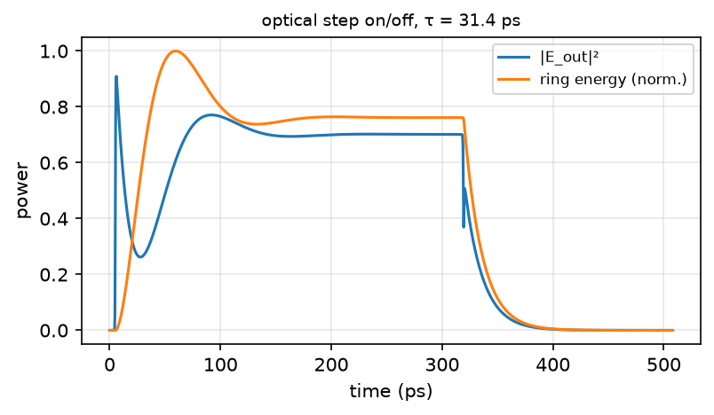
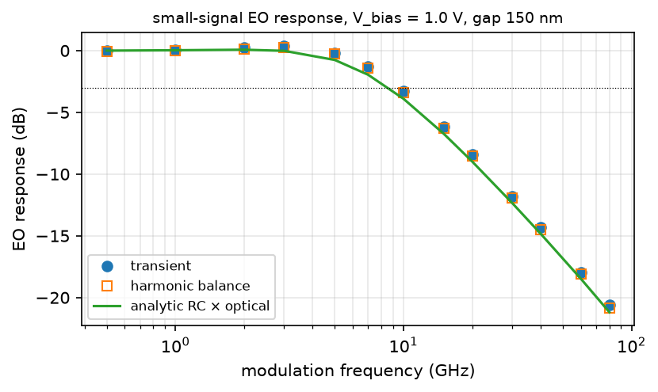
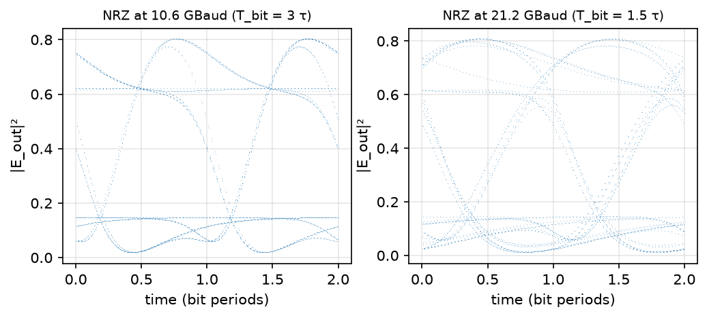

# 16 — depletion-mode ring modulator: circulax's example, every parameter from DBEME

Task: `tasks/13_mrm_electro_optic.md`. Scripts: `studies/mrm/eo_parameters.py`
(main venv), `studies/mrm/circulax_mrm.py` (`.venv-circuit`). Data and
figures: `reports/output/mrm/`. Date: 2026-09-20. Reference: circulax's
`ring_modulator` example (https://gdsfactory.github.io/circulax/examples/ring_modulator/),
whose t-CMT ring with an electrical port, RC driver and analyses are used as
written; report 15 for the ring and coupler.

**In one paragraph.** The example's ring has nine typed-in numbers. Here
each one has a source: `n_g`, `L` and the roughness loss from the ring
study, the through amplitude `γ` from the DBEME point coupler at a 150 nm
gap, and the electro-optic coefficients from the strip's TE0 field
overlapping a lateral pn junction with declared doping (Soref–Bennett
plasma dispersion). The result for the report-15 ring (500 × 220 nm,
R = 10 µm) is a 28 pm/V, V_π·L = 1.0 V·cm modulator whose photon lifetime
of 31 ps sets an electro-optic −3 dB bandwidth of 9.6 GHz at one
half-linewidth detuning; transient, harmonic balance and the analytic
RC × optical form agree to 0.6 dB; a 10.6 GBaud NRZ eye is open with 9 dB
between the levels, a 21 GBaud eye is closing. The RC pole is at 221 GHz,
so this design is photon-lifetime limited: bandwidth is bought with
coupling or loss, and the numbers say how much extinction each costs.

## 1. Sanity gate

| check | criterion | measured | pass |
|---|---|---|---|
| `dn_eff/dV` at 1 V reverse, 5e17 / 5e17 abrupt lateral junction | 10–50 pm/V; V_π·L 0.5–3 V·cm (literature for this doping) | 28.4 pm/V; 1.01 V·cm (50 pm/V at −0.5 V, 19 pm/V at 3 V) | ✓ |
| depletion overlap free of the 10 nm grid | smooth `Γ(V)` | line density interpolated at 0.1 nm; before that the slope was quantised (0 at 3 V) | ✓ |
| photon lifetime from an optical step at zero detuning vs t-CMT `τ` (amplitude; energy decays with `τ/2`) | 2 % | energy decay 16.14 ps → `τ` = 32.28 ps vs 31.44 ps: 2.7 % (fit window follows the 0.2 ps source edge) | marginal |
| EO response: transient vs harmonic balance | 0.5 dB | ≤ 0.26 dB over 0.5–80 GHz | ✓ |
| EO response: simulation vs analytic RC × second-order optical (example's form) | 0.5 dB to −3 dB | ≤ 0.62 dB up to 10 GHz (−3 dB: 9.6 GHz transient, 8.6 GHz analytic) | marginal; the analytic form is the linearised small-signal limit |
| eye at `T_bit = 3τ` open, at `1.5τ` closing | qualitative | 10.6 GBaud: opening 0.44, levels 0.63 / 0.08; 21.2 GBaud: 0.22, 0.74 / 0.14 | ✓ |
| operating point | `Δω·τ = 1` at the biased resonance | the bias shift enters once, through the ring's own `v_to_wr V` (first run double-counted it: 1.7 linewidths, peak at 10 GHz) | ✓ |

## 2. Device and parameter provenance

| t-CMT parameter | value | from |
|---|---|---|
| `n_g` | 4.175 | `ring_loss.json`, three-wavelength fit (report 15) |
| `L` | 62.83 µm (R = 10 µm) | report 15 |
| `γ` (through amplitude), gap 150 nm | 0.9823 (`κ²` = 0.0350) | `coupler_1550.json`, bus side (report 15 §2.3 on why the bus side) |
| roughness loss | 4.4 dB/cm | Payne–Lacey, σ = 2 nm, L_c = 50 nm (report 15) |
| free-carrier absorption, doped core, 1 V reverse | 14.0 − 4.0 = 10.0 dB/cm | `eo_parameters.py`: Soref–Bennett on the undepleted core, `Γ_core` = 0.914 |
| `α0` (round-trip amplitude `a`) | 0.9896 (14.4 dB/cm total) | sum of the two |
| `α1` = `da/dV` | 7.3e-4 /V | depletion removes absorption |
| `dn_eff/dV` at 1 V | 7.65e-5 /V = 28.4 pm/V | mode overlap with the depletion slab, `(n_Si/n_eff) Γ_dep Δn` |
| `v_to_wr` | −2.2e10 rad/s/V | `−ω₀ (dn/dV)/n_g` |
| `C_j` | 14.4 fF (0.23 fF/µm at W = 100 nm) | `ε h / W` over the ring |
| `R_s` | 50 Ω | **assumed** |
| junction | abrupt, at the core centre, full height, `N_A = N_D = 5e17 cm⁻³`, `V_bi` = 0.92 V | **declared** |

Lifetimes at the operating point: `τ_e` = 49.9 ps (coupling), `τ_l` = 84.9 ps
(loss), `τ` = 31.4 ps; `Q_L` = 19 100; optical pole `1/(2πτ)` = 5.1 GHz; RC
pole 221 GHz.

`eo_parameters.json`, per bias:

| V_rev (V) | W (nm) | Γ_dep | Δn_eff | dn/dV (/V) | pm/V | V_π·L (V·cm) | Δα (dB/cm) | C_j (fF/µm) |
|---|---|---|---|---|---|---|---|---|
| 0 | 68.9 | 0.178 | 2.1e-4 | 1.18e-4 | 43.8 | 0.66 | −2.8 | 0.33 |
| 1 | 99.6 | 0.254 | 3.0e-4 | 7.65e-5 | 28.4 | 1.01 | −4.0 | 0.23 |
| 2 | 122.8 | 0.311 | 3.7e-4 | 5.95e-5 | 22.1 | 1.30 | −4.9 | 0.19 |
| 3 | 142.3 | 0.357 | 4.2e-4 | 5.21e-5 | 19.3 | 1.49 | −5.6 | 0.16 |

## 3. Results

Optical step on/off at zero detuning: the ring energy builds and decays
with `τ/2` = 16.1 ps (t-CMT `τ` = 31.4 ps is the amplitude lifetime). The
delay-line ring of report 15 built from the same `γ`, `a` gives the same
`Q λ/(2πc)` (`tests_circuit/`), so the t-CMT and the round-trip models agree
on the lifetime.

| f (GHz) | transient (dB) | harmonic balance (dB) | analytic (dB) |
|---|---|---|---|
| 1 | 0.08 | −0.03 | 0.03 |
| 3 | 0.36 | 0.27 | −0.02 |
| 5 | −0.18 | −0.25 | −0.76 |
| 10 | −3.28 | −3.43 | −3.90 |
| 20 | −8.43 | −8.55 | −8.98 |
| 40 | −14.32 | −14.48 | −14.84 |
| 80 | −20.59 | −20.85 | −21.19 |

−3 dB at 9.6 GHz (transient), 8.6 GHz (analytic): about twice the optical
pole, the peaking of a ring detuned by one half-linewidth. The RC pole
(221 GHz) plays no part; this ring is photon-lifetime limited.

NRZ, ±1 V around 1 V reverse, 96 bits: at `T_bit = 3τ` (10.6 GBaud) the
eye opens 0.44 with levels 0.63 / 0.08 (9 dB); at `1.5τ` (21 GBaud) the
lifetime's inter-symbol memory closes it to 0.22. Note the asymmetric
rise/fall of the Lorentzian transfer and the slow tail on the low level,
both of which the example describes.

## 4. What the numbers say about the design

`τ = 1/(1/τ_e + 1/τ_l)`: at gap 150 nm the coupling lifetime (50 ps)
dominates; to reach the example's 7 ps one needs `1 − γ²` ≈ 0.2 (a 50 nm
gap or a longer coupler) or a lossier ring, each of which pulls the ring
out of critical coupling and costs extinction. The gap table of report 15
prices the first lever: `κ²` 0.035 → 0.014 → 0.006 for 150 → 200 → 250 nm.
A smaller ring helps both `τ_e` and `τ_l` in proportion to `L`; R = 5 µm
halves them, and its coupler exists (report 15, R = 5 rows) — a second
design point to run.

## 5. Limits

* The junction is a textbook abrupt model with declared doping; no
  process, no carrier transit, no temperature. Real lateral junctions are
  offset from the centre, partially etched, and have contact resistance
  far above 50 Ω; `R_s` is an assumption.
* The coupler's ring-side amplitude is imposed by symmetry (report 15 §2.3);
  `κ²` carries the ±14 % grid uncertainty of report 15.
* No self-heating or thermal tuning; no absolute resonance wavelength
  (report 15).
* circulax's transient is quasi-static in the S-matrix components; the
  ring here is the t-CMT ODE, which is exact for a single mode near
  resonance. Multimode rings belong to task 12.

## 6. References

- Circulax ring modulator example, https://gdsfactory.github.io/circulax/examples/ring_modulator/ (t-CMT form, analyses).
- R. A. Soref and B. R. Bennett, *IEEE J. Quantum Electron.* 23, 123 (1987) — plasma-dispersion coefficients at 1550 nm.
- Q. Xu, B. Schmidt, S. Pradhan, M. Lipson, *Nature* 435, 325 (2005) — the silicon ring modulator.
- W. Bogaerts et al., *Laser Photon. Rev.* 6, 47 (2012) — ring model.
