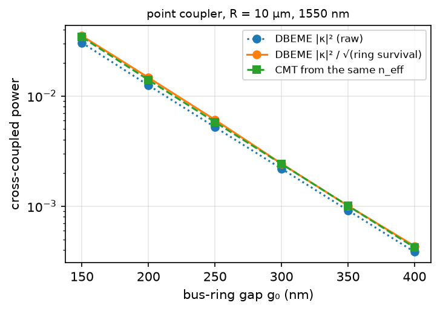
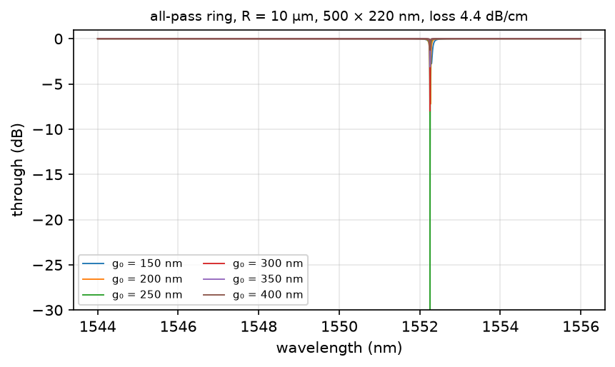
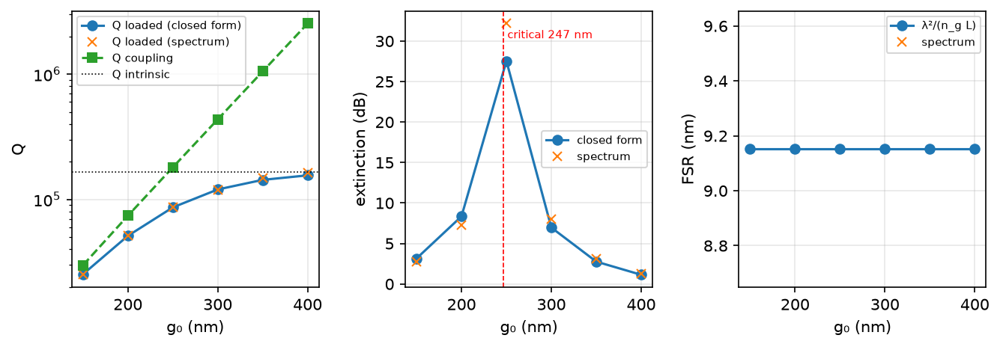

# 15 — all-pass micro-ring resonator from DBEME building blocks

Task: `tasks/11_ring_resonator_circuit.md`. Scripts: `studies/ring/`
(`build_coupler.py`, `ring_loss.py`, `ring_model.py`, `cmt_check.py`,
`gradient_check.py`, `circulax_ringdown.py`), `examples/demo_ring_resonator.py`.
Data and figures: `reports/output/ring/`. Date: 2026-09-20.

**In one paragraph.** A ring is a circuit, not a cascade: DBEME supplies the
bus-ring coupler (one path per gap over a dataset whose ring core walks away
from a fixed bus) and the bent strip's index and loss; the circuit layer
(`dbeme/circuit/`, sax) closes the loop and the analytical ring
(Bogaerts 2012) checks it. The coupler's bus side is converged and
power-conserving; its ring side is not computable in the straight frame
(the moving guide sheds its translation mismatch at every interface,
independent of mode count) and is imposed by the symmetry of identical
guides. With that stated, a 500 × 220 nm ring of R = 10 µm at 1550 nm gives
FSR 9.15 nm, n_g 4.18, an intrinsic Q of 1.7e5 from a 4.4 dB/cm roughness
budget, critical coupling at a 247 nm gap, and coupling that agrees with
coupled-mode theory from the same indices to 5 %, with direct EME to 3 %,
and with the closed-form ring to 1e-15 through sax. Absolute resonance
wavelengths are not claimed.

## 1. Sanity gate

| check (§) | criterion | measured | pass |
|---|---|---|---|
| ring algebra: amplitude vs intensity forms, unitarity, power conservation, FSR, FWHM, Q, critical coupling (Phase 1) | 1e-12 / 1 % | ≤ 5e-14; FSR −0.22 %; Q, FWHM, depth < 1 % | ✓ |
| sax adapter vs sax `straight` (sign of `exp(+iβz)`) | 1e-9 rad | 2.4e-14 rad | ✓ |
| sax ideal-coupler ring vs closed form | 1e-6 | 4e-15 in ‖T‖, 1e-15 rad | ✓ |
| §5.1 reciprocity, TE0 pair, coupler S | 1e-6 | 2.7e-7 … 2.5e-6 over 18 (gap, λ) paths | marginal: 1e-6 exceeded by ≤ 2.5× at the smallest gaps; of the eigensolver tolerance, not pursued |
| §5.2 mode-count convergence, bus side (g0 = 400 nm) | residual falls with N | ‖t‖² 0.99958 / 0.99958 / 0.99960, κ² 0.00038 / 0.00039 / 0.00039 at N = 6 / 12 / 20; N = 30 breaks the transfer-route cascade | ✓ bus side; **ring side does not converge** (0.781 / 0.781 / 0.785), see §2.3 |
| §5.4 slicing independence (g0 = 150 nm, 82 vs 83 sections, max section 10 → 0.5 µm) | Δκ² < 1e-4 | 2.9e-6 (Δ‖t‖² 6e-6) | ✓ |
| gap axis / cell: 10 nm vs 20 nm cell, g0 = 200, 300 nm | 1 % | +14 % coupling at 20 nm; CMT on each dataset's own `n_eff` shows the same +14 %, so it is the **cell** (mode solve), not the step | ✗ quoted as ±14 % (first order) to ±5 % (second order) on κ² |
| §7 A DBEME vs direct EME, g0 = 300 nm, 52 sections | Δ < 1e-3 | Δκ² 6.0e-5 (3 %), Δ‖t‖² 4.5e-5 | ✓ |
| PML convergence, R = 3 µm, 1550 (thickness ×1.3, stretch 1+3j, standoff +0.5 µm) | 5 % | 0.99, 1.000, 0.99 | ✓ |
| roughness model vs literature strip loss | factor 2 of 2–3 dB/cm | 4.4 dB/cm (EIM index), 7.8 (mode index), σ = 2 nm, L_c = 50 nm | ✓ (EIM) / ✗ (mode index): order-of-magnitude model, EIM form adopted |
| CMT vs DBEME coupler (corrected), R = 10 µm, six gaps | 5 % for κ² < 0.3 | ratios 1.026, 1.050, 1.048, 1.006, 0.999, 1.032 | ✓ (raw 0.89–0.91) |
| CMT vs DBEME, R = 5 µm | 5 % | 1.136 (200 nm), 0.986 (300 nm) | ✗ at 200 nm: the tighter arc walks the gap 2× faster per section |
| sax ring vs closed form on the DBEME coupler | Q 1 % | Q_L 25037 / 25286 … 163396 / 155651 across gaps (1–5 %; the 5 % is ‖t(λ)‖ moving between 1550 nm and the dip) | ✓ |
| circulax steady state vs sax, ideal ring, 2201 λ | 1e-4 | 8e-10 in ‖T‖, 1.3e-9 rad | ✓ |
| `jax.grad` vs central difference through the gap interpolant | 1e-3 | ≤ 3e-4 (κ²), ≤ 7e-3 (extinction, at the critical-coupling knee) | ✓ |
| circulax ring-down vs frequency-domain Q (delay-line plugin `circuit/circulax_ext.py`, ideal ring, Q = 22751) | 2 % | τ = 18.749 / 18.736 ps at N = 8 / 16 sections vs Q λ/(2πc) = 18.721 ps: 0.15 % / 0.08 % | ✓ |

## 2. Device and dataset

### 2.1 Coupler

`datasets/Si_ring_coupler_220nm_{1530,1550,1570}` (`platforms.ring_coupler_dataset_info`):
two fully etched 220 nm Si strips, Sellmeier Si / SiO₂, symmetric cladding;
axes `w1`, `w2` ∈ {480, 500, 520} nm and `gap` 100 → 400 nm by 10, 400 →
700 nm by 20; **10 nm cells** (464 × 160), window ±2.32 × ±0.8 µm, 6 modes;
~26 s per cross section. The bus is fixed at (−1.0, −0.5) µm and only the
ring core moves (`BusRingStrips`); every edge sits on a cell boundary at
every grid point (`tests/test_ring_coupler_platform.py`).

Path per gap `g0` and radius R: `gap(z) = g0 + R − √(R² − (z − z_max)²)` in
the straight frame, from the 0.7 µm end gap (even/odd splitting 1.5e-4,
residual coupling ~1e-6) to `g0` and back; 32–82 sections; `force_unitary =
False`, interface projection on the section entered. The lumped `(2N, 2N)`
S-matrix in tracked order is rotated from the TE0 even/odd supermodes into
the bus/ring basis with the sign read off the fields
(`build_coupler.analyse`).

**What the dataset buys.** The first gap at 1550 nm cost 776 s (24 new
points); the next five gaps and both R = 5 µm rings cost **0 s** of
solving; every warm build is 0.01 s. Direct EME of one gap: 531 s.

### 2.2 Ring

`studies/ring/ring_loss.py`, direct solves (no dataset):

| quantity | value |
|---|---|
| `n_eff` straight / R = 10 µm, 1550 nm (10 nm cells) | 2.44674 / 2.44845 |
| `n_g` (three wavelengths, degree-2 fit) | 4.178 |
| radiation loss R = 2 / 3 / 5 µm at 1550 (PML, 12 nm cells) | 0.58 / 7.3e-4 / 1.1e-9 dB/cm |
| roughness (Payne–Lacey, EIM, σ = 2 nm, L_c = 50 nm) | 4.43 dB/cm; bend enhancement ≤ 0.5 % at R ≥ 5 µm |
| round-trip amplitude a, R = 10 µm | 0.99680 |
| intrinsic Q (closed form) | 1.66e5 |

The arc model is `2πR` minus the chord the coupler already covers
(56.17 µm at R = 10 µm, chord 6.54 µm), with the bent guide's `n_eff(λ)`
and the loss as dB/cm; the coupler's ring passage is straight in the model
and an arc in reality — a 0.2 µm length correction is included, the index
difference over the chord (0.06 rad) is not.

### 2.3 What the straight frame cannot give: the ring side of the coupler

Measured on the cached dataset with single-step paths (400 → 390 → 400 nm
etc.): the per-interface loss of light in the ring equals the ring mode's
own overlap with itself shifted by the step — mismatch 2.0e-3 at 10 nm,
7.7e-3 at 20 nm, 2.9e-2 at 40 nm, 1.1e-1 at 80 nm, nearly ∝ step. Along a
path it adds up linearly: ring-side through power 0.75–0.83 for the six
gaps; and it does **not** fall with the basis (N = 6 / 12 / 20: 0.781 /
0.781 / 0.785), because the residual is a sharp localised field a dozen box
modes cannot hold. The bus never moves and is conserved to 1e-5 with κ²
converged in N. Hence the coupler is built from the converged bus through
amplitude `t` alone: `κ = i √(1 − ‖t‖²) t/‖t‖` (quadrature; bus-side power
conservation puts `1 − ‖t‖²` within 1e-4 of the survival-corrected
κ²/√(ring survival), which CMT confirms to 5 %) and `S(ring→ring) = t` by
the symmetry of identical guides. Before this, the imposed coupler was 8–13°
off quadrature and the sax ring transmitted 1.66.

## 3. DBEME result

| g0 (nm) | κ² (DBEME) | κ² CMT | ‖t‖² | Q_L | Q_c | ER (dB) | regime |
|---|---|---|---|---|---|---|---|
| 150 | 0.0350 | 0.0341 | 0.9650 | 2.5e4 | 2.7e4 | 3.2 | over-coupled |
| 200 | 0.0143 | 0.0140 | 0.9857 | 5.1e4 | 7.4e4 | 8.4 | over-coupled |
| 250 | 0.0059 | 0.0058 | 0.9941 | 8.6e4 | 1.8e5 | 27.5 | near critical (247 nm) |
| 300 | 0.0024 | 0.0024 | 0.9976 | 1.2e5 | 4.4e5 | 7.0 | under-coupled |
| 350 | 0.0010 | 0.0010 | 0.9990 | 1.4e5 | 1.0e6 | 2.8 | under-coupled |
| 400 | 0.00042 | 0.00042 | 0.9996 | 1.6e5 | 2.5e6 | 1.1 | under-coupled |

FSR 9.151 nm (λ²/(n_g L)), Q_i = 1.66e5, critical coupling at g0 = 247 nm;
R = 5 µm: κ² 0.0060 (200 nm), 0.0011 (300 nm). Resonance shift **0.57 nm per
nm of ring width** (`dn_eff/dw` = 1.53e-3 /nm from the strip dataset) — a
sensitivity, not a position.

The over/critical/under sequence with gap, the 27 dB extinction near
critical coupling and the Q_L → Q_i saturation are the textbook picture
(Bogaerts 2012 §2); every number in it that depends on the loss depends on
the roughness assumption.

## 4. DBEME vs direct EME

Same path, same slicing, same mode count, `force_unitary=False` on both
(g0 = 300 nm, R = 10 µm, 52 sections): κ² 0.00219 (dataset) vs 0.00213
(direct), ‖t‖² 0.99756 vs 0.99760. Timing: direct 531 s; dataset 0.006 s
warm, 776 s cold for the whole gap axis the six gaps share. The speed-up on
the gap sweep is the method's claim: six gaps and two radii for one cold
build.

## 5. DBEME vs references

### 5.1 Internal (done)

Coupled-mode theory from the same `n_eff` (§1): 5 % at R = 10 µm after the
ring-side correction, 14 % at R = 5 µm / 200 nm. Slicing 3e-6. Direct EME
3 %.

### 5.2 Lumerical, same geometry — **to be filled** (v231 is installed; scripts to go under `studies/ring/lumerical/`)

| reference run | DBEME value | Lumerical value | discrepancy | cause |
|---|---|---|---|---|
| MODE FDE, 500 × 220 straight, 1550: `n_eff`, `n_g` | 2.44674, 4.178 | | | |
| MODE bent, R = 10 µm: `n_eff` | 2.44845 | | | |
| MODE bent, R = 3 µm: loss (dB/cm) | 7.3e-4 | | | |
| FDTD 3-D point coupler, R = 10 µm, gap 150 / 200 / 250 / 300 nm: κ² at 1550 | 0.0350 / 0.0143 / 0.0059 / 0.0024 | | | the ring-mode outward shift and the 10 nm-cell ±14 % are the expected causes |
| FDTD: bus through ‖t‖² | 0.9650 / 0.9857 / 0.9941 / 0.9976 | | | |
| Lumerical EME, same coupler, gap 200 nm: κ² | 0.0143 | | | |
| INTERCONNECT ring from the exported S: resonance positions, ‖T‖ | (sax) | | | needs a Lumerical `.dat` writer if the VPI format is refused |
| FDTD 3-D full ring, R = 5 µm, gap near critical: FSR / Q_L / ER / position | 18.3 nm (λ²/(n_g L)) / — / — / not claimed | | | 20 nm mesh both sides; roughness absent in both |

### 5.3 Literature — **to be filled**

| paper | quantity | DBEME | paper | discrepancy | cause |
|---|---|---|---|---|---|
| Chrostowski & Hochberg 2015 ch. 4 (220 nm, 500 nm, oxide, R = 10 µm, FDTD κ² vs gap) | κ² at 150 / 200 / 250 / 300 nm | 0.0350 / 0.0143 / 0.0059 / 0.0024 | | | confirm figure, radius and mesh in the book |
| Bogaerts et al. 2012 | `n_g` of a 220 nm wire; FSR vs R | 4.18; 9.15 nm at R = 10 µm | | | |
| Dumon et al. 2004 (220 nm, 248 nm DUV, 1 µm BOX) | FSR at the paper's R and width; coupling-limited Q | (compute at the paper's geometry) | Q > 3000, 2.4 dB/cm | | BOX leakage and roughness absent here |

**How to compare Q:** coupling-limited Q (over-coupled regime) depends only
on κ² and is the comparable number; intrinsic Q depends on the assumed σ,
L_c; the critical-coupling gap depends on both.

## 6. Conclusions and limits

* **Supported.** FSR and `n_g`; the coupler's bus-side through and cross
  power vs gap (three internal checks agree to 3–5 %); the over → critical →
  under progression with gap; extinction and loaded Q *as functions of the
  loss assumption*; resonance shift per nm of width; the sax and circulax
  compositions of these blocks; gradients through the cached grid.
* **Not supported.** Absolute resonance wavelength (`n_eff` to 2e-3 is
  0.7 nm; the cell moves κ² by 14 %); the ring-side coupler amplitude from
  the cascade (imposed by symmetry); intrinsic Q beyond the roughness model's
  order of magnitude; anything at R = 5 µm to better than 15 %; the
  ring-down in circulax 0.2.3.
* **What the frame costs.** A straight-frame EME of a moving guide is exact
  for the guide that does not move and loses the moving guide's translation
  mismatch at every interface, linearly in the step count, whatever the
  basis. A frame with the ring straight would move the bus instead. The
  Lumerical FDTD rows in §5.2 are the way to price the residual (the
  ring-mode outward shift, the cell) — run them.
* **Next** (tasks/11 §4 blanks; tasks/12): the FDTD and literature rows;
  the multimode round-trip operator and a pulley coupler.
