# 22 — O-band bilayer double-tip edge coupler (Wan & Wang 2025)

**Task:** [tasks/18_edge_coupler_oband.md](../tasks/18_edge_coupler_oband.md).
**Paper:** Y. Wan, J. Wang, *O-band low loss and polarization insensitivity
bilayer and double-tip edge coupler*, Adv. Photonics Nexus **4**(2), 026004
(2025). The paper's curve values below were digitised from the figure pixels
(`reports/output/edge/paper_digitised.json`, axis-calibrated on the tick
marks; ±0.004 in overlap, ±0.01 dB in loss). Table 1, the text's measured
1.18 / 1.46 dB and the measured PDL of 0.48 dB are quoted from the paper.

**Where the numbers live.**

* `reports/output/edge/summary.json` (`studies/edge_coupler/summary.py`)
  collects the headline losses, lattice terms, gate, optimisation and
  full-stack numbers.
* `studies/edge_coupler/report_tables.py` prints the loss, staircase,
  full-stack and direct tables from them.
* The facet overlaps are in `phase1_*.json`, the stretch budgets in
  `device_<λ>.json`, the length scan in `stretch_scan.json`, and the
  direct-EME runs in `direct_*.json`.
* Every number is from the 1.0.0 solver, regenerated on 2026-10-02 (all
  outputs above, the six direct-EME runs and the Fig. 4 planes included),
  with the four corrections to the cascade (README, "What changed relative
  to upstream" → Fixed):
  * one sign per mode in both overlap sets;
  * the interface reflection block;
  * the interface column cap, now opt-in and off;
  * the reciprocal projection of each lossy interface matrix. It makes the
    cascade reciprocal by construction, so §1's reciprocity rows are
    computed with it off and still measure the basis.
* The report was first written (2026-09-30) before the fourth correction.
  It moved the best estimates by ≤ 0.009 dB; §2.7's two-mask rows and §7's
  length optimum moved more, and each says so in place. §2.7 also quotes the
  upstream reflection block's figures, as history.

> **Outcome.** This is the first fibre-to-chip device in the repository: a
> Gaussian fibre launch on the lossy PML basis, into an 86.5 µm path of 280
> cached sections.
>
> * **Fig. 3 is reproduced.**
>   * Each series' mean error against the paper is within 0.05
>     (−0.048 … +0.017).
>   * The worst points, 0.06–0.08, are at the widest tips (150 and 220 nm TE,
>     `Wtip` 180–190 nm) and along the 220 nm TM curve.
>   * At the design point: 0.872 / 0.843 (TE/TM) against the paper's
>     0.848 / 0.858. Both are within 3 points of polarisation-insensitive,
>     though the TE/TM order is reversed.
>   * The conventional 220 nm tips' TM collapses to 0.375, against 0.428.
> * **The TE coupling loss (best estimate) is 0.03–0.09 dB above the paper's
>   3D-FDTD across the band:** 0.92 / 0.86 / 0.94 dB at 1260 / 1310 / 1360 nm,
>   against the paper's 0.89 / 0.77 / 0.87.
>   * For TE the best estimate is the lower bound to within 0.02 dB. It rests
>     on treating the join-to-L3 stretch as lattice, which is measured for L3
>     but only bounded for the rest of L1 and L2 (§4.3, §9).
>   * Part of the agreement is compensation: the TE facet couples 0.12 dB
>     better than the paper's (§3).
>   * The conservative bound is 0.83–0.91 dB above the paper.
> * **TM runs 0.47–0.64 dB high:** 1.56 / 1.59 / 1.88 dB, against
>   1.10 / 1.09 / 1.23.
>   * The main term is our reading of the wedge MMI (Q3). TM loses
>     0.41–0.68 dB there, 0.38–0.48 dB more than TE.
>   * Smaller terms: the facet overlap (0.08 dB at 1310 nm), substrate
>     leakage in the tips, and at 1360 nm a length-dependent TM loss in the
>     height converter.
>   * The **PDL gate fails**: 0.64 / 0.73 / 0.94 dB, against < 0.5. About
>     half of the excess over the paper's PDL at 1310 nm is the facet, whose
>     TE/TM order is reversed (§4.4).
>   * The 1310 nm TM best estimate is +0.4999 dB against the task's 0.5 dB
>     criterion. It passes by the letter, by 8e-5 dB, a hundredth of the
>     ±0.01 dB digitisation error, so the call is not resolved; the
>     conservative bound fails (+1.02 dB).
> * **The conventional tips' TM penalty** is there and falls with wavelength,
>   as in Fig. 5: 4.0 / 3.3 / 2.7 dB, against the paper's 3.4 / 2.4 / 1.8.
> * **The width lattice is the dominant numerical error.** As built on the
>   10 nm lattice the device reads ~1.8–2.3 dB (bilayer, oxide launch).
>   Three pieces are lattice, each measured directly:
>   * the tip: 0.00–0.07 dB;
>   * the corner points the path walks through at every diagonal step of the
>     height converter: 0.27 dB TE. This follows from the axis choice, §4.3;
>   * the converging arms' 20 nm steps: 0.27 % of TE per gap step, whatever
>     the gap.
> * **How the best estimate removes the lattice.** A zero-solve length scan
>   of the join-to-L3 stretch (§4.3) finds L3 flat from 0.25× to 8× its
>   length at 1310 and 1360 nm (and for TM at 1260 nm; the 1260 nm TE moves
>   between −0.01 and +0.06 dB of its 1× value). Only a small part of the
>   stretch falls with length:
>   TM 0.01 / 0.04 / 0.12 dB, TE ≤ 0.02 dB. The best estimate treats the
>   stretch as lattice except that part.
>   * The lower bound takes the whole stretch as lattice: 0.00–0.12 dB below
>     the best estimate.
>   * The conservative bound removes only the tip term and the corners (the
>     corners measured at 1310 nm) and keeps the arm-step loss: TE
>     1.68–1.75 dB, TM 2.11–2.35 dB.
> * **The facet needed the full stack.** On the oxide-only EME basis, the
>   near-cutoff tip mode touches the bottom PML (F5 fails there). So the launch
>   and the tip are solved on the full stack, with the Si substrate. They join
>   the oxide path through a mode-matching interface on the identical grid,
>   which transmits the fundamental with 0.99993 / 0.9984 at 1310 nm.
> * **Phase 4.** Re-optimising the six lengths on the warm cache, at zero
>   mode solves:
>   * the 1310 nm objective falls from 2.06 to 1.74 dB (CMA-ES, then
>     L-BFGS-B; L-BFGS-B alone stalls at 1.84 dB);
>   * the band objective falls from 2.28 to 2.03 dB (L-BFGS-B alone reaches
>     2.05 dB).
>   * The staircase's own response to a length change is of the same size,
>     and a cascade change worth 0.001 dB at Table 1 moved the 1310 nm
>     optimum by 15 µm in total length, so the gains are indicative (§7).
>   * A CMA-ES over the facet (41 lossy solves, 38 distinct candidates
>     archived) moves the worse polarisation's coupling from 0.831 to 0.872,
>     at `Wtip` 95 nm, `g` 1.28 µm.
> * **The gate** passes, except for:
>   * §5.4 slicing by the letter: ≤ 2.5e-3 (bilayer 2.4e-3) against 1e-4;
>   * F5 on the oxide-only stack, which is why the launch and tip are on the
>     full stack, where F5 passes;
>   * F1 at two points;
>   * F3 parity by the letter;
>   * the PDL.
>
>   Reciprocity, measured with the reciprocal projection off, is 2.5e-4. The
>   full-device §5.8 check was not run. On the tip stretch (oxide basis) and
>   on the MMI plus output (60 of 280 sections), the cached cascade
>   reproduces a from-scratch EME to ≤ 9.2e-7 (≤ 3.7e-5 when the stretch is
>   cut from the device's own path).

---

## 1. Sanity gate

1310 nm, bilayer unless stated; `gate.py` → `gate_1310.json`,
`gate_detail.py` → `gate_detail_1310.json`, `archive_checks.py`,
`window_check.py`, `direct.py`. The gate scripts open the oxide-only dataset,
so the facet rows F3/F4 are on that basis.

| check (§5.x / task gate) | criterion | measured | pass |
|---|---|---|---|
| 5.1 reciprocity, physical channel (facet fundamental → output TE0/TM0), reciprocal projection off | < 1e-2 relative (lossy) | **2.5e-4 / 2.0e-4** (TE/TM; conventional 1.8e-4 / 6.3e-6); with the opt-in column cap 4.1e-3 / 1.1e-3 | ✓ — note 1 |
| passivity: physical input columns of the lumped \|S\|² | < 1.05 | 0.733; conventional 0.779 | ✓ |
| passivity: the fibre launch, out + reflected (oxide launch) | ≤ the beam's power in the window, 0.973 | 0.643 + 6.8e-5 (TE), 0.652 + 1.4e-5 (TM) | ✓ downstream — on the oxide basis the launched TE fundamental alone carries \|a\|²·r = 1.05 > 0.973 (the PML-affected tip mode, §5 †); the full-stack launch is passive |
| 5.4 slicing: `z` sampled at 50 / 12.5 nm instead of 25 nm | max\|ΔT\| < 1e-4 (§5.4) | ≤ 2.4e-3 (bilayer), 2.5e-3 (conventional), i.e. ≤ 0.018 dB (bilayer ≤ 0.016 dB). The resampling moves where the lattice steps fall (280 sections in all three samplings), so the staircase itself changes; the total reflection is only 6.8e-5 / 1.4e-5 | ✗ by the letter (a staircase-position effect, ≪ the lattice terms of §4.3) |
| 5.7 / F5 window and PML at the facet, **full stack** (0.25 µm Si PML; the launch basis's 0.5 µm Si PML is one of the variants) | eq. (1) < 1e-3, `Im n` < 10 % | ≤ 7e-4, ≤ 7.2 % | ✓ |
| 5.7 / F5, **oxide-only stack** (the EME basis away from the tip) | same | a ±6.5 µm window moves eq. (1) by 0.019 (TE) / 4e-4 (TM); a 1 µm PML moves it by 0.086 / 0.072 and `Im n` by −81 % / −79 % | ✗ — why the launch and tip are on the full stack (§2.4) |
| 5.8 DBEME vs direct EME, **aligned**: tip stretch 0–25 µm (25 sections) | max\|ΔT\| < 1e-3 | **6.3e-7 / 9.2e-7** against the stretch's own cascade; 3.7e-5 / 2.6e-5 against the device cascade | ✓ |
| 5.8 aligned: MMI + output 76–86.5 µm (35 sections) | max\|ΔT\| < 1e-3 | **1.5e-7 / 2.8e-7** | ✓ |
| 5.8 full device (task Phase 3 gate) | max\|ΔT\| < 1e-3 | not run (~8 h aligned) | — |
| 5.8 exact-value sections: L1 / L2 / L3 / MMI + output | reported | \|ΔT\| 0.020 / 0.061 / 0.023 / 0.005 (TE): snapping and walked corners (§6) | — |
| 5.13a the launched branches' tracked links | > 0.5 | min 0.868 (TE), 0.905 (TM), both at the MMI output face; one link < 0.9 | ✓ |
| 5.13a the fundamental in the stored set at every point | top stored mode vs the target rule's coarse lossless estimate | within −0.032 … +0.029 (bilayer, 263 points), −0.032 … +0.049 (conventional, 210 points) | ✓ |
| F1 150 nm overlaps against Fig. 3 | ±0.05; TE/TM gap ≤ 5 points over 100–150 nm | inside ±0.05 except TE at `Wtip` 180 and 190 nm (−0.073, −0.079); gap ≤ 2.9 points | ✓ except two points |
| F2 220 nm TM | ≥ 30 points below TE at 130 nm | 42 points | ✓ |
| F3 parity: centred launch into x-odd modes (oxide basis) | < 1e-4 | 5.8e-3 (TE), 1.1e-2 (TM) | ✗ by the letter — note 2 |
| F4 completeness (oxide basis) | reported | the window holds 0.973 of the beam; Σ\|c_m\|² = 1.60 (TE) / 1.73 (TM) — the lossy basis is not orthogonal; there the fundamental takes \|a\|² = 0.945 / 0.901 (conjugated power coupling 0.848 / 0.843); on the full stack η = 0.859 / 0.829 | — note 2 |
| Phase 3: bilayer against Fig. 5 at 1310 nm | each within 0.5 dB | TE +0.09, TM +0.4999 dB (best estimate); conservative bound +0.91 / +1.02 | ✓ by the letter on the best estimate (TM by 8e-5 dB, inside the ±0.01 dB digitisation, so the call is not resolved); ✗ on the conservative bound |
| Phase 3: PDL over 1260–1360 nm | < 0.5 dB | 0.64 / 0.73 / 0.94 dB (best estimate) | ✗ |
| Phase 3: 220 nm reference | TM penalty ≥ 1.5 dB, falling with λ | 4.0 / 3.3 / 2.7 dB | ✓ |
| tests | | `tests/test_bilevel_pair.py`, `tests/test_fiber_launch.py`, `tests/test_overlap_gauge.py`, `tests/test_interface_reflection.py`, `tests/test_reciprocal_interface.py`; full suite 473 passed | ✓ |

**Note 1 — reciprocity and the column cap.**

* **The basis** (cap off, reciprocal projection off) keeps the physical
  channel reciprocal to 2.5e-4 / 2.0e-4 (TE/TM). At the default the
  projection makes the lossy cascade reciprocal by construction, so
  `gate.py` and `gate_detail.py` compute this row with it off (README →
  Fixed, "Reciprocal interface matrix").
* **The opt-in cap** (`SingleEME.INTERFACE_COLUMN_CAP`, report 13 §12)
  raises that to 4.1e-3 / 1.1e-3, also with the projection off.
  * It scales down every interface column whose power exceeds 1, which is a
    one-directional operation. It acts after the projection, so a capped
    cascade is not reciprocal by construction.
  * Uncapped, 52 interfaces have a physical column up to 0.59 % above 1
    (their locations are not archived), and the device stays passive
    (0.733).
  * The cap costs 0.10 / 0.06 dB (TE/TM) on this device, and 0.06 /
    0.002 dB for the conventional tips (`archive_checks.json`).
* **History.** Before 2026-09-30 this row read 3.7e-2 / 2.6e-2 with the cap.
  Most of that was upstream's reflection block: with the corrected block and
  the cap it is 4.1e-3.

**Note 2 — F3/F4 on a lossy basis.**

* **Cross-polarised carriers, at least 1.7e-3 of 5.8e-3 (TE) and 3.8e-3 of
  1.1e-2 (TM),** counted among the five largest odd carriers.
  * These modes have an odd dominant component and an even minor component,
    so coupling to them is symmetry-allowed.
  * The parity metric reads only the dominant component, so it counts them
    as odd.
* **Co-polarised odd continuum members, 2.3e-3 / 4.5e-3 among those five.**
  * `Im n` 0.029–0.043: a power 1/e length of 2.4–3.6 µm, with 2–6 % left
    after 10 µm.
  * Parity −0.97 … −1.36: the biorthogonal basis leaves them a small even
    admixture.
* **The rest,** 1.8e-3 / 2.8e-3, sits in smaller carriers that are not
  archived.
* **The odd supermodes.** On this basis they sit below the oxide line, and
  neither is among the five largest carriers (each < 4.2e-4 TE /
  7.4e-4 TM).
* **Why Σ\|c_m\|² exceeds the power in the window.** The modes' powers do not
  add on a non-orthogonal basis.
* **Reconstruction.** The E field rebuilt from the fundamental alone leaves
  0.152 / 0.147 (TE/TM) of the beam, close to 1 − η on this basis
  (0.15 / 0.16). Adding the continuum makes it worse (2.9 / 3.6 with all
  40), because a truncated PML continuum is not an L² basis for a freely
  diffracting beam.

The radiated part is lost, as it should be, but it is not tracked.

## 2. Device, platform and basis

### 2.1 Geometry

The geometry is Table 1 of the paper plus the three readings recorded in
`tasks/18` (Q1–Q3, confirmed by Jae). The fibre is at `z = 0`.

| z (µm) | segment | `w_low` (150 nm shelf) | `w_high` (220 nm part) | `gap` |
|---|---|---|---|---|
| 0 → 25 | L1, double tip | 130 → 248 nm | 0 | 1.6 µm |
| 25 → 45 | L2, height converter | 248 → 0 | 0 → 342 nm (inner edge) | 1.6 µm |
| 45 → 68 | L3 | 0 | 342 → 450 nm | 1.6 → 0.415 µm |
| 68 → 76 | Lt, MMI access | 0 | 450 → 800 nm | 0.415 → 0 |
| 76 → 78.5 | Lm, wedge MMI | 0 | 800 → 750 nm (`gap` 0: one 1.6 → 1.5 µm strip) | 0 |
| 78.5 → 86.5 | output taper | 0 | 367.5 → 225 nm (0.735 → 0.45 µm) | 0 |

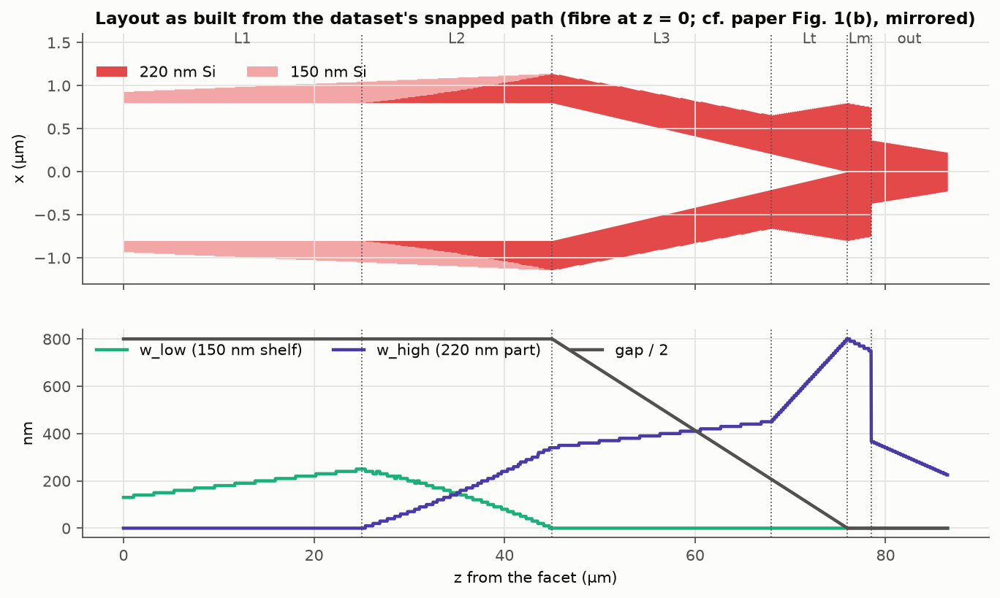

The **conventional** reference (the paper's dashed curves) is the same path
with the partial etch removed: 220 nm tips from the facet, and `w_low = 0`
throughout. It lives in the same dataset family.

### 2.2 Cross section and platform

**Cross section.** `BiLevelPair` (`dbeme/fde/cross_section.py`) is two arms
mirrored about `x = 0`. Each arm is a 150 nm shelf of width `w_low` with a
220 nm part of width `w_high` on its inner edge; `gap` is measured edge to
edge.

* At `gap = 0` the arms merge into one strip. So the MMI and the output guide
  are points of the same family: one grid, one window, and every junction an
  ordinary neighbour overlap.
* The axes are `(w_low, w_high, gap)` rather than `(w, w_hi)`, so that every
  corner a walked path passes is a valid geometry. §4.3 covers what the
  corners cost.
* Stack: 2 µm BOX, 2 µm top oxide, air above. A `core_mask` restricts the
  lossy backends' confinement filter to the device layer.
* Tests: `tests/test_bilevel_pair.py`.

**Platform.** `dbeme.platforms.wan2025_edge_coupler_dataset_info` sets up a
PML finite-difference backend:

| item | value |
|---|---|
| window | ±5.5 µm × (−2.61, 2.79) µm |
| mesh | 50 nm base cells, refined to 10 nm over `\|x\| < 1.2 µm` and `y ∈ (−0.41, 0.44) µm`; every layer boundary on a node |
| PML | 0.5 µm on all four edges (the facet solves of `phase1.py`, `leakage.py` and the F5 baseline use the default 0.25 µm Si PML below the BOX, 413 × 172 nodes; eq. (1) agrees with the 0.5 µm grid to ≤ 6.3e-4) |
| modes and fields | 40 modes, co-located fields |
| nodes | 413 × 177 |
| `w_low` axis | 10 nm |
| `w_high` axis | 10 nm, with 5 nm over 220–370 nm (the output taper), and 367.5 nm |
| `gap` axis | 20 nm (10 nm below 200 nm), and 415 nm (`d`) |

**Datasets**, each at 1260, 1310 and 1360 nm:

* `datasets/Si_bilevel_pair_220_150nm_ox_<λ>`: oxide-only stack, the whole
  path.
* `..._ox_tip_<λ>`: the width axes at 2.5 nm over 90–260 nm.
* `..._full_tip_<λ>`: full stack, from the facet to the 200 nm join.

The FEM backend was not compared (task Phase 0.3). Its absorber is one
uniform lossy ring, which cannot terminate a Si substrate below and air above
at the same time.

### 2.3 What the basis needed (Phase 0.3)

**The Si substrate cannot be in the path's EME window.**

* Two ways of putting it in were tried: physical Si above a 0.5 µm PML, and a
  thin Si-only PML at the BOX interface. Either way it forms a slab between
  the oxide and the PML wall.
* That slab carries a dense band of PML-guided modes: `Re n` from ≲ 1.8 to
  3.2, `Im n` 0.12–0.45, with 93–99.9 % of their power in the PML.
* Around a shift-invert target of 2.3 they filled all 30 slots at the tip,
  which had no device mode. With physical Si above the PML the output strip
  lost TE0; with the thin Si-only PML the MMI lost TE0–TE2.
* Around a target at the MMI's fundamental, the band still pushed out every
  TM mode and TE3–TE5. That target is 2.929 from the target rule; the mode
  itself is at 2.960.

The probe logs are `reports/output/edge/probe_*.log`. So the path's EME
basis is the **oxide-only stack**.

**No single target serves the path.**

* The guided index runs from 1.451 (tip TE on the oxide stack) to 2.96 (MMI
  TE0).
* The oxide stack's Berenger band sits at 1.81–1.87 + 0.33–0.38j, nearer to
  2.3 than the tip mode is.
* So `TargetRulePMLBackend` (`dbeme/fde/pml.py`) sets the target point by
  point from `FundamentalTarget` (`dbeme/platforms.py`). That solves the same
  arms in plain oxide on a 40 nm PEC-boxed grid (1–2 s) and rounds the
  highest index to 1e-3. The rule's name is part of the dataset identity.

What the 40-mode set holds:

| point | modes |
|---|---|
| tip | the two tip supermodes and the near-cutoff oxide continuum (`Re n` down to ~1.37) |
| MMI | TE0–TE5 and TM0–TM3 |
| output | TE0 (2.6502) and TM0 (2.1287), confinement 0.99 and 0.98 |

**Solve cost.** The shift-invert is now factorised with a minimum-degree
ordering on `Aᵀ + A` instead of SciPy's default COLAMD
(`dbeme/fde/pml.py::_shift_invert`, `studies/edge_coupler/profile_solve.py`):

* fill per factor: 9.8 M → 5.7 M;
* `eigs`: 102 → 67 s, including the factorisation (63 s + 4.4 s), on 146 202
  unknowns;
* eigenvalues unchanged to 1.3e-13.

### 2.4 The facet and the tip on the full stack

**The oxide stack is not converged at the facet.** There the near-cutoff tip
mode's tail reaches the bottom PML 2 µm below:

* a 1 µm PML moves its eq. (1) overlap by 0.086 / 0.072 (TE/TM) and its
  `Im n` by ~80 %;
* a ±6.5 µm window moves the TE overlap by 0.019 (§1, F5).

On the full stack the Si substrate terminates the tail instead of the PML,
and the same checks move nothing (≤ 7e-4, ≤ 7.2 %).

**How the full stack is joined in.** `studies/edge_coupler/fullstack_tip.py`
solves the launch and the tip on the full stack, from the facet to the 200 nm
join at 13.8 µm, where the mode is confined and both stacks agree.

* It uses a small dataset whose grid is **identical** to the oxide datasets':
  a 0.5 µm Si PML makes the window and the stretched layers coincide.
* At the join, one cross-stack mode-matching interface is built from the
  full-stack and oxide-stack modes of the same point on the same grid, so no
  interpolation is needed. The oxide path continues from there.
* It transmits the fundamental with:

| λ | TE | TM |
|---|---|---|
| 1260 nm | 0.99997 | 0.9996 |
| 1310 nm | 0.99993 | 0.9984 |
| 1360 nm | 0.9996 | 0.9963 |

**What this changes.**

* **The launch becomes clean.** At 1310 nm the full-stack launch into the
  fundamental, 0.860 / 0.838, is within 0.01 of its conjugated power
  coupling, 0.859 / 0.829. Across the band it is within 0.015; the largest
  gap is TM at 1360 nm, 0.865 against 0.851. So `|a|²` is power again, to
  that accuracy.
* **The substrate leakage is exact up to the join.**
* **The loss changes** against the oxide launch with a first-order leakage
  correction:
  * TE by −0.01 … +0.15 dB;
  * the bilayer TM by +0.09 … +0.19 dB;
  * the conventional TM by −0.03 … −0.05 dB.
  * On the oxide basis the launched fundamental's `|a|²` overstates its
    conjugated power coupling: 0.945 / 0.901 against 0.848 / 0.843 (TE/TM,
    1310 nm). The TE fundamental alone carries `|a|²·r` = 1.05 > 1, the
    PML-affected tip mode (§5 †).
* **The bilayer TM loses in the tip.** On the full stack it loses 0.14 dB
  between the facet's power coupling and the join (0.829 → 0.804), where the
  oxide basis had shown a spurious gain. The march from the launch `|t|²` of
  0.838 gives 0.18 dB (§4.2).

### 2.5 Substrate leakage after the join

`studies/edge_coupler/leakage.py` solves the full stack at the path's points
up to 30 µm. It replaces the oxide-stack `Im n` of the launched branch with
the full-stack one,
`P → P·exp(−2k₀∫(Im n_full − Im n_ox) dz)`, which is first order in a 1e-4
leakage rate.

After the join this is worth 0.00 dB for TE, and 0.012 / 0.034 / 0.090 dB for
the bilayer TM at 1260 / 1310 / 1360 nm. The 150 nm tips' TM is the leakiest
mode of the structure. The conventional tips bind TM and do not leak.

### 2.6 The fibre

`dbeme/propagator/fiber.py`.

* **The beam.** A Gaussian of waist `w0 = 2 µm` (4 µm MFD), E along x (TE) or
  y (TM), in oxide. It is normalised to unit power on the infinite plane and
  cut to the window's physical interior, so power outside the window counts
  as lost.
* **The expansion.** Its projections `A = <E_g, H_m>` and `B = <E_m, H_g>` on
  the facet's modes (the dataset's normalised, biorthogonal basis) give the
  E- and H-expansion coefficients `s = M⁻ᵀA` and `d = M⁻¹B`.
* **The launch** is the per-mode interface transmission `t = 2sd/(s + d)`.
  * It is exact for a mode of the beam's shape: Fresnel `1 − r²`
    (`tests/test_fiber_launch.py` checks 8/9 for 1 → 2).
  * It reduces to the plain overlap when the indices match, as they nearly
    do here.
  * The naive `(s + d)/2` is not a transmission (9/8 in the same test).
* **The offset.** The fibre's vertical offset is scanned over ±0.6 µm. The
  best is centred for every full-stack launch except the 1260 nm bilayer TM
  (−0.05 µm).

The paper's eq. (1) is also computed as written (`fiber.paper_overlap`),
together with the conjugated Poynting power coupling
(`fiber.power_coupling`). The unconjugated, biorthogonal quantity §5.16
names is the launch `|t|²` itself. On a lossy basis it is not a power, which
is why the conjugated form is quoted as the physical coupling.

### 2.7 The path

`studies/edge_coupler/device.py`. `EdgeCouplerPath` (a `ParametricPath`)
does two things the base class does not:

* **The MMI output face is one interface.** A step of more than four grid
  steps between two samples is linked directly instead of being walked
  through the intermediate widths. Walking it would turn the abrupt
  1.5 → 0.735 µm face into a taper.
* **No mutual-neighbour corner solves.** The propagator never reads a
  diagonal step's mutual-neighbour corner (the one the walk does not pass
  through), so skipping it saves a solve per diagonal step. The walked corner
  points themselves are solved and cost loss (§4.3).

**One gauge for both overlap sets.** This study found the gauge bug that the
base class now fixes (tag `pre_gauge_ab_ba`; README, "What changed relative
to upstream").

* **The old rule.** Upstream fixed each mode's sign from the diagonal of
  `overlap_ab` and, in a second pass, from the diagonal of `overlap_ba`.
* **What went wrong** (`gauge_trace.py` → `gauge_trace.json`):
  * The raw diagonals disagree in sign at 120 / 148 / 137 branch-interfaces
    of the bilayer path (1260 / 1310 / 1360 nm). Only 3–4 of these touch a
    physical branch.
  * Each disagreement flipped that branch's `overlap_ba` sign relative to
    its `overlap_ab` sign, and the flip persisted downstream.
  * The branch that becomes TE2 is the one TE0 couples to most strongly
    where the arms merge (gap 20 → 10 nm at `w_high` 790 nm; |O| 0.25 /
    0.24 / 0.23). Its diagonals agree at the merge itself.
  * It collects its disagreements upstream. At the end of L1 and in the
    height converter (z ≈ 23–34 µm) it alternates between a near-cutoff
    continuum mode (n ≈ 1.40–1.44 + 0.007–0.04i) and a Berenger mode
    (n ≈ 1.81–1.85 + 0.33–0.41i), at |diag| 2e-3–0.18.
  * Near the L3/Lt boundary (z ≈ 67–69 µm) it enters as the bound mode at
    |diag| < 1e-6.
  * It has five such events at 1260 and 1360 nm and four at 1310 nm. The
    odd parity leaves it with opposite signs in the two sets at the merge.
* **The result.** `archive_checks.json` runs both rules on the current code,
  reciprocal projection included.
  * Under the two-mask rule the merge step transmits 1.073 of TE0 at
    1260 nm. Under the current rule it transmits 1.0004 and reflects 1.6e-4,
    within the ≤ 0.59 % column excess of note 1.
  * The flip's reflection is antisymmetric, and the projection removes it:
    the two-mask merge step now reflects 1.3e-4, against 0.073 without the
    projection. The projection leaves `T` alone (`T21 = T12ᵀ` already), so
    the spurious 1.073 stays. The gauge error no longer shows as reflection.
  * The band-edge TE loss (raw, before leakage) now reads 2.48 / 2.34 dB
    instead of 2.07 / 1.89 dB, 0.41 / 0.45 dB worse. Without the projection
    the flip had made it better, 1.81 / 1.33 dB.
  * At 1310 nm the parity is even and the two rules differ by 0.0008 /
    0.0002 dB.
  * Under upstream's reflection block, with which this was first found, the
    same flip appeared as 7.0 % / 5.8 % reflection, and the band-edge TE loss
    read 3.79 / 3.81 dB.
* **The current rule.** The masks come from `overlap_ab` alone. The path's
  study-local override was removed once the base class took the rule, which
  reproduces its overlaps and lumped S bit for bit.

**Sections.** The 25 nm `z` sampling puts every breakpoint on a sample.

* The bilayer path has 280 sections over 263 distinct points.
* The conventional path has 231 sections over 210 distinct points. 31 of
  those points, carrying 50 sections, are ones only it needs.

**What the datasets cost** (cold).

* Per-point times were 78–146 s: bilayer 95–146 s, conventional 78–99 s.
* Three builds and other jobs shared the machine.
* The times include the target-rule solve and the overlaps.
* The bare eigensolve is 67 s (`profile_solve.py`, 4 threads on E-cores
  28–31).

| λ | bilayer: points / s per point / hours | conventional: + points / s per point | full-stack tip |
|---|---|---|---|
| 1260 nm | 244 / 131 s / 8.8 h | + 31 / 99 s | 16 points |
| 1310 nm | 239 / 95 s / 6.3 h | + 31 / 78 s | 16 points |
| 1360 nm | 248 / 146 s / 10.1 h | + 31 / 93 s | 16 points |

Warm, with the dataset loaded, the whole 86.5 µm device takes **0.22 s** to
assemble from the cached points and **1.0 s** of cascade (280 sections,
40 modes).

## 3. The facet (Phase 1) — paper Figs. 2 and 3

`studies/edge_coupler/phase1.py` does one lossy solve per cross section on the
**full stack**. It picks the even TE and TM supermodes by polarisation and
x-parity, and computes three measures of the coupling to the 4 µm MFD beam:
eq. (1), the conjugated power coupling, and the launch. None of this involves
the cascade, so the 2026-09-30 corrections do not touch it.

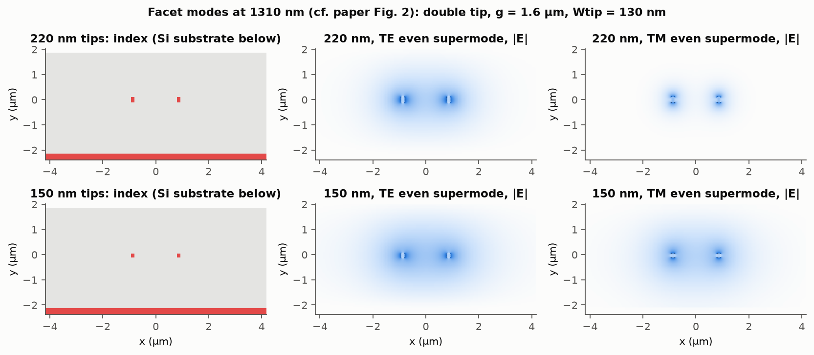

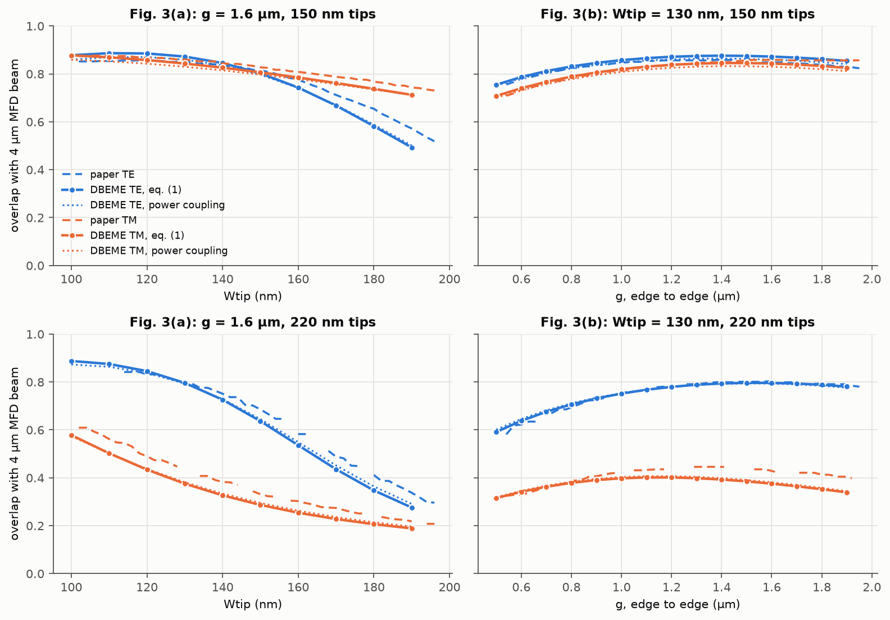

DBEME minus paper, eq. (1), over the paper's ranges. The 100 nm point falls
before the digitised curves start. For 220 nm TE the comparison starts at
120 nm, the first DBEME point inside the paper's curve (which begins at
114 nm).

| series | Fig. 3(a), `Wtip` 110–190 nm: signed mean err / max \|err\| | Fig. 3(b), `g` 0.6–1.9 µm: signed mean err / max \|err\| |
|---|---|---|
| TE, 150 nm tips | −0.016 / 0.079 | +0.017 / 0.027 |
| TM, 150 nm tips | −0.020 / 0.030 | −0.005 / 0.031 |
| TE, 220 nm tips | −0.036 / 0.064 | +0.001 / 0.018 |
| TM, 220 nm tips | −0.048 / 0.059 | −0.035 / 0.063 |

At the design point (`Wtip` 130 nm, `g` 1.6 µm):

| tips | TE eq. (1) (paper) | TM eq. (1) (paper) | TE / TM power coupling | TE / TM launch `\|t\|²` | supermodes TE / TM |
|---|---|---|---|---|---|
| 150 nm (this design) | 0.872 (0.848) | 0.843 (0.858) | 0.859 / 0.830 | 0.860 / 0.838 | 1.4496 / 1.4540 |
| 220 nm (conventional) | 0.796 (0.802) | 0.375 (0.428) | 0.793 / 0.381 | 0.793 / 0.381 | 1.4597 / 1.5444 |

**The mechanism is there in both directions.**

* The 220 nm tips bind TM (1.544 against 1.460), and the beam couples 42
  points worse to it.
* At 150 nm the two supermodes are within 0.0044 of each other at the design
  point (≤ 0.0055 across 100–150 nm), and within 3 points in coupling. The
  TE/TM order is the reverse of the paper's.

**Where it disagrees most.**

* On average, the 220 nm TM curve. It runs 0.03–0.06 low across Fig. 3(a) and
  for `g` ≥ 1.1 µm in Fig. 3(b), and closes in on the paper as `g` falls:
  0.025 low at 1.0 µm, within 0.013 at `g` ≤ 0.8 µm.
* At a single point, 150 nm TE at `Wtip` 180–190 nm, where the curve is
  steepest.
* The paper states neither the material indices nor the tips' sidewall
  angle, and so not their exact cross section.

**The two coupling measures.** For a centred beam they agree to ≤ 0.018; at
a 0.8 µm vertical offset they part by up to 0.06.

On the oxide-only stack the design point reads 0.862 / 0.858 (eq. (1)), but
that stack is not converged at the facet (F5, §2.4). The device uses the
full-stack values above.

## 4. The device (Phase 3) — paper Figs. 4, 5 and 8

`studies/edge_coupler/analyse.py` and `fullstack_tip.py` compute:

* the fibre launch;
* the path cascade (scattering route, no projection, column cap off);
* the output TE0/TM0 power, with the fibre offset scanned;
* the substrate leakage;
* the guided power, marched section by section.

### 4.1 The field along the device (Fig. 4)

`fields.py` re-solves planes along the path and sums them with the marched
amplitudes, in the path's own branch order and gauge (oxide launch). The
figure shows |E| on the device layer and four cross sections at the paper's
inset planes; the insets are cut to the window's physical interior. The
planes and the march they use are from the current code (2026-10-02).

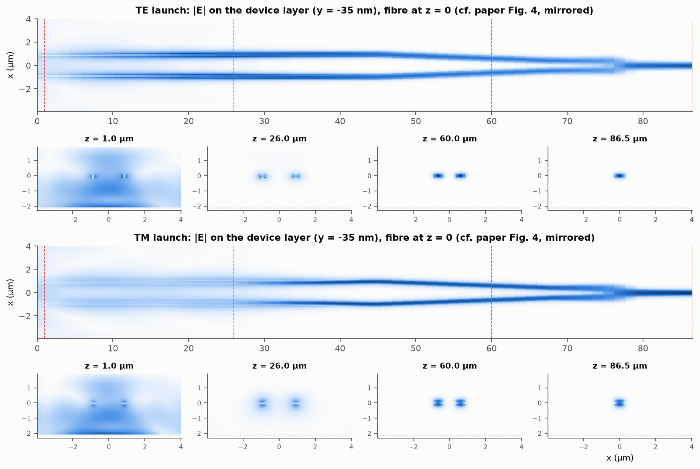

* **TE** stays in the arms from the tips to the MMI and images onto the
  output.
* **TM** is visibly less confined in L1 and tightens through the height
  converter.
* **At `z` = 1 µm** the insets show what the fibre put into the continuum:
  the part of the beam the tips have not captured.

### 4.2 Where the power goes (1310 nm, as built)

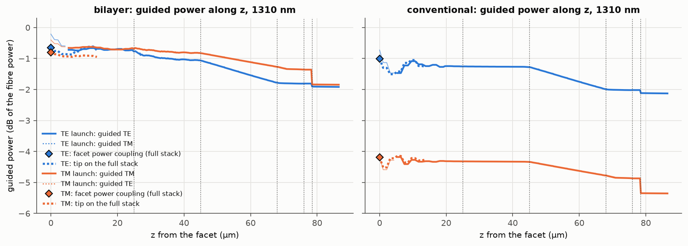

Loss by stretch, in dB:

* **Facet:** the full-stack conjugated power coupling.
* **Tip:** the guided power at the join over the facet row's power coupling.
  For the bilayer TM, the march itself from the launch `|t|²` of 0.838 gives
  0.18 dB.
* **The rest:** the march on the oxide path, before the 0.00 / 0.03 dB
  leakage correction after the join. The sampling edges are at 24.9 µm
  (conventional 25.5 µm), 45.2, 68.0, 75.9 and 78.5 µm.

| stretch | bilayer TE | bilayer TM | conventional TE | conventional TM | what it is |
|---|---|---|---|---|---|
| facet → fundamental (power coupling) | 0.66 | 0.81 | 1.01 | 4.19 | the facet coupling at the Fig. 3 design point |
| tip, 0 → 13.8 µm (full stack) | 0.08 | 0.14 | 0.26 | 0.07 | tip evolution and substrate leakage (bilayer TM) |
| rest of L1, 13.8 → 25 µm | 0.09 | 0.04 | 0.01 | 0.01 | |
| L2, 25 → 45 µm | 0.30 | 0.14 | 0.03 | 0.02 | the height converter: 0.27 / 0.06 dB of it is the walked corners (§4.3) |
| L3, 45 → 68 µm | 0.71 | 0.44 | 0.71 | 0.44 | the converging arms' 20 nm steps — the same in both variants |
| Lt | 0.03 | 0.09 | 0.03 | 0.09 | |
| Lm + face | 0.10 | 0.48 | 0.10 | 0.48 | TM loses at the wedge MMI (TE / TM 0.02 / 0.41, 0.10 / 0.48, 0.20 / 0.68 dB at 1260 / 1310 / 1360 nm) |
| output taper | 0.01 | 0.01 | 0.01 | 0.01 | |

**The MMI is the largest polarisation-dependent term that is not lattice.**

* At 1310 nm its TM − TE of 0.38 dB is half the 0.73 dB PDL.
* Its share of the PDL is 0.38 / 0.38 / 0.48 dB at 1260 / 1310 / 1360 nm.
* The facet adds 0.25 / 0.15 / 0.10 dB.

The PDL grows 0.30 dB from 1260 to 1360 nm. The main changes in TM − TE:

| term | 1260 → 1360 nm |
|---|---|
| the tip on the full stack: TE tip loss falls 0.18 → 0.03 dB, TM rises 0.10 → 0.19 dB | +0.24 dB |
| the length-dependent part (§4.3) | +0.11 dB |
| the MMI | +0.10 dB |
| the leakage after the join | +0.08 dB |
| the full-stack output against the stretch-by-stretch march | −0.09 dB |
| the facet | −0.16 dB |

The remaining terms (tip lattice, Lt, output taper) sum to +0.03 dB.

### 4.3 The lattice: three terms, each measured

The dataset path is a staircase on the width lattice. Three pieces of its
loss come from the lattice, not the device.

**1. The near-cutoff tip.** The tip is walked at 10 / 5 / 2.5 nm on the
`_tip` dataset and joined to the main path at the identical 200 nm point (a
signed permutation between the two paths' branch bases,
`analyse.joined_lumped`). Extrapolating to 0 gives:

* bilayer tips: +0.00 … −0.07 dB (TE 1.878 → 1.859 → 1.852 → 1.845 dB at
  1310 nm);
* conventional tips: −0.09 … −0.35 dB;
* the exception: at 1360 nm the bilayer sequences are not monotonic (the
  term is −0.008 / +0.003 dB).

**2. The walked corners.** On the `(w_low, w_high)` axes nearly every step of
the height converter changes both widths.

* The path walks such a step one axis at a time, through a corner point with
  a narrower arm. `n_eff` dips at every one; this is the sawtooth in the TE
  branch of the §4.5 plot.
* The main path against its corner-free twin, in which every change is one
  interface, gives TE 0.271 and TM 0.059 dB.
* The exact-value direct EME over L2 (§6), which has neither corners nor
  snapping, gives 0.274 / 0.070 dB against the snapped path, and the
  corner-free twin 0.271 / 0.059 dB: the corners are nearly all of it for
  TE, and snapping adds ~0.01 dB for TM.
* The corners were measured at 1310 nm and are applied unchanged at the band
  edges.
* A `(w_arm, w_high)` parameterisation would have made the converter mostly
  single-axis.

**3. The converging arms' steps.** In L3 every 20 nm gap step jogs both arms
sideways by 10 nm and sheds 0.27 % of TE: the per-interface ratio is
0.9972–0.9975 at all 59 of them, whatever the gap.

* **The loss does not change with length.** Holding the steps and scaling
  every `dz` of L3 (`stretch_scan.py`, zero mode solves) leaves it constant
  from 0.25× to 8× (5.8 to 184 µm) at 1310 and 1360 nm, and for TM at
  1260 nm. The 1260 nm TE moves between −0.01 and +0.06 dB of its 1× value
  (0.74–0.81 dB); its length-dependent part, 0.01 dB, is kept in the best
  estimate. §5's segment scan agrees from 2.3 to 115 µm.
* **For the bilayer tips the stretch grows linearly with merged step size.**
  * The staircase merges steps across the rest of L1, L2 and L3 together.
  * Corner-free staircases with 1× / 2× / 3× merged steps give TE
    1.596 / 2.701 / 3.808 dB, linear to 0.001 dB.
  * The conventional tips' staircases are not linear (residual
    0.06 / 0.08 dB).
* **It persists with exact geometry values at the same sections.** L3 still
  loses 0.60 dB of TE (§6); 0.12 / 0.10 dB (TE/TM) of its loss is
  snapping and corners.

So this term is mostly the steps, with no adiabatic component beyond
0.01 dB (TE, 1260 nm).

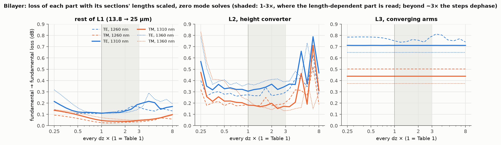

**How the scan is read.** Scaling `dz` of a fixed staircase mimics a longer
smooth taper only while the step spacing is short against the beat length of
the modes the steps couple. As the spacing grows, the step couplings dephase
and the loss rises again: from ~1.2–1.7× for TE, and after the minimum for
TM, which lies at 1.2–2.8×. So only a fall below the 1× value counts as the
length-dependent part: the loss at 1× minus the minimum over 1–3×, part by
part.

| λ | TE | TM |
|---|---|---|
| 1260 nm | 0.02 dB (0.01 of it L3) | 0.01 dB |
| 1310 nm | 0.00 dB | 0.04 dB (0.03 of it L2, at its minimum at 2.4×) |
| 1360 nm | 0.02 dB | 0.12 dB (0.09 of it L2, at its minimum at 2.8×) |

Where TE rises from 1.2–1.7×, a slower adiabatic fall could be hidden
underneath. The TE figures are a bound set by that onset, not a measurement.

| 1310 nm, dB (2.5 nm tip, before leakage) | main path | corner-free 1× | 2× | 3× | linear 0× | corners |
|---|---|---|---|---|---|---|
| bilayer TE | 1.867 | 1.596 | 2.701 | 3.808 | 0.490 | 0.271 |
| bilayer TM | 1.833 | 1.774 | 2.368 | 2.966 | 1.177 | 0.059 |
| conventional TE | 2.076 | 2.126 | 2.852 | 3.752 | 1.284 | −0.051 |
| conventional TM | 5.288 | 5.311 | 5.855 | 6.148 | 4.935 | −0.023 |

**The linear intercept is not the smooth device.** The merge factor is not the
step size: 119 / 67 / 51 steps are in range, not 1/m. For bilayer TE the
intercept removes 1.38 dB from a stretch that loses only 1.09 dB in all.

**Three estimates of the smooth device.**

* **Best estimate:** takes the join-to-L3 stretch's loss as lattice, except
  its length-dependent part. The stretch's loss is measured per wavelength:
  TE 1.05–1.12 dB and TM 0.62–0.71 dB for the bilayer tips.
* **Lower bound:** takes all of the stretch as lattice.
* **Conservative bound:** removes only the tip term and the corners, keeping
  the arm-step loss. The corners are clipped at zero, so the conventional
  tips' −0.05 / −0.02 dB are not applied.

### 4.4 Loss against the paper (Figs. 5 and 8)

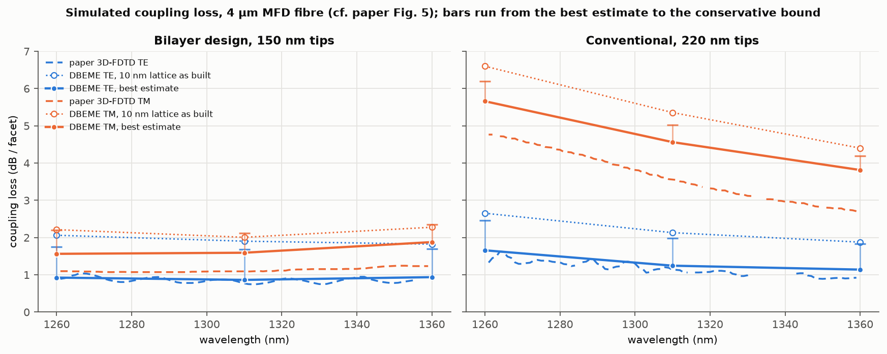

| dB / facet | oxide launch, 10 nm | full-stack launch, 10 nm | tip | join→L3 | its length-dependent part | **best estimate** | conservative | paper 3D-FDTD | measured † |
|---|---|---|---|---|---|---|---|---|---|
| **1310 nm, bilayer TE** | 1.90 | 1.99 | −0.03 | 1.09 | 0.00 | **0.86** | 1.68 | 0.77 | 1.16 |
| **1310 nm, bilayer TM** | 2.01 | 2.19 | −0.02 | 0.62 | 0.04 | **1.59** | 2.11 | 1.09 | 1.62 |
| 1310 nm, conventional TE | 2.13 | 2.14 | −0.15 | 0.74 | 0.00 | 1.24 | 1.99 | 1.13 | — |
| 1310 nm, conventional TM | 5.36 | 5.31 | −0.29 | 0.46 | 0.00 | 4.56 | 5.02 | 3.56 | — |
| 1260 nm, bilayer TE | 2.06 | 2.09 | −0.07 | 1.12 | 0.02 | 0.92 | 1.75 | 0.89 | 1.27 |
| 1260 nm, bilayer TM | 2.21 | 2.30 | −0.04 | 0.71 | 0.01 | 1.56 | 2.20 | 1.10 | 1.54 |
| 1260 nm, conventional TE | 2.65 | 2.64 | −0.18 | 0.82 | 0.01 | 1.66 | 2.46 | 1.33 | — |
| 1260 nm, conventional TM | 6.60 | 6.55 | −0.35 | 0.54 | 0.00 | 5.66 | 6.19 | 4.76 | — |
| 1360 nm, bilayer TE | 1.82 | 1.98 | −0.01 | 1.05 | 0.02 | 0.94 | 1.70 | 0.87 | 1.25 |
| 1360 nm, bilayer TM | 2.28 | 2.40 | +0.00 | 0.64 | 0.12 | 1.88 | 2.35 | 1.23 | 1.45 |
| 1360 nm, conventional TE | 1.88 | 1.92 | −0.09 | 0.70 | 0.00 | 1.14 | 1.83 | 0.92 | — |
| 1360 nm, conventional TM | 4.40 | 4.37 | −0.18 | 0.38 | 0.00 | 3.81 | 4.19 | 2.71 | — |

* The paper's band-edge values are its last digitised points: 1261 nm; for
  the 150 nm TE curve 1356 nm, where it is still rising ~0.015 dB/nm; 1359 nm
  otherwise.
* † Fig. 8 trace, median over ±1 nm. The paper's text gives 1.18 / 1.46 dB
  at 1310 nm.

**TE agrees.** The bilayer TE best estimate is within +0.03 / +0.09 /
+0.07 dB of the paper's FDTD at 1260 / 1310 / 1360 nm. Part of this is
compensation: at 1310 nm the TE facet overlap is 0.024 above the paper's
(0.872 against 0.848, 0.12 dB), so the rest of the TE device runs ~0.2 dB
above the FDTD.

**TM is 0.47–0.64 dB high**, and the excess is polarisation-specific. The
model identifies these contributors; they overlap, so they are not an
additive account:

* the wedge-MMI TM loss: 0.38–0.48 dB more than TE, under our Q3 reading of
  the MMI access and the MMI;
* the facet: 0.843 against the paper's 0.858, i.e. 0.08 dB;
* the tip on the full stack: TM loses 0.14 dB between the facet and the
  join, from tip evolution plus substrate leakage (TE loses 0.08 dB there).
  The paper does not state whether its FDTD included the Si substrate;
* at 1360 nm, a 0.09 dB length-dependent TM loss in the height converter.

**PDL:** 0.64 / 0.73 / 0.94 dB, against the paper's simulated 0.21 / 0.32 /
0.37 dB and its measured 0.48 dB. The gate fails at every wavelength.

* At 1310 nm about half of the 0.41 dB excess over the paper's PDL is the
  facet. Its TE/TM order is reversed (§3), worth 0.20 dB: TE couples 0.12 dB
  better and TM 0.08 dB worse than the paper's eq. (1).
* The rest is the TM terms above.

* The conservative bound's PDL is lower (0.45 / 0.43 / 0.65 dB), but only
  because the arm-step loss it keeps is larger for TE than for TM.
* The lower bound's PDL is 0.65 / 0.69 / 0.84 dB.

**The conventional TM penalty** (TM − TE) is 4.0 / 3.3 / 2.7 dB, falling with
wavelength as in Fig. 5 (paper 3.4 / 2.4 / 1.8 dB). The trend is the paper's.

* The conventional TM loss itself is 0.9–1.1 dB higher than the paper's. At
  1310 nm the contributors are the facet overlap, 0.57 dB (0.375 against
  0.428), and the MMI's TM loss, 0.48 dB (0.38 dB more than its TE loss).
  They are not an additive account.
* The conventional TE is 0.11–0.33 dB high.

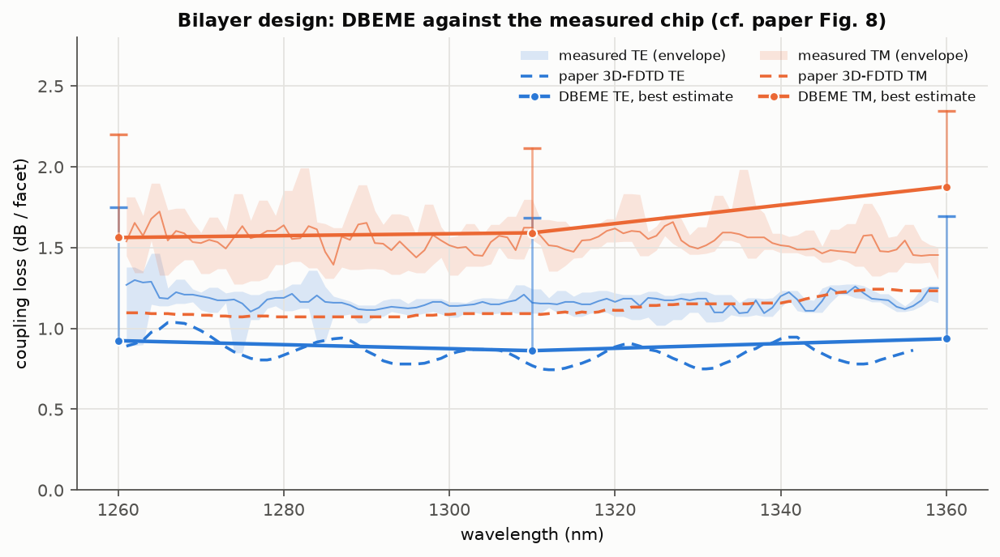

**Against the measured chip (Fig. 8).**

* The TE best estimate lies ~0.3 dB below the measured TE across the band.
* The TM best estimate lies inside the measured TM spread at 1260–1310 nm
  and above it at 1360 nm.
* DBEME has no facet, alignment or fabrication loss, so a margin below the
  measurement is expected. The TM coincidence is the model's MMI TM loss
  standing in for the chip's real losses, not agreement.

**The paper's TE ripple** in Fig. 5 has an ~18–19 nm period for the 150 nm
design and ~11 nm for the 220 nm one.

* `Δn_g·L = λ²/Δλ` ≈ 93 µm. With `Δn_g` of order 1 that is a beat over a
  length comparable to the device, so a mode pair inside the coupler is not
  excluded.
* Three wavelengths cannot resolve it.

### 4.5 `n_eff` along the path

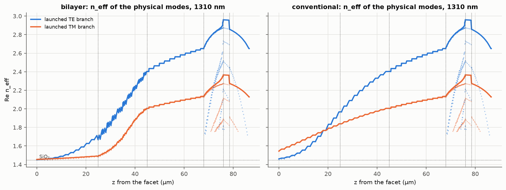

The plot follows the launched TE and TM branches from the tip to the output
strip.

* **Starting values** (on the oxide-only basis, which the plot uses):
  * bilayer 1.451 / 1.455, just above the oxide (1.4496 / 1.4540 on the
    full stack, §3);
  * conventional 1.460 / 1.544, the 220 nm TM tip mode being tightly bound.
* **The sawtooth** in the bilayer TE branch through the height converter is
  the walked corners of §4.3.
* **The MMI's higher-order modes** appear where the arms merge.

## 5. Each section alone (Phase 2)

Each segment is taken alone: fundamental in → fundamental out, through its
own sections and interfaces, with its length scanned 0.1–5× at zero mode
solves (`analyse.py`, `segment_study`; 1310 nm, oxide basis, 10 nm lattice).
The segment boundaries differ from §4.3's partition by one section.

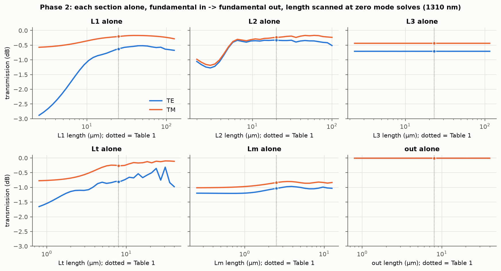

| segment | T at Table 1, TE / TM | length dependence |
|---|---|---|
| L1 (double tip) | 0.866 / 0.954 † | TE improves up to ~50 µm (0.62 → 0.52 dB) and collapses below 10 µm; TM 0.20 → 0.17 dB at ~39 µm: the clearest adiabatic knee |
| L2 (height converter) | 0.927 / 0.948 | TE within 0.33–0.40 dB (mostly 0.33–0.36) from ~6.5 to ~46 µm, 0.51 dB at 100 µm; TM gains ~0.06 dB up to ~46–59 µm |
| L3 | 0.850 / 0.904 | **flat from 2.3 to 115 µm** (TE 0.708 dB throughout): per step, not per length |
| Lt | 0.829 / 0.942 | still improves with length at its Table 1 value: TE 0.81 → 0.31 dB at ~31 µm and back to 0.98 dB at 40 µm (fundamental to fundamental; in the device the MMI's higher modes re-image) |
| Lm (MMI) | 0.788 / 0.825 | weak for the fundamental alone; in the device the MMI length matters strongly (§7) |
| output taper | 0.998 / 0.998 | flat |

† On the oxide basis the tip mode at L1's input is PML-affected: its power
per unit `|a|²` is 1.11 for TE and 1.07 for TM. So this is not a clean power
ratio; the full-stack march gives the tip's physical loss (§4.2).

**The paper's L2 attribution is not reproduced at 1260–1310 nm.** The paper
puts its TM penalty in the height converter, where "the optical field
dissipates into the cladding".

* **What the converter loses.** With exact geometry values (§6) it loses
  0.11 dB of TM against 0.03 dB of TE, a difference of
  0.08 dB. Most of that is step loss, which exact values keep.
* **The length-dependent part.** That part, which a smooth converter would
  keep, is 0.01 / 0.03 / 0.09 dB of TM at 1260 / 1310 / 1360 nm (§4.3).
  Against the paper's 0.21–0.37 dB PDL, that is a partial reproduction at
  1360 nm only.
* **Where the model puts the larger TM excess instead:** at the wedge MMI,
  0.48 against 0.10 dB in the device march (§4.2). The fundamental-alone Lm
  row above counts the MMI's higher modes as loss and shows the opposite
  order.

## 6. DBEME vs direct EME (§5.8)

`studies/edge_coupler/direct.py` re-solves every cross section of a stretch of
the path. It assembles and overlaps each neighbour pair on the spot, and
cascades them two points at a time with SingleEME's own interface formulas:
no cache, no tracking. It runs in two versions:

* **Aligned:** the dataset's own snapped points. This tests the cache, the
  tracking, the gauge and the bookkeeping.
* **Exact values:** the smooth design values at the same section starts.
  It keeps the same sections, but every section boundary becomes a (smaller)
  step. So it measures snapping and corners at a fixed section count, not
  the z-discretisation.

All six runs are on the current code (2026-10-02, reciprocal projection on),
so both sides of every row use the same interface formulas:

| stretch (1310 nm, bilayer) | sections | DBEME TE / TM | direct TE / TM | \|ΔT\| TE / TM | direct time |
|---|---|---|---|---|---|
| tip 0–25 µm, **aligned** | 25 | 0.8620 / 0.9558 | 0.8620 / 0.9558 | **6.3e-7 / 9.2e-7** | 1 184 s |
| MMI + output 76–86.5 µm, **aligned** | 35 | 0.7807 / 0.8174 | 0.7807 / 0.8174 | **1.5e-7 / 2.8e-7** | 3 076 s |
| L1 0–25 µm, exact values | 25 | 0.8620 / 0.9558 | 0.8821 / 0.9547 | 0.020 / 0.001 | 2 220 s |
| L2 25–45 µm, exact values | 78 | 0.9321 / 0.9590 | 0.9927 / 0.9745 | 0.061 / 0.016 | 7 299 s |
| L3 45–68 µm, exact values | 75 | 0.8490 / 0.9040 | 0.8718 / 0.9244 | 0.023 / 0.020 | 7 971 s |
| MMI + output, exact values | 35 | 0.7807 / 0.8174 | 0.7760 / 0.8148 | 0.005 / 0.003 | 3 275 s |

**The aligned comparisons agree to ≤ 9.2e-7 on both stretches.** One is the
near-cutoff tip with its continuum, where tracking and gauge are hardest; the
other is the MMI with the abrupt face. So the method adds nothing to what the
cross sections contain.

* The tip check is on the oxide basis. The full-stack tip (facet to 13.8 µm)
  and the cross-stack join that the headline numbers use were not checked
  against a direct EME.
* The DBEME column is each stretch's own cascade.
* Cut from the device's own path, the same sections differ from the direct
  result by ≤ 3.7e-5 on the tip and 2.8e-7 on the MMI (`archive_checks.json`).
  * The difference comes from the path the stretch is cut from: `direct.py`
    builds a path that ends 2 µm past the stretch, while `archive_checks.py`
    uses the full device path. Both cascade only the stretch's own sections.
  * The MMI stretch ends at the device end, so there the two paths coincide.
* Before the reciprocal projection the same checks gave 2.1e-6 / 2.2e-6 and
  1.4e-7 / 8.7e-7, and before the 2026-09-30 corrections 9.1e-6 / 1.1e-5
  and 3.6e-7 / 5.0e-6.
* The full 280-section device was not run aligned (~4–7 h at the re-runs'
  47–88 s per point).

**The exact-value runs isolate the snapping and the corners**, as
10 log₁₀(direct / DBEME) per stretch:

| stretch | TE | TM |
|---|---|---|
| L1 | 0.10 dB | −0.00 dB |
| L2 (the corners, matching §4.3) | 0.27 dB | 0.07 dB |
| L3 | 0.12 dB | 0.10 dB |
| MMI | −0.03 dB | −0.01 dB |

The L1 row moved most with the corrections (0.14 / 0.02 dB before them): its
old DBEME side predated all four. The DBEME column uses each stretch's own
first and last sections. Cut from the device's path, the same 78 sections of
L2 give 0.9321 / 0.9590 (`archive_checks.json`); §5's boundaries differ by
one section, hence 0.927 / 0.948 there.

**Cost:** the direct runs take 0.3–2.2 h per stretch (aligned:
1 184 s and 3 076 s; exact-value: 0.6–2.2 h), on four threads each with four
runs sharing the P-cores. The same stretches from the cache take well under a
second.

## 7. Optimisation (Phase 4)

`studies/edge_coupler/optimise.py`.

* **Objective:** the worse of TE and TM loss (each at its best fibre offset,
  leakage-corrected) plus 0.5 × PDL. It is taken at 1310 nm or averaged over
  1260/1310/1360 nm, on the oxide-launch path and the 10 nm lattice.
* **What a length change does on the lattice.** Scaling a segment rescales
  its `dz` without changing its steps. The step couplings then dephase
  (§4.3), and on its own that moves the join-to-L3 staircase loss by up to
  0.09 dB within 1–3× and 0.29 dB at 0.25× (TE, 1310 nm,
  `stretch_scan.json`).
* **What that means for the numbers.** That is the same size as the gains
  below. The improvements are indicative, and part of them may be the
  staircase's interference rather than the device. The absolute values carry
  the §4.3 lattice terms.

### 7.1 The free axes: six lengths at zero mode solves

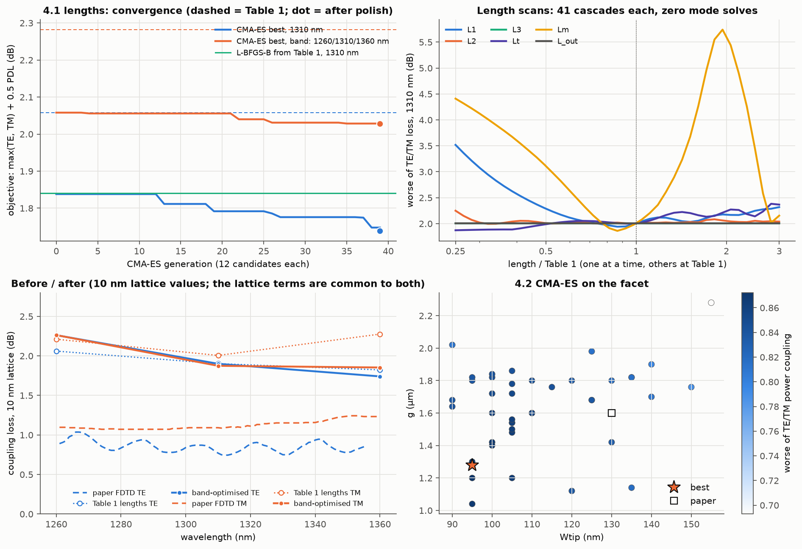

| lengths (µm) | L1 | L2 | L3 | Lt | Lm | L_out | total | objective (dB) |
|---|---|---|---|---|---|---|---|---|
| Table 1 | 25 | 20 | 23 | 8 | 2.5 | 8 | 86.5 | 2.058 (1310) / 2.282 (band) |
| L-BFGS-B from Table 1, 1310 nm | 23.60 | 19.64 | 22.95 | 7.94 | 2.25 | 8.01 | 84.4 | 1.840 |
| L-BFGS-B from Table 1, band | 21.30 | 21.64 | 22.84 | 9.03 | 2.19 | 7.96 | 85.0 | 2.048 |
| CMA-ES + polish, 1310 nm | 30.94 | 31.33 | 57.04 | 2.02 | 2.36 | 13.57 | 137.3 | **1.739** (TE 1.731, TM 1.714) |
| CMA-ES + polish, band | 19.85 | 30.55 | 25.74 | 10.09 | 2.11 | 7.35 | 95.7 | **2.028** (worst: 2.26 / 1.90 / 1.85) |

* **The cost.** An evaluation is one re-cascade of 280 cached sections per
  wavelength, fibre-offset scan included. The 480 CMA-ES candidates plus the
  L-BFGS-B polish ran in 144 s (1310 nm) and 286 s (band, three cascades per
  evaluation), after 56 s / 161 s of warm setup, with **no mode solve**,
  timed under load (other solver jobs shared the cores).
* **L-BFGS-B.**
  * At 1310 nm it stops early: SciPy reports `ABNORMAL` after 5 iterations
    and 48 evaluations. The surface is rugged, from MMI interference and
    forward step coupling between modes.
  * On the band it converges in 9 iterations, 0.02 dB short of the CMA-ES
    optimum.
* **The short MMI access.** Only the 1310 nm search found it: Lt ≈ 2 µm,
  the 0.25× lower bound of the search box.
  * At fixed other lengths, Lt = 2.0 µm takes the worse polarisation at
    1310 nm from 2.01 to 1.87 dB, and it is still falling there, so a
    shorter access was not explored.
  * The band optimum keeps Lt at 10 µm; its worst wavelength is 1260 nm.
* **The band optimum at 1310 nm** reaches 1.90 dB (TE 1.90 / TM 1.87),
  against 1.73 dB (the worse polarisation) for the 1310-only search.
* **The MMI length is the sensitive one.** With the other lengths fixed, the
  worse polarisation goes from 1.86 dB at 2.17 µm to 5.74 dB at 4.9 µm, and
  back to 2.02 dB at 7 µm, the next image. Table 1's 2.5 µm sits near the
  first minimum.
* **L3 and the output taper.** At 1310 nm both are flat (±0.001 dB) over
  0.25–3× Table 1. Over the band, L3 moves the 1260 nm TE loss by up to
  0.12 dB and the output taper moves it by up to 0.02 dB.
* **L1 is best near 22 µm** (1.94 dB against 2.01 at Table 1).
  * Stretching it to 40–49 µm gains TE 0.04–0.08 dB but costs TM
    0.05–0.17 dB.
  * Below ~10 µm the worse polarisation rises by more than 0.6 dB.
* **What the 1310 nm optimum trades away.**
  * It is 51 µm longer than Table 1, mostly in L3 (57 µm) and L2 (31 µm).
  * L3 and the output taper are flat at 1310 nm in the 1-D scans (about
    Table 1 and the L-BFGS-B optima; not checked about this one), so those
    40 µm can likely go back to Table 1 at no cost. Much of the rest of its
    gain sits in the MMI access, where our geometry is a reading (Q3) rather
    than the paper's.
  * **Where the optimum sits is not robust.** Before the reciprocal
    projection (README → Fixed, "Reciprocal interface matrix") the same
    seeded search ended at L1/L2/L3 = 43/19/42 µm (121.8 µm, 1.755 dB). The
    projection moves the Table 1 objective by 0.001 dB, yet the two runs
    part after 18 of 40 generations and end 15 µm apart in total length and
    0.016 dB apart in objective. The surface is rugged and flat-bottomed:
    only Lt ≈ 2 µm and Lm = 2.3–2.4 µm recur.

### 7.2 The facet: CMA-ES over `Wtip` and `g`

**Setup.** Task 4.2 was reduced to the facet. The facet involves no cascade,
so the 2026-09-30 corrections do not touch it.

* **Method:** a compact (μ/μ_w, λ)-CMA-ES in the style of Hansen's `purecma`
  (no new dependency), over `Wtip` (5 nm lattice) and `g` (20 nm).
* **Cost per candidate:** one lossy full-stack solve, 2.0–2.8 min (mean
  2.4 min).
* **Objective:** the worse of TE and TM power coupling at the best vertical
  offset.
* **Runs:** 38 distinct candidates are archived, from two runs.
  * An interrupted run: 3 generations with 16 solves saved; 3 solves of its
    4th generation were lost.
  * A restart about its best: 4 generations, 22 solves.

| facet | `Wtip` | `g` | TE coupling | TM coupling | worse |
|---|---|---|---|---|---|
| Table 1 | 130 nm | 1.6 µm | 0.859 | 0.831 | 0.831 |
| CMA-ES best | **95 nm** | **1.28 µm** | 0.873 | 0.872 | **0.872** (+0.21 dB) |

**Why it moves there.**

* Narrower tips help TM's coupling more: from 130 to 100 nm, eq. (1) goes
  0.843 → 0.877 for TM against 0.872 → 0.878 for TE.
* The closer gap keeps the pair from getting too wide for the 4 µm beam.
* Fig. 3(a) shows TE flat below ~120 nm while TM still gains 1–2 points down
  to 100 nm. That TM rise is the gain, and it is shallow.

**Not computed:**

* the widths at the L1/L2 and L2/L3 boundaries, which task 4.2 also asked
  for;
* the device loss and spectra of the 95 nm / 1.28 µm design, which needs ~100
  new cross sections;
* its tolerance.

**What the facet objective leaves out.** A 95 nm tip sits closer to cut-off,
leaks more into the substrate, and evolves faster along L1. It is also below
the 130 nm the paper chose "considering manufacturing capabilities".

## 8. DBEME vs the paper: discrepancy table

| quantity (1310 nm unless stated) | DBEME | paper | Δ | cause |
|---|---|---|---|---|
| facet overlap, 150 nm TE / TM (eq. 1) | 0.872 / 0.843 | 0.848 / 0.858 | +0.024 / −0.015 | material indices, mesh, the tips' sidewalls — none stated in the paper |
| facet overlap, 220 nm TM | 0.375 | 0.428 | −0.053 | the most tightly bound tip mode: the most sensitive to index and cross section |
| bilayer TE loss | 0.86 dB | 0.77 dB | +0.09 | at the lower bound of the lattice treatment (0.86 dB); not accounted for — index and cross-section differences as for the facet |
| bilayer TM loss | 1.59 dB | 1.09 dB | +0.50 | TM-specific loss in the wedge MMI (0.48 dB TM against 0.10 dB TE, Q3 reading), facet 0.08 dB, the tip on the full stack 0.14 dB TM (tip evolution plus substrate leakage; TE loses 0.08 dB there) — contributors, not an additive account |
| bilayer TM loss, 1360 nm | 1.88 dB | 1.23 dB | +0.64 | the MMI TM loss grows to 0.68 dB (TE 0.20); the tip's TM leakage and the converter's length-dependent TM loss grow too |
| PDL, 1260–1360 nm | 0.64–0.94 dB | 0.21–0.37 dB | +0.41–0.57 | the facet's reversed TE/TM order (0.20 dB at 1310 nm) and the TM terms above |
| conventional TE loss | 1.24 dB | 1.13 dB | +0.11 | |
| conventional TM loss | 4.56 dB | 3.56 dB | +1.00 | facet overlap 0.57 dB; MMI TM loss 0.48 dB (TE 0.10) — contributors, not an additive account |
| TE ripple (150 nm: ~18–19 nm period) | not resolved | 0.1–0.2 dB | — | three wavelengths |

## 9. Limits

* **The lattice treatment.** The best estimate takes the join-to-L3 stretch
  as lattice except its length-dependent part.
  * That is supported for L3 taken alone, which is flat at 0.25–8× (TE at
    1260 nm between −0.01 and +0.06 dB of its 1× value).
  * In the device, L3's length still moves the 1260 nm TE loss by up to
    0.12 dB (§7.1), through the modes the MMI re-images.
  * For TE elsewhere the loss never falls more than 0.02 dB below its 1×
    value, but it rises from 1.2–1.7×, where the step couplings dephase. So
    a slower adiabatic fall cannot be excluded.
  * A smooth-geometry EME would need several times more sections than the
    2.2 h exact-value L3 run.
  * At 1310 nm the three estimates span TE 0.86 / 0.86 / 1.68 dB and TM
    1.55 / 1.59 / 2.11 dB (lower / best / conservative).
  * The corners were measured at 1310 nm only.
  * The merged-step extrapolation over-corrects and is not used.
* **Three wavelengths** of the seven the task names. 1280, 1300, 1320 and
  1340 nm were not built, for compute; only their `dataset_info.py` exists.
* **The path basis is the oxide-only stack** away from the tip. Substrate
  leakage after the join is a first-order correction (≤ 0.09 dB).
* **The column cap is off.** With it (opt-in) the losses read 0.00–0.12 dB
  higher and reciprocity, with the projection off, 4.1e-3 (§1, note 1).
* **Passivity.** The device is passive at 0.733. On a truncated PML basis a
  long lossy cascade need not be: report 13's 312-section path is not at
  the default (38.9 over all outputs, the self-overlap transmission floor;
  README, "Reciprocal interface matrix").
* **The reciprocal projection is on** (the lossy default since 2026-10-01).
  It removes each interface's antisymmetric reflection exactly at a zero
  step and is an `O(A·δ)` error on a finite step's reflection (README). It
  moved the best estimates by ≤ 0.009 dB.
* **Q1–Q3** — the tip widening through L1–L3, the gap convention, the MMI
  access and the output taper — are this project's readings of what Table 1
  leaves open. The TM excess sits where Q3 acts.
* **No facet Fresnel term:** the beam is launched in oxide. A lensed fibre in
  air adds ~0.15 dB (air/SiO₂).
* **Other simplifications:** vertical sidewalls and no fabrication tolerance.
  The reflection back into the fibre is ≤ 0.02 % at 1260–1310 nm and up to
  0.11 % (bilayer TE, 1360 nm).

## Reproducing

```bash
# datasets (cold; 6-10 h per wavelength on this machine; resumable)
.venv/Scripts/python examples/run_solver_job.py --cpus 0-7 studies/edge_coupler/build.py 1310
.venv/Scripts/python examples/run_solver_job.py --cpus 0-7 studies/edge_coupler/tip.py build 1310
# leakage first: fullstack_tip.py and analyse.py read leakage_<λ>_<variant>.json
.venv/Scripts/python examples/run_solver_job.py --cpus 8-15 studies/edge_coupler/leakage.py 1310 bilayer 1 30
.venv/Scripts/python examples/run_solver_job.py --cpus 8-15 studies/edge_coupler/leakage.py 1310 conventional 1 30
.venv/Scripts/python examples/run_solver_job.py --cpus 8-15 studies/edge_coupler/fullstack_tip.py 1310
# facet (cold)
.venv/Scripts/python examples/run_solver_job.py --cpus 0-7 studies/edge_coupler/phase1.py design full
.venv/Scripts/python examples/run_solver_job.py --cpus 0-7 studies/edge_coupler/phase1.py design ox
.venv/Scripts/python examples/run_solver_job.py --cpus 0-7 studies/edge_coupler/phase1.py wtip full
.venv/Scripts/python examples/run_solver_job.py --cpus 0-7 studies/edge_coupler/phase1.py gap full
.venv/Scripts/python examples/run_solver_job.py --cpus 8-15 studies/edge_coupler/window_check.py
# device, lattice, checks (warm)
.venv/Scripts/python studies/edge_coupler/analyse.py 1310
.venv/Scripts/python studies/edge_coupler/stretch_scan.py 1310 1260 1360
.venv/Scripts/python studies/edge_coupler/gate.py 1310
.venv/Scripts/python studies/edge_coupler/gate_detail.py 1310 bilayer conventional
.venv/Scripts/python studies/edge_coupler/gauge_trace.py
# cold: staircase.py solves its corner-free and merged points (~30-40, ~2 h, once);
# direct.py re-solves every section of a stretch (0.2-3 h); fields.py re-solves 60 planes
.venv/Scripts/python examples/run_solver_job.py --cpus 0-7 studies/edge_coupler/staircase.py 1310 --dataset=<a copy of the dataset> bilayer
.venv/Scripts/python examples/run_solver_job.py --cpus 0-7 studies/edge_coupler/staircase.py 1310 --dataset=<another copy> conventional
.venv/Scripts/python examples/run_solver_job.py --cpus 0-7 studies/edge_coupler/direct.py 1310 0 25 bilayer aligned
.venv/Scripts/python examples/run_solver_job.py --cpus 8-15 studies/edge_coupler/direct.py 1310 76 86.5 bilayer aligned
.venv/Scripts/python studies/edge_coupler/archive_checks.py   # after direct.py: it reads direct_1310_*.json
.venv/Scripts/python examples/run_solver_job.py --cpus 0-7 studies/edge_coupler/fields.py 1310 bilayer 60
# optimisation (warm, except the facet search)
.venv/Scripts/python studies/edge_coupler/optimise.py lengths 1310
.venv/Scripts/python studies/edge_coupler/optimise.py lengths 1260 1310 1360
.venv/Scripts/python studies/edge_coupler/optimise.py lengths_global 1310
.venv/Scripts/python studies/edge_coupler/optimise.py lengths_global 1260 1310 1360
.venv/Scripts/python examples/run_solver_job.py --cpus 8-15 studies/edge_coupler/optimise.py facet 16   # with no opt_facet.json present: the archived run's 16 saved solves (it was launched with 36 and interrupted)
.venv/Scripts/python examples/run_solver_job.py --cpus 8-15 studies/edge_coupler/optimise.py facet 18   # resumes from opt_facet.json about its best (sigma 0.1)
# numbers and figures
.venv/Scripts/python studies/edge_coupler/summary.py
.venv/Scripts/python studies/edge_coupler/report_tables.py
.venv/Scripts/python studies/edge_coupler/figures.py
```
